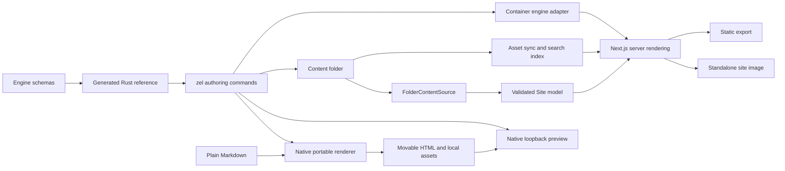

# Zellij — durable project context

Last refreshed: **2026-11-05**. Initial review baseline: local `main` at
`6356b05deaddf5421b24d7c8a1e30f868d4923c0`.

Current implementation: combined image publication and smaller runtimes merged
in PR #68 as `e7b0d79`, after all 16 PR checks passed. Static image compressed
layers shrank about 75%; Next images about 10% with the same fixture content.
Import heading anchors and literal code fences merged in PR #69 as `b1ff508`,
after all 16 PR checks passed. Imported page metadata and Docusaurus document
IDs merged in PR #70 as `5001718`, with all PR and post-merge checks passing.
Docusaurus autogenerated sidebars merged in PR #71 as `eb90705`, after all
16 PR checks passed; both post-merge workflows also passed. Generated category
pages and manual category links merged in PR #72 as `ab768ea`, after all 16
PR checks passed. Both post-merge workflows passed; main CI recovered from a
Docker info timeout on a targeted CLI-job retry. PR #73 merged as `a4b575d`
after all 16 final-head checks passed; both post-merge workflows passed. It adds
explicit Docusaurus slugs, fixes encoded Next page lookup/active navigation,
and allows selected runtimes the existing twelve-second discovery budget.
PR #74 merged import asset controls and optional `convert --validate` as
`74abf77`; all 16 PR checks and both post-merge workflows passed. PR #75 merged
website URL mapping and exhaustive CLI dispatch as `2c5ac7c`, after all 16
final-head checks passed, including the Windows correction in `74bacea`.
Its base-image post-merge workflow passed; main CI later exposed a Windows
watch-readiness assertion race, corrected in `a1003bd`. PR #76 merged relative
website document URLs and that harness fix as `e8f525d`, after all 16 final-head
checks passed; both post-merge workflows passed. VitePress imports merged in
PR #77 as `0729235`, after all 16 final-head checks passed; both post-merge
workflows passed too. Jekyll imports merged in PR #78 as `6190e51`, and Hugo imports merged in
PR #79 as `7a03f50`, each after all 16 final-head checks passed. Both post-merge
workflows passed for each PR. Sphinx imports merged in PR #80 as `c067b5a`,
after all 16 checks passed on `fb622d1` in run `42109434915`. Its base-image
post-merge run passed; main run `42113725983` exposed a Windows watched-folder
rename EPERM in the preview fixture. This milestone bounds retries for that
operation while retaining real disappearance/recovery assertions.
Current work adds native Cloudflare Pages static deployment through `cf`,
`deploy`, `publish`, `ship` and GitHub workflow generation. It uses existing
projects, environment credentials and previews by default. Live Cloudflare
account acceptance remains pending; see the latest dated entry.
Every registered command family has a handler, but the full design
remains incomplete; see [the current CLI status](specs/zel-cli-status-2026-11-05.md)
for format/provider/advanced-option limits. The prior
rc.2 release proposal awaits explicit publication approval and predates these
changes. See the latest dated entries and the image measurement evidence.

Latest content-preservation work: PR #55 merged as `f1ca1ff` after all 13 CI jobs passed in
`41573372928` on final head `2794773`. Source fix `8370ec4` preserves 82 legacy
bookmarks before a proposed Netlify migration. All 46 production routes, 282
original heading IDs and 29 referenced images are retained in the 55-route
staging site. Both published test images passed corrected fresh-pull acceptance;
PR #54 main CI `41572436263` also passed. See
[the migration report](specs/zellij-netlify-migration-2026-11-02.md).
The user created https://zel-stage.netlify.app and made its main site and
previews public. Updated GitHub secrets now work: candidate portable/hosted
draft deployments, HTTP acceptance and browser search passed. Full-docs routes,
images, bookmarks and search are retained, but React hydration errors remain:
the newline preceding Netlify's hosting comment reproduces the problem locally.
The user disabled the badge; its script disappeared, but the comment/newline
and React #418 remain. The user reports filing a Netlify bug and emailing
support@netlify.com; a response is pending. The support report and verified local
reproduction are in [the hydration diagnosis](specs/zellij-netlify-hydration-2026-11-02.md).
Keep the old live site/domain intact. See the latest dated entry and
specs/evidence/zellij-netlify-acceptance-2026-11-02.json.

Candidate **0.2.0-rc.2 is prepared and merged** in PR #60 as `0fbf0a1` after
all 13 checks passed in `41595462484` on `04653b0`; their source trees are
identical. Browser acceptance PR #59 merged as `93dca08` after all 13 checks
passed in `41594855467` on `97f9f9f`. Publication is awaiting explicit user
approval: automatic approval review rejected the attempted release command
before execution. No rc.2 tag or release exists. The proposed tag targets
`0fbf0a12c3cf7074c4620e2bb84cc5d8e5fd7469`; see the latest dated entry and
specs/evidence/zellij-rc2-preparation-2026-11-02.json.
Final local `zcheck` passed with serial Rust fixtures: 365 engine and 317
Rust tests passed; the default parallel run hit independently reproduced local
shell-startup delays. See the final validation entry for this limitation.

Latest release: native **0.2.0-rc.1 is published** at tag commit `61881e8` (PR #50).
All eight public-artifact acceptance jobs passed in run `41548199714` using
corrected harness `29029e1`: six native platforms and both Linux image
architectures. The original release run has two Windows downloader failures;
the follow-up checks the unchanged published assets. Download recovery,
validation of existing tags and candidate installation/CLI documentation merged
in [PR #51](https://github.com/mylife-inc/Zellij/pull/51) as `49d9a14` after all
13 checks passed on `9ab6232`. Stable release remains `zellij-v0.1.3`; production
docs were not deployed. See the final dated entry and specs/zel-release-procedure.md.
Temporary build/image
selection merged in PR #46, including the Zod/schema compatibility fix.
Image platform selection
merged in PR #45. Shared output controls merged in PR #44.
Explicit --config merged in PR #43; shared --cwd and
--site-root merged in PR #42.
Hosted rendering selection and optional-peer installs merged in PR #41.
Eject/features merged in PR #40; maintenance
commands merged in PR #39.
Portable development and hosted static preview merged in PR #38.
Formatting and validation watch merged in PR #37.
Editable Next.js wrappers merged in PR #36, configured import/ship in PR #35,
CI generation in PR #34 and Netlify delivery in PR #33. These capabilities are
available in candidate `zellij-v0.2.0-rc.1`; the stable native release is still `zellij-v0.1.3`.

This is the starting point for future Zellij conversations in this checkout.
The companion [audit](specs/zellij-audit-2026-10-16.md) contains reproducible
defects, remaining work, evidence, and verification limits. Recheck dated facts
before acting. The initial review created documentation only; subsequent authorized work is
recorded below.

### Implementation update — 2026-10-16

The user subsequently authorized implementation and the repository setup.
`mylife-inc/Zellij` is now **public**, with **main** as its default branch.
Before the visibility change, Gitleaks 8.30.1 scanned all 134 reachable commits
and reported no detected leaks. No historical rewrite was performed.

The first milestone merged in [PR #1](https://github.com/mylife-inc/Zellij/pull/1)
as `6950589`. Commit `1a2e26b` adds shared output-path/collision
checks, conversion source containment, protected page/guide creation, staged
static exports, and streamed image Dockerfiles. `deda7a0` restores the browser
job's engine-build prerequisite; `bd6b6c6` bounds file-descriptor use during
large conversions and tests the CLI against an image built from its checkout.
See the audit's implementation record for the resolved finding IDs.

Verification established: **99 Rust tests**, warnings-denied Clippy, formatting,
**227 engine tests**, workspace typechecking, and the engine/showcase production
builds pass. Hosted browser run `39000366953` passed **294 tests**, with 114
existing conditional skips across desktop/mobile Chromium and mobile WebKit.
The CI workflow additionally exercises initial static export, failed-build
preservation, and successful replacement using a real container. Consult the
PR's latest checks and merge status before relying on a particular revision.

Compatibility change: conversion requires a new/empty destination outside its
source tree. Static export requires a new/empty directory outside content, or
an export previously created with the `.zellij-output` ownership marker.
Existing unmarked exports need a new/empty output on their first build with the
new CLI; never mark an authored directory as generated output.

A clean `npm ci` restored the missing local packages. `npm audit` also reported
19 advisories (3 critical, 6 high, 6 moderate, 4 low). Next.js and Vitest upgrades
need a separate compatibility-tested change; no automatic audit fix was applied.
This was the dependency baseline before the second milestone below.

### Dependency and template update — 2026-10-16

The user authorized continuing. Commit `17d5a23`, tracked in
[PR #2](https://github.com/mylife-inc/Zellij/pull/2), removes the 19 reported
npm advisories and fixes the invalid section scaffolds (audit R4). The locked
tree and a freshly generated standalone app with all features both report
**zero npm advisories** at this date; this is not a claim that all bugs are gone.

- Next.js is `16.4.2`; Vitest resolves to `4.1.12`, Vite `7.3.7`, Mermaid
  `11.17.2`, KaTeX `0.18.10`, esbuild `0.28.2`, and XML DOM `0.9.12`.
- Scoped dependency overrides keep optional math/diagram chains patched.
  The engine manifest carries the production overrides; `zellij init` and
  feature changes copy them to the app root, where npm actually enforces them.
  Manual wrappers must carry that map too. The repository additionally
  overrides tsup's esbuild. Tests keep the shared constraints in agreement.
- `src/content/frontmatter.ts` replaces gray-matter, using the existing YAML
  package for guides, prose, and search. Metadata must be a YAML mapping with
  a closing delimiter; executable language tags are rejected. BOM, Windows
  newlines, nested values, and multiline scalars are tested.
- `src/cli/section-templates.ts` generates YAML from schema shapes and bounds,
  chooses valid media alternatives, and validates the serialized result with
  the complete Zod schemas. `context --json` embeds `sectionTemplates`; Rust
  copies those strings instead of guessing nested types and list lengths.
  Templates contain TODO text and explicit replaceable media paths. The
  command writes only YAML; authors supply their actual assets.
- CI audits dependencies, validates and statically exports all 23 templates
  emitted by the actual Rust binary, and tests formulas/Mermaid math labels
  in browsers. Browser failures retain traces and the job has a time limit.

Local verification: **260 engine tests**, **99 Rust tests**, formatting,
warnings-denied Clippy, workspace typechecks, engine packaging, all four
example content checks, and all 23 Rust-generated template checks pass.
The showcase production build passes with webpack. Local Turbopack hits the
execution sandbox's helper-process port restriction; the normal Turbopack
build and container/browser acceptance are hosted CI gates. Consult PR #2's
latest checks for their results. No new native CLI release is issued here.

Hosted run `39004471983` at `d8c9f5d` passed all four jobs: engine, schema sync,
CLI/container acceptance, and browsers. The normal Turbopack build and all 23
template static exports passed; **297 browser tests passed**, with **114
conditional skips and no retries**. A minimal (`--features none`) fresh wrapper
also audited clean. Its lockfile still includes Mermaid, remark-math and
rehype-mathjax through the engine's optional dependencies; audit follow-up S11
tracks that feature-selection/package-size defect separately.

CI reliability history: after PR #1, run `39001111736` initially stalled on
repeated mobile-WebKit navigation timeouts. Its fresh-runner retry passed all
294 tests (114 conditional skips). This is not a diagnosed/fixed browser bug.
The separate automated security-review plugin failed its PR #2 commit review
with HTTP 400; that review must not be represented as passed.

### Conversion update — 2026-10-16

The next authorized milestone is [PR #3](https://github.com/mylife-inc/Zellij/pull/3).
Source commit `4196e6b` addresses R5's ordinary Markdown document links and
referenced assets for both MkDocs and Docusaurus. A shared parser-based pass
rewrites links to canonical engine routes, expands reference-style links,
preserves query/fragment text and code examples, and copies binary assets into
`assets/imported/docs/` or `assets/imported/static/`. Docusaurus's default
`static/` paths are supported; unlisted documents remain unpublished.

Assets participate in the same complete output preflight/staging as text.
Escaping references, symlinks, case-only file conflicts, hidden document names,
and duplicate public routes are rejected before writing. Missing or ambiguous
references and HTML/JSX attributes are reported. Markdown images under the
public asset prefix now receive the site's basePath in the MDX component map.

R5 still has explicit migration limits: source-specific/custom heading IDs,
fragments targeting a removed leading H1, HTML/JSX attributes and imports,
custom static folders and source route overrides require manual work. Fragment
text is retained, not universally validated or translated. Do not describe
this milestone as full-fidelity migration of arbitrary MkDocs/Docusaurus sites.

Local verification: **109 Rust tests**, **261 engine tests**, warnings-denied
Clippy, formatting, all workspace typechecks, engine packaging and the updated
documentation content check pass. `scripts/check-conversion.mjs` runs the real
CLI and engine to check routes, an actual heading anchor, rendered image URLs
under `/products/docs`, and copied binary bytes. Hosted CI adds static exports
of both imports and checks actual HTML links, fragments and asset files. Read
PR #3's latest checks before claiming hosted acceptance; no native CLI release
is part of this milestone.

Integration review exposed a separate prefix-configuration gap: generated
Next config does not mirror `site.yaml`'s basePath. The CI fixture configures
both explicitly using `scripts/fixtures/conversion.Dockerfile`. The existing
showcase `verify-basepath.mjs` also replaces strings no longer present in its
configuration, so it must not be trusted as current prefix acceptance (S12).

PR #2 merged as `3408f37`; main run `39005197060` passed all checks, and base
image run `39005197029` published all four feature variants for AMD64/ARM64.

### Scaffolding and discovery update — 2026-10-16

Commits `fe4240c` and `ee68282`, tracked in
[PR #4](https://github.com/mylife-inc/Zellij/pull/4), resolve the reproduced
content-authoring findings **R6–R8**.
Rust content scaffolds and converters share a JSON-backed YAML string scalar
serializer, including explicit escapes for YAML's extra Unicode line breaks and
characters its parsers reject literally.
The Node initializer uses the same representation. Names, copyright text,
page identifiers, section references, guide titles and front matter preserve
punctuation, implicit YAML values and multiline text. This covers generated
content metadata; it does not validate arbitrary npm package names or workflow
inputs as package identifiers, GitHub expressions or shell commands.

Plain/minimal starters omit the guide CTA unless `--guide` creates its target.
All CLI commands that resolve a content root now use `Project::discover`:
`./content`, current root, `./docs`, then `./documentation`. Explicit paths
retain their existing exact-directory behavior. Marker files, a sections
directory, and guide-only roots are recognized; hidden/reserved guide folders
and markers of the wrong filesystem type are excluded. Discovery never walks
upwards. This selects a root; the engine still owns semantic validation.

Local verification: **117 Rust tests**, **262 engine tests**, warnings-denied
Clippy, formatting, workspace typechecks, engine packaging, documentation
content validation, and both conversion fixtures pass. The new
`scripts/check-scaffolds.mjs` checks exact metadata and rendered Hero links
for **40 Rust starters, 10 Node content starters and 10 guide titles**. Hosted
CI additionally exercises four guide-only discovery locations and a menu-only
root through the real container engine. Hosted results are pending at this
record; consult the PR before claiming acceptance. No native release is made.

The separate security-review plugin failed to read its model response during
the source commit, although the commit itself succeeded. That review did not
complete and must not be described as passed.

Prior milestone completion: PR #3 merged as `dd99c2c`. Main CI `39007109533`
and image run `39007109576` passed, publishing all four variants for Linux
AMD64/ARM64. Browser acceptance had 296 initial passes plus one successful
retry, with 114 conditional skips. The retry was a mobile-WebKit navigation
error at `/guide/quickstart`; PR CI had a different FAQ interaction retry.
These flakes remain undiagnosed, not repaired by the conversion changes.

### Header layout and overflow update — 2026-10-17

Source commit `da1c222` implements the requested viewport-wide header: branding
at the left inset and search/theme/actions at the right. The existing
`brand.logo.href` remains the company-site link; `brand.title` can retain a
separate site-home link. No new branding schema or company assets are required
by the engine change. Search continues to open its existing dialog.

Desktop navigation measures the remaining space and inert copies of every
label, including active font weight and icons. Trailing items move into More
and return when space grows; resizing, loaded fonts and theme changes trigger
measurement. Existing `menuOverflowAfter` remains the configured count limit.
The overflow model preserves destinations, group headings, descriptions,
icons and external/new-tab flags. The mobile drawer receives the full resolved
menu, independently of the width-selected desktop prefix.

Keyboard focus follows items that move into/out of overflow; breakpoint changes
close stale panels and release drawer scroll lock. Tall More panels scroll,
and compact More panels stay within the viewport at either edge. Mobile
controls have 44px targets at the default root font size. The header was checked
at widths from 320 to 1600px, including larger menu text and a wide brand.
This is not a full WCAG audit or a claim of manual screen-reader acceptance.

Local evidence: **268 engine tests**, workspace typechecks, engine packaging,
and documentation validation pass. The focused desktop/mobile Chromium
navigation run passed **34 tests** with **26 device-specific skips**. The six
new desktop header cases also pass (the final compact-panel check was rerun
separately after correcting its fixture width). Final engine typechecking and
six focused unit tests pass after the positioning adjustment. Production builds,
the full browser suite and mobile WebKit remain hosted CI gates; consult the
PR containing `da1c222` for their outcomes. No native CLI release is made.

Prior milestone completion: PR #4 merged as `4be61dc`. PR CI `39010124427`
passed with 297 browser passes, 114 conditional skips and no retries. Main CI
`39010596721` passed with 296 initial browser passes, one successful retry and
114 skips. The retry was the previously observed mobile-WebKit FAQ interaction
(answer hidden after clicking the summary); its cause remains undiagnosed.
Image run `39010596751` published all four variants for Linux AMD64/ARM64 and
passed the published-image build/serve smoke test.

### Canonical search and preparation update — 2026-10-17

Source commit `29654d3` resolves **R10–R12** and the interrupted search load
**S2**. `createContentSource` in `src/config/runtime.ts` now supplies the shared
folder/legacy selection and content-path contract for rendering and preparation.
`writeSearchIndex` reads a fresh `loadSite` result, including canonical guide
routes, frontmatter/sidebar overrides, unlisted pages and title-stripped bodies.
Preparation bypasses the global rendering memo; S8 remains a separate issue.

`src/mdx/headings.ts` parses Markdown/MDX without executing authored JavaScript.
Search and the TOC use the renderer's `rehype-slug` semantics, including formatted,
setext, quoted, indented, repeated and mathematical headings. All heading levels
participate in duplicate IDs; only h2/h3 split search passages, so deeper
subsections retain their text. Search stores unprefixed routes for Next's router.
The existing regex-based prose cleanup is not a complete MDX text interpreter.
Optional math loading is shared with rendering and stays external in CLI bundles;
bundling MathJax broke its runtime paths and was caught using Zellij's own docs.

`zellij prepare`, `sync-assets` and `search-index` accept `--content <dir>` and
`--config <legacy-file>`, including inline values with spaces/equals signs.
Helpers still accept an app-root string or now a `ZellijRuntimeOptions` object.
Wrappers must pass the same explicit content root to preparation and rendering;
preparation does not infer TypeScript configuration. Missing roots and malformed
assets directories fail before clearing previous prepared files. Physical-path
overlap checks protect source assets, including public-directory symlinks.
Rerunning asset sync removes stale output even if the source assets folder has
been deleted. Automatic dev watching is still absent: **S9 is only partly fixed**.

Synthetic guide roots and configured home redirects now claim route ownership;
only a guide and its own root page may intentionally share that route. The
search dialog aborts cancelled requests, retries on reopen after cancellation
or failure, and caches completed data for the current deployment prefix.

Local verification: **285 engine tests**, all workspace typechecks, packaging,
all four example preparation/content checks, and the packaged CLI integration
fixture pass. The fixture covers canonical routes, actual optional math loading,
custom paths, legacy config, invalid flags and asset removal. Four focused
Chromium desktop/mobile recovery cases pass without retries. An initial broad
run against the local dev server timed out in the existing `networkidle` check;
production lazy-loading and WebKit acceptance remain hosted CI gates. The new
recovery test's early-hydration click was corrected to use the existing retrying
shortcut pattern. CI additionally exports a real container site and checks that
each indexed route and anchor exists. Consult this commit's PR for hosted results.

R13 documentation now states the fast check's actual limits. Complete prose-link
and asset validation remain open, as do basePath synchronization/acceptance S12,
remaining UI findings and native CLI/platform completion. No native binary
release is made in this milestone.

Prior milestone completion: [PR #5](https://github.com/mylife-inc/Zellij/pull/5)
merged as `7fb5178`. PR CI `39019128511` and main CI `39019556088` passed all four
jobs, including **305 browser passes, 124 conditional skips and no retries**,
268 engine tests and 117 Rust tests. Image run `39019556101` published all four
feature variants for Linux AMD64/ARM64 and passed published-image build/serve
smoke acceptance. Previously recorded FAQ/WebKit flakes remain undiagnosed.

### Deployment prefix and runtime isolation update — 2026-10-17

Source commit `8463720` resolves **S6, S8 and S12**. The shared native
`engine/packages/zellij/deployment-config.cjs` resolves content roots and the
deployment prefix for both `withZellij()` and the runtime. It lives at package
root so source, compiled modules and native Next configuration resolve the same
file; package and container distributions include it.

`site.yaml` supplies Next's basePath automatically. A wrapper may supply it when
content omits it; explicit values must agree, including an explicitly empty
prefix. Values are normalized and malformed prefixes rejected. Next embeds the
effective value as reserved `ZELLIJ_BASE_PATH`; runtime configuration must agree
with that build-time choice. Changing the prefix requires rebuilding. Custom
content paths must match across preparation, runtime factories and the second
argument of `withZellij(config, contentOptions)`.

Runtime memoization is keyed by absolute application/configuration/content
paths, runtime prefix and compiled prefix. Production retains each site's
result; development retains the 250 ms TTL. Failed loads evict their entry so
correcting a missing/invalid file can recover. Social metadata images now receive
the same prefix as canonical URLs and other assets.

The previous in-place showcase prefix script is replaced by an isolated,
production-built wrapper fixture. Only its content declares the prefix; its
custom content directory exercises preparation and rendering together. CI tests
redirects, nested links, ordinary/optimized images, Next resources, metadata,
sitemap, robots and search in Chromium and WebKit. Conversion exports now use
the default CI image without a special Next-config override.

Local evidence: **303 engine tests**, all workspace typechecks, engine packaging,
packaged-CLI integration and all four example preparation/checks pass. The
production prefix fixture passes Chromium with webpack and a local font-response
fixture. One earlier normal-font build succeeded; another failed in Next's Google
Fonts loader (new audit **S13**). Hosted acceptance uses normal fonts, Turbopack
and WebKit and remains a gate; consult the PR containing this commit. The local
font fixture is not shipped and does not resolve S13. No native binary release
is included.

Prior milestone completion: [PR #6](https://github.com/mylife-inc/Zellij/pull/6)
merged as `d115a9a`. PR CI `39022447464` passed all four jobs, with **285 engine
tests, 117 Rust tests, 311 browser passes, 124 conditional skips and no retries**.
Main CI `39022871779` passed with 310 initial browser passes plus one successful
retry of the existing mobile-WebKit FAQ interaction (`sections.spec.ts:191`).
Its cause remains undiagnosed. Image run `39022871680` published all four feature
variants for AMD64/ARM64 and passed published-image build/serve acceptance.

### Deep and strict validation update — 2026-10-17

Source commit `86e5e2d` addresses the static-validation portion of **R13**.
Both `zel check <dir>` and `zellij check <dir>` accept `--deep` and `--strict`.
The default remains the fast content-model check. Deep mode parses MDX without
executing authored JavaScript and checks static prose/section links, heading,
HTML and section anchors, local media and section previews. Strict mode fails
on existing or new warnings. Build/dev/migrate retain fast checks unless the
caller runs an explicit deep/strict gate first.

Reference semantics are Zod metadata in `src/content/reference-schema.ts`, used
by configuration/section schemas and exported in the generated Rust schema.
Do not add a new link/media/inline-prose field without its reference annotation.
`src/cli/deep-check.ts` uses canonical Site routes, redirect targets and the
renderer's heading/GFM anchor pass. Inline prose shares tokenization with
`InlineMarkdown`. Section source paths survive loading for useful diagnostics.
MDX positions refer to the loaded body, after front matter/title removal.

The checker preserves the first Markdown reference definition, follows
home/guide redirects before checking fragments, and validates example references
in their actual rendering page. It detects recursive previews and duplicate IDs.
Asset paths must resolve to files inside the physical content/assets boundary;
raw Markdown/HTML image URLs use `/_zellij/assets/...`, while Screenshot and
schema-declared media use content asset paths. Fast navigation validation now
ignores URL query strings when finding a route.

Limits remain explicit: no component/JavaScript execution or remote HTTP checks;
literal menu `url:` remains unchecked. Dynamic MDX, custom components, component
ID props, srcSet and contextless relative links warn. Wrapper-owned public files
outside the content asset prefix and SVG-internal fragments are not verified.
Optional math parsing depends on the installed environment: use the installed
wrapper for math-enabled deep checking; the bare container checker installs no
optional dependencies. Full build/browser acceptance is still necessary.

The checker exposed four broken showcase anchor links in `pro/tour.yaml` and
`pro/highlights.yaml`; they now target existing highlights/specifications content.
Local evidence: **317 engine tests**, **117 Rust tests**, workspace typechecks,
formatting, warnings-denied Clippy, engine packaging, isolated packaged-checker
and preparation integration, and all four local examples under `--deep --strict`
pass. CI adds deep/strict validation for the three fully tracked examples (PayOS
needs its generated docs), plus the real Rust/container command and static export.
Consult this source commit's PR for hosted results. No native binary release is
included; the new Rust flags require the current CLI source and matching image.

Source review also found **S14**: video-embed omits basePath for local video and
poster URLs. It remains a separate rendering fix, with prefixed browser acceptance
needed. S13 font-build reproducibility and the prior browser flakes remain open.

Prior milestone completion: [PR #7](https://github.com/mylife-inc/Zellij/pull/7)
merged as `ba30f9b`. PR CI `39025935776` and main CI `39026348416` passed all four
jobs, with **303 engine tests, 117 Rust tests, 311 browser passes, 124 conditional
skips and no retries**. Separate Chromium/WebKit prefix acceptance passed with
normal fonts and Turbopack. Image run `39026348423` published all four variants
for AMD64/ARM64 and passed the published-image build/serve smoke test.

### Development preparation update — 2026-10-17

Source commit `8674908` completes the remaining preparation-watching part of
**S9**. The Node helper now provides `zellij dev [--content <dir>] [--config <file>]
-- [Next dev arguments]` and standalone `zellij prepare --watch`. Generated
wrappers and all four examples use the supervised dev command. The base image
uses that same generator, so Rust `zel dev` gets watching through its existing
`npm run dev` invocation; no new Rust flag or native binary release is needed.
Existing wrappers must update their dev script or run the standalone watcher.

`src/cli/watch-preparation.ts` polls filesystem metadata every 500 ms, requires
two stable snapshots, and serializes preparation. This covers bind mounts,
custom/legacy content locations, root removal/recreation and symlinked roots.
Generated output, Next output, node_modules and Git internals are excluded.
Separate content/asset snapshots avoid copying images on prose-only edits and
avoid rebuilding search for asset-only changes. Failed preparations do not
acknowledge pending asset changes. Repeated identical errors are suppressed;
corrected content recovers without restarting. Startup must prepare successfully.

Search/manifest JSON is replaced through a sibling temporary file. Asset trees
are copied and hashed before a short rename swap; failed copies preserve the
old tree. This is not a transaction across the whole site, and an asset rename
swap can briefly leave its directory absent. The dev supervisor owns Next's
process, forwards signals, propagates its exit status, and closes the watcher.
Search clears its loaded data on close and bypasses HTTP caching in development;
production keeps the existing cache behavior.

Local evidence: **324 engine tests** (seven watcher regressions), workspace
typechecks, engine packaging, isolated installed-CLI process/exit acceptance,
existing packaged preparation, and deep/strict docs validation pass. The real
webpack dev server passes Chromium checks for updated search on reopen, rendered
headings/images after reload, added/deleted pages, removed/restored assets,
invalid-MDX recovery and released server port. CI adds the installed-package
fixture, actual Rust/container dev acceptance and Chromium/WebKit dev acceptance
with normal Turbopack. Consult the PR containing this commit for hosted results.

Content edits still require browser reload for page/image changes. Automatic
browser reload is future work; do not equate this watcher with full MkDocs live
reload. Restart after deployment-prefix, wrapper-config or feature changes.
Nested symlinks are not followed by the polling traversal. Portable Markdown
build/serve/view remain unimplemented, as recorded in the portable contract.

Browser verification exposed **S15**: MDX h2/h3/h4 links replace their accessible
names with “Link to this section.” This remains an accessibility follow-up;
S13, S14 and the existing mobile-WebKit flakes also remain open.

PR #9's first normal-Turbopack dev gate exposed S13 again: IBM Plex Sans failed
before browser acceptance with `next/font/google queries have exactly one entry`.
This matches upstream Next issue #99114, whose fix #100158 is merged but was not
in npm's stable 16.4.2 on 2026-10-17. See the audit for links and evidence limits.
A retry does not resolve the build's Google Fonts dependency. Treat a stable
font remedy as the next reliability priority before expanding the CLI surface.

Prior milestone completion: [PR #8](https://github.com/mylife-inc/Zellij/pull/8)
merged as `d4615ca`. PR CI `39036985726` and main CI `39037525173` passed all four
jobs (317 engine tests, 117 Rust tests and the real deep/strict container/export
fixture). Both browser runs had 310 initial passes plus one successful retry of
the known mobile-WebKit FAQ interaction, with 124 conditional skips. Separate
Chromium/WebKit prefix acceptance passed. Image run `39037525149` published all
four feature variants for AMD64/ARM64 and passed published-image build/serve
acceptance. No new native CLI release was made.

### Reproducible theme fonts — 2026-10-17

Source commit `7963587` replaces the build-time Google Fonts loader with a
pinned local snapshot, addressing **S13**. The twelve existing families retain
normal styles, weight ranges, Unicode subsets, swap behavior, CSS variable
names and metric-adjusted fallbacks. There are **75 unmodified WOFF2 files**
(1,539,836 bytes total). Fonts are not preloaded; a browser requests only the
families/subsets used by its page. The generated stylesheet uses namespaced
family names and relative asset URLs that Next processes with the site prefix.

`src/themes/fonts/manifest.json` records URLs, SHA-256, sizes, user agent, pinned
license provenance and fallback metrics. Original CSS and OFL notices are kept.
`prepare-fonts.mjs` verifies the snapshot entirely offline and copies it beside
the compiled modules. Git attributes preserve hashed upstream bytes on Windows.
The stylesheet references a bundled file containing every full license notice. Updates are explicit, reviewed
snapshot changes; normal builds never refresh fonts. Dependency installation
can still require network access. This does not implement portable `file://`
documentation or the requested Rust build/serve/view commands.

Local evidence: **324 engine tests**, workspace typechecks, engine build and
strict/deep documentation checks pass. The npm archive contains all font files
and notices for both source and compiled modules. Real webpack/Chromium
production-prefix and development-watcher acceptance pass, including all font
faces decoding, lazy loading, local prefixed URLs and deployed notices. CI adds
a fresh Turbopack site build with Docker `RUN --network=none` after dependency
installation, plus Chromium/WebKit production and development font checks.
The first hosted run `39053315323` passed the offline Turbopack build,
engine/schema/CLI jobs and 310 production browser tests plus one successful
retry of the known mobile-WebKit FAQ interaction (124 conditional skips).
Its production font gate failed because Turbopack stripped license comments.
Follow-up `21479d3` emits the combined notice as a real CSS URL asset and checks
its deployed response byte-for-byte. Local webpack/Chromium dev acceptance
passed this follow-up. [PR #10](https://github.com/mylife-inc/Zellij/pull/10)
tracks final hosted verification. Run `39054096571` passed all 311 production
browser tests without retries, then exposed a test URL-resolution error:
Turbopack emitted the notice relative to its stylesheet (`../media/...`), while
the test fetched it relative to the page. The trace confirmed the emitted CSS
reference; the check now resolves it against the owning stylesheet and still
requires the complete notice bytes and local deployment prefix. The corrected
license asset also passes local webpack production acceptance. No native CLI
release is made.

Run `39054561760` passed all engine/schema/CLI checks, offline build, and both
Chromium/WebKit production font/prefix checks. Development passed Chromium but
WebKit requested Next's own `/__nextjs_font/geist-latin.woff2` debug-overlay font,
which the test mistakenly treated as a Zellij asset. The installed Next overlay
middleware explicitly serves four local Geist font paths outside basePath.
Development acceptance now recognizes only those exact local framework paths;
all Zellij and remote font requests remain checked, and production has no
exception. That run's main browser suite had 310 initial passes plus one known
FAQ retry and 124 conditional skips. Consult PR #10 for final acceptance.

Prior milestone completion: [PR #9](https://github.com/mylife-inc/Zellij/pull/9)
merged as `bd01bdb`. Main CI `39052261993` passed all four jobs, including **311
browser tests**, 124 conditional skips and **no retries**. Chromium/WebKit
production-prefix and dev-watcher acceptance passed. Image run `39052261989`
passed eight platform/feature builds, four multi-platform publications and the
default-image build/serve smoke test. This successful run does not diagnose the
previous FAQ/WebKit flakes. PR #9's final PR run had one successful FAQ retry.

PR #10 completion: merged as `5a9e12c` after exact-head run `39055211438`
passed all four jobs: **324 engine tests**, **117 Rust tests**, schema sync,
typechecks, warnings-denied Clippy, offline Turbopack build, and **311 browser
passes / 124 conditional skips / no retries**. Main CI `39055788092` passed;
its browser suite had 310 initial passes and one successful known mobile-WebKit
FAQ retry. Both runs passed Chromium/WebKit production and development font,
license and prefix gates. Image run `39055788338` passed eight feature/platform
builds, four AMD64/ARM64 manifest publications and the default-image build/serve
smoke test. This closes S13's hosted acceptance; it does not diagnose the FAQ
flake or constitute a native CLI release.

### Truthful CLI inspection output — 2026-10-17

Source commit `4d659b4` resolves the reproduced **R9** behaviors. Rust `zel
context --json` emits the exact embedded engine JSON; supplying a filename
writes that format to the file with confirmation on stderr. `list themes`
lists all 14 names, labels and descriptions, generated from the engine's config
names and renderer tokens. The catalog is included in schema-sync CI.

JSON is implemented for every `list`, `explain` and `detect` as well. Explain
returns the selected full section schema. Lists return named arrays with stable
identifiers; detect returns the supplied source path and ordered matches with
numeric confidence and strength. Missing/non-directory sources fail instead
of masquerading as no match. Equal-confidence detection and converter listings
are deterministic across inventory registration order. See the CLI spec's
output contract and command docs for exact fields.

Other commands reject `--json` with exit 2 **before execution**. Unimplemented
`--verbose` / `-v` is removed from the parser/help and rejected, rather than
silently ignored. Errors remain human messages on stderr; JSON validation,
conversion/build reports, verbose tracing and config loading remain future work.
The existing Markdown context and human inspection formats are retained.

Local acceptance: **125 Rust tests**, warnings-denied Clippy and formatting,
**325 engine tests**, all workspace typechecks, engine package build and deep/
strict docs validation pass. Eight new binary integration tests run with no
external tools on PATH and cover exact embedded output, file/stdout/stderr
behavior, all section schemas, theme/config agreement, detection, error codes,
and refusal before command actions. A first engine run exposed a missing test
fixture name (corrected); a subsequent default-concurrency run hit two existing
math-rendering timeouts during a full Rust rebuild. The unchanged suite passed
with two local workers and unchanged timeouts. Hosted full acceptance remains
the next gate; no native binary release is part of this milestone.

Hosted completion: [PR #11](https://github.com/mylife-inc/Zellij/pull/11)
merged as `0a89131` after final source/help head `c411317` passed CI
`39059091256`. Main CI `39059796288` also passed all four jobs: 125 Rust tests,
325 engine tests, typechecks/schema sync, zero npm advisories, and **311 browser
passes with 124 conditional skips and no retries**. Container/scaffold/conversion,
font/license, production-prefix and development-watcher acceptance passed.
Image run `39059796306` passed all 13 jobs, publishing all four feature variants
for Linux AMD64/ARM64 and passing the default-image smoke test. No native binary
release was issued.

### Native portable Markdown build — 2026-10-17

Source commit `8f72022` adds the native `zellij-docs` crate and
`zel build --target portable`. A plain Markdown folder selects it automatically;
discovered structured Zellij content retains the hosted static default. The
renderer parses Markdown with pulldown-cmark, highlights code with syntect, and
writes full HTML pages with ordinary relative links. Embedded local scripts
provide search, theme selection and mobile navigation without fetch/router data.
The 14 themes are generated from engine tokens; the same pinned 75-font snapshot
and license notices are embedded by Cargo. Building needs no Node, Docker or
network. Source checkout builds do require the engine font snapshot in this repo.

Output defaults to a sibling `<input-name>-site`; `--out`, `--name` and `--theme`
configure publication. Index/README home selection, optional front-matter title/
description/order, directory links, heading/footnote fragments, referenced
assets, synthetic home, breadcrumbs and previous/next are implemented. The
shared staged publisher moved from `zellij-engine` to `zellij-core::output`
without changing the ownership/failed-build-preservation contract. Source and
output are disjoint; nested symlinks, missing references, duplicate outputs and
Windows-incompatible names fail before replacing output. URL paths normalize
Windows separators at the filesystem boundary.

Current limits: raw HTML is displayed literally with a warning; MDX is rejected.
Math rendering, Mermaid execution, custom navigation/config, portable watch/reload,
`serve` and `view` remain unfinished. External media is not downloaded. The
[portable contract](specs/zel-portable-docs.md) and CLI build docs carry the exact
behavior and capability comparison. This is not complete MkDocs compatibility.

Local acceptance: **137 Rust tests**, formatting, warnings-denied Clippy,
generated-theme parity, deep/strict docs checks and Chromium file acceptance
pass. The browser fixture builds without tools on PATH, preserves an old export
on failure, moves output to a space/Unicode path, opens home and deep links with
networking blocked, and checks search/anchors, local fonts/media, keyboard,
themes, mobile layout and JavaScript-disabled content. Review caught and fixed
Escape clearing the search field instead of closing its dialog. CI now includes
native portable build/CLI/browser jobs on Linux, macOS and Windows, each with
Chromium and WebKit. Hosted results are pending at this record; these jobs do
not establish full native Windows container support or release/install coverage.

Browser follow-up: the first hosted run passed Chromium but WebKit rejected
its initial file navigation with offline emulation enabled. A minimal local
file containing only an H1 reproduced that failure; HTTP-blocked file loading
without emulation passed. WebKit acceptance therefore blocks HTTP requests
explicitly and asserts that every observed request uses file/data URLs; Chromium
also retains offline emulation. Both JavaScript and no-JavaScript contexts use
these guards. No file-security flags or HTTP fallback are used. Both engines
now pass locally. WebKit additionally exposed missing focus restoration after
pointer-opened search; the runtime now records and restores the opening control.

Portable-build completion: [PR #12](https://github.com/mylife-inc/Zellij/pull/12)
merged as `680779f` after final head `99c0f54` passed all seven jobs in
`39063380795`. Native Linux/macOS/Windows portable checks passed in Chromium
and WebKit. PR browser acceptance had 310 initial passes plus one successful
retry of the existing mobile-WebKit FAQ test, with 124 conditional skips.
Main CI `39064011730` passed all seven jobs, including 138 Linux Rust tests,
325 engine tests and **311 browser passes, 124 skips, no retries**. Image run
`39064011643` passed all 13 jobs and published four AMD64/ARM64 variants. The
local debug binary was rebuilt from main; no native release was issued.

### Native serve and view — 2026-10-17

Source commit `e33cd92` implements `zel serve` and `zel view`.
`zellij-docs::server` uses tiny_http to serve existing static exports on IPv4
loopback. It supports selected and ephemeral ports, MIME types, GET/HEAD,
extensionless HTML, directory indexes/redirects, query preservation, custom
404 responses and an explicit `--base-path` mount. It serves bytes unchanged,
disables caching for preview and requires a regular root index.html. Traversal,
malformed encodings, metadata paths, nested symlinks and Windows junctions are
rejected; foreign Host headers are refused. There is no directory listing,
home-page fallback, or automatic prefix rewriting.

`zellij-cli/src/preview.rs` orchestrates the workflow. `view` reserves its port
before building and calls the same portable helper as `build --target portable`.
It builds plain Markdown only, prints the actual URL, and launches the system
opener in a separate thread. `--no-open` suppresses launch; `--browser` selects
one executable receiving the URL as one argument, without a shell. Missing or
failing launchers warn while HTTP keeps running. Source files remain unchanged;
build failures preserve owned output, and port conflicts fail before rebuilding.

Ctrl-C (plus POSIX termination signals) stops normally with exit 0 and releases
the listener. Response writers are bounded and do not block the control loop;
shutdown can interrupt in-flight responses and retains all exported files.
Neither serve nor view watches/rebuilds/reloads on edits. Portable raw HTML/MDX,
math/Mermaid, richer navigation/config, and native release/installer work remain
open. This preview server is not a public-hosting/TLS/authentication service.

Local evidence: **143 Rust tests**, warnings-denied Clippy, formatting and
updated deep/strict docs validation pass. Six new real-HTTP tests cover routing,
MIME/HEAD/methods, port and prefix behavior, path/symlink containment and shutdown.
`scripts/check-preview.mjs` checks the actual CLI without external tools on PATH,
both browsers under a URL prefix, launch readiness/errors/no-open, source and
failed-build preservation, and Ctrl-C with slow/incomplete requests. A compiled
browser substitute requests the ready URL before recording launch; automated
acceptance does not claim to exercise each machine's actual default GUI browser.
Windows CI uses `scripts/fixtures/preview-console.rs` to create a private console
for the tested child and send a real Ctrl-C event, rather than Node's force-kill.
Cross-platform hosted acceptance is pending at this record.

Native-preview completion: [PR #13](https://github.com/mylife-inc/Zellij/pull/13)
merged as `bc95346` after head `4b4da4c` passed all seven jobs in
`39066025208`. Main CI `39066685507` also passed all seven jobs: 144 Linux
Rust tests, 325 engine tests, 311 website browser passes, 124 conditional skips,
and no retries. Both Chromium and WebKit passed native direct-file and HTTP
preview on Linux/macOS/Windows, including launcher failure recovery and real
Ctrl-C. Image run `39066685512` passed all 13 jobs and published all four
AMD64/ARM64 feature variants. No native binary release was issued.

### Portable watch and live reload — 2026-10-17

Source commit `2c44098` implements `zel view --watch`. Ordinary `view` remains
one-time build/serve/open; `serve` remains unchanged-file preview. The watcher
captures the resolved source before the initial build, polls streamed file-byte
hashes, waits for two matching scans, and serializes full rebuilds. Hidden entries
and node_modules are ignored. Same-size/preserved-timestamp edits are detected.
Nested links, Windows junctions, special files and replacement root links are
refused. Missing roots and invalid documents/assets recover on subsequent edits.
Large trees require full scans/builds; no incremental compiler is implemented.

`zellij-docs::prepare` returns a staged `PreparedBuild`; ordinary `build` publishes
it immediately. Watch mode publishes under the shared `LiveReload` write lock,
while HTTP holds a read lock through file resolution/opening and revision
attachment. Responses do not hold it while streaming to clients. This excludes
the publication rename gap from preview reads, without making multiple HTTP
requests a single generation transaction. Failed builds retain the last export
and revision and report their error in the terminal and a browser notice.

Only watch HTTP responses receive `_zellij/preview.js` and revision polling.
The version embedded in each HTML response detects updates even before its
first poll. Success reloads the current URL, preserving query/fragment; deleted
page 404 previews can recover on restoration. Files on disk receive no preview
client or endpoint and remain movable/offline. Ctrl-C joins the worker and
cleans staged work before reporting completion; exported files remain. Name,
theme, output and port changes require restarting the command.

Local evidence: **147 Rust tests**, formatting, warnings-denied Clippy, strict/
deep docs validation, and actual CLI acceptance in Chromium and WebKit pass.
Four added Rust regressions cover snapshots (including preserved timestamps and
links), staged publication, HTTP revisions/endpoints/HEAD and unchanged output.
The browser/process fixture additionally exercises the first-poll race, atomic
saves, added/deleted pages, changed/missing assets, search refresh, error notice
and recovery, temporary source loss, symlinks/junctions, ignored trees, continuous
HTTP availability during publication, Ctrl-C, and moved offline exports. CI
uses the same native Linux/macOS/Windows matrix and real Windows console helper.
Hosted acceptance is pending at this record. No native release is issued.


Hosted follow-up: run `39068473117` exposed a race-fixture deadlock on Linux
and macOS. The test held the first preview-status response but awaited the
page's full load before allowing that response to continue. It now waits for
DOMContentLoaded plus the actual intercepted request before editing, then
releases the response only after publication. Reload assertions and timeouts
are unchanged; production code is unchanged. Final hosted status belongs to
[PR #14](https://github.com/mylife-inc/Zellij/pull/14).


Run `39068818910` passed the corrected race on Chromium, but Linux WebKit also
held DOMContentLoaded while a network request was intercepted. The final fixture
therefore delays only the first fetch initiation in the page. It waits for the
client to attempt that poll, changes the source, observes actual publication,
and then permits the real HTTP response. A session marker removes the delay on
reloaded documents. Production code, reload assertions and timeouts are unchanged.


Run `39069154907` passed Linux/macOS native acceptance, all broader checks,
and Windows Chromium watch acceptance (including real Ctrl-C). Windows WebKit
still timed out awaiting DOMContentLoaded in the deliberately paused first-poll
scenario. The fixture now waits for navigation commit, then explicitly requires
the rendered heading and attempted poll before editing. Failed watch runs retain
Playwright traces plus browser readiness and CLI output for diagnosis. Full
post-reload navigation, search, image and offline assertions remain in place.


The trace from `39069833700` confirmed successful publication and browser reload:
the page contained the updated heading and the new revision. It exposed an early
search shortcut sent before deferred page enhancements initialized. The fixture
now waits for the controls that site.js reveals before pressing the shortcut;
static heading visibility alone is not JavaScript readiness. Production code is
unchanged, and the first-poll race still must complete before these search checks.


HTTP transport correction: traces from `39070119126` showed requests for
site.js/search.js receiving no response, so the browser could not start its
first poll. The earlier lifecycle/interception explanations above were
provisional and did not explain the underlying failure. A standalone local
64-connection burst reproduced missing responses in ordinary `serve`; closing
answered keep-alive sockets immediately released the stuck requests. Inspection
of tiny_http's task queue found that queued connections can outnumber idle
workers, leaving connections unprocessed while those workers wait on persistent
clients. This affects PR #13's server as well as watch mode.

Source commit `6f14500` replaces the transport with Hyper HTTP/1 and Tokio:
idle sockets are async tasks, file
lookups use a bounded 16-thread blocking pool, and file bodies stream with
backpressure. A maximum of 256 connections, a 10-second header-read timeout and
cancellation on shutdown bound the preview service. Existing routing, host/path
checks, byte-preserving serving, HEAD lengths and watch publication locks remain.
The new regression queues 64 persistent requests plus idle preconnections,
requires all responses without closing other clients, then reuses the sockets
and shuts down with them open (eight bursts). Its initial 64-client version
failed against tiny_http after five seconds; the replacement passed the server
suite. Full local validation now passes: **148 Rust tests**, warnings-denied
Clippy, formatting, deep/strict docs checks, and Chromium/WebKit actual CLI
HTTP/watch plus moved direct-file acceptance. Cross-platform hosted CI remains
pending at this entry; see PR #14 for the final exact revision and results.

Watch/reload completion: [PR #14](https://github.com/mylife-inc/Zellij/pull/14)
merged as `142965f` from final head `4f20092`. PR CI `39071150585` and merged-main
CI `39071818383` each passed all seven jobs. Native Linux/macOS/Windows passed
both Chromium and WebKit offline/HTTP/watch acceptance, including real Windows
Ctrl-C. The CLI job passed 149 Linux Rust tests; engine tests remained 325, and
website browser acceptance passed 311 tests with 124 conditional skips and no
retries. Image run `39071818346` passed all 13 jobs and published all four
AMD64/ARM64 variants. Native release packages were not issued.

### Portable configuration, navigation and branding — 2026-10-17

Source commit `4ba149f` adds optional `<Markdown-root>/zel.yaml` for site name,
initial theme, local company logo/link and nested navigation. It has no parent
search. A present file selects portable automatic build dispatch before hosted
marker discovery; explicit targets still win. CLI name/theme flags override
file values, then folder-name/cupertino defaults apply. The entire file must
remain valid even when some settings are overridden.

Navigation entries contain exactly one of `page`, `children`, or HTTP(S) `href`.
Source-relative page filenames are exact and retain literal spaces/Unicode.
Groups/links require labels; duplicate or missing pages, empty groups, traversal,
unknown/duplicate keys and incorrectly typed values fail. Nesting is bounded at
16 groups. Configured order and aliases drive sidebar and previous/next links;
unlisted pages are still rendered, validated and searched, but have no paging.
Omitting nav keeps automatic ordering; an empty list intentionally hides links.
A synthetic home lists authored navigation. Folder breadcrumbs stay unchanged.

Logo paths are checked for containment, image type and symlinks/junctions, copied
locally, and linked with encoded relative URLs. The company logo can open its
HTTP(S) website while the adjacent title links to documentation home. Mobile
controls occupy a separate row to preserve title/logo space. Navigation and
branding remain usable without JavaScript and after moving a direct-file export.

Watch mode rereads configuration on creation, edit and deletion. Invalid settings
preserve the last export and show the existing preview error notice; recovery
rebuilds/reloads. Browser preferences now save only explicit visitor choices,
so new project defaults take effect until overridden. The new versioned storage
format may reset an older saved choice once. General `zel.toml` defaults remain
planned; this portable format is distinct from hosted `site.yaml`.

Local verification: 154 Rust tests, warnings-denied Clippy, formatting, deep/strict
documentation validation and a fresh CLI build passed. Chromium/WebKit passed
moved file://, HTTP and watch acceptance, including config addition/removal,
error recovery, theme precedence, logo loading, nested navigation, alias paging,
unlisted search, mobile layout and no-JavaScript use. Visual inspection caught
mobile brand compression; the fixed layout and geometry assertions pass in both
browsers. The existing three-platform CI matrix runs these added checks. Hosted
acceptance is pending at this dated entry; consult the PR containing `4ba149f`
for its final revision/results. No new native release packages are issued.

Configuration completion: [PR #15](https://github.com/mylife-inc/Zellij/pull/15)
merged as `7b7222f` from head `92f2d10`. PR CI `39075396282` and main CI
`39076012865` each passed all seven jobs, including Chromium/WebKit portable,
HTTP and configuration/watch acceptance on native Linux/macOS/Windows. PR CI
passed 155 Linux Rust tests and 311 website browser tests (124 conditional skips,
no retries). Image run `39076012860` passed all 13 jobs and published all four
AMD64/ARM64 variants. The local binary was rebuilt; no native release issued.

### Portable publication paths — 2026-10-17

Source commit `90befda` fixes a publication/watch inconsistency found during
final review. At `7b7222f`, a configured `node_modules/logo.svg` was successfully
copied into an export, but watch snapshots exclude that directory and would not
notice edits. Explicit Markdown asset links also bypassed hidden/dependency
exclusions. Discovery, watch snapshots, logo configuration and referenced assets
now share the same excluded-name rule. Hidden paths and `node_modules` cannot be
published through those references. Authors must move published assets into a
normal source folder such as `assets/`.

Local verification: 18 configuration/portable/watch tests, warnings-denied Clippy,
formatting and deep/strict docs validation passed. Regression fixtures contain
real excluded files and check image/download references, logo configuration,
source preservation and preservation of the previous export. Hosted acceptance
is pending at this dated entry; consult the PR containing `90befda` for results.

Publication-path completion: [PR #16](https://github.com/mylife-inc/Zellij/pull/16)
merged as `a6a9a7d` from head `e188a13`. PR CI `39076533168` and main CI
`39077026320` each passed all seven jobs; image run `39077026408` passed all
13 jobs and published all four AMD64/ARM64 variants. Linux ran 156 Rust tests.
Native Linux/macOS/Windows Chromium/WebKit file, HTTP and watch checks passed.
The website suites each had 310 initial passes, 124 conditional skips and one
successful mobile-Safari retry: the PR's testimonial-carousel slide did not
become active within 5 seconds; main's FAQ answer remained hidden after its
first click. These are recorded flakes, not diagnosed or fixed by this work.
No native package release was issued.

### Native portable validation — 2026-10-17

Source commit `7457daf` adds `zel check [dir] --target portable|static`, native
strict warnings and portable JSON reports. Automatic selection shares build's
helper: a root `zel.yaml` entry wins, then hosted discovery, otherwise portable.
The existing hosted engine checker remains available; explicit static is useful
for unmarked hosted folders. Hosted JSON is rejected before container execution.

`zellij-docs::check` and build now share a complete in-memory compiler. Check
performs configuration/discovery/Markdown/navigation/reference/render/output-path
validation without staging or writing files. Build then stages/publishes as
before. Virtual file/directory output collisions are caught before filesystem
writes, so checks can detect them too. Existing output ownership is irrelevant
to a check; it does not promise output permissions, disk capacity or publication.

Errors are collected per document during read/parse, then across references
when parsing succeeds. Fatal config/discovery/render/output errors stop their
phase. Raw HTML stays a warning; strict makes it fail without changing severity.
`--deep` is accepted but redundant for portable content, whose local references
are always checked. MDX and external URL availability remain outside this target.

Portable JSON emits one stdout report on validation success/failure with no
stderr diagnostics. Schema version 1 includes target/root/strict/ok, nullable
HTML page count and diagnostics with severity/code/nullable source-relative file/
message. No guessed line/column fields. Codes: source, configuration, markdown,
reference, output-path, rendering, raw-html. Exit 0 success, 3 content/strict,
1 returned I/O failure; first fatal error controls status. Usage errors use
stderr and exit 2. See the portable contract and `zel check` documentation.

Local verification: **164 Rust tests**, warnings-denied Clippy, formatting,
updated deep/strict docs checks, and fresh binary build passed. Chromium/WebKit
passed moved file:// navigation/search/branding/no-JS, HTTP preview and full
watch/configuration/recovery/Ctrl-C acceptance with the refactored compiler.
Nine new library/CLI tests verify check/build parity, multi-file errors,
structured output/exit behavior, target selection, strict warnings, collision
failures, and byte-preservation of source and existing output. The CLI tests
remove external tools from PATH. All-platform CI includes native checker tests.
Hosted acceptance is pending at this dated entry; consult the PR containing
`7457daf` for its final head/results. No native package release is issued.

Native validation completion: [PR #17](https://github.com/mylife-inc/Zellij/pull/17)
merged as `c391dc3` from head `df82cdf`. PR CI `39078577656` and main CI
`39079171966` each passed all seven jobs, including native Linux/macOS/Windows
portable validation and Chromium/WebKit acceptance. Linux ran 165 Rust tests;
the engine ran 325. PR website acceptance had 310 initial passes, 124 skips and
one successful mobile-Safari FAQ retry; main passed 311 tests with 124 skips and
no retries. Image run `39079171941` passed all 13 jobs and published all four
AMD64/ARM64 variants. Local main/binary were updated; no native release issued.

### Hosted reveal and FAQ interaction — 2026-10-17

Source commit `9acd934` fixes the audit's **S4** entrance-content visibility
failure and a reproduced FAQ scrolling race. The changes affect the hosted
engine; native portable rendering is unchanged.

The browser investigation distinguishes established defects from the earlier CI symptom. At `c391dc3`, 30 instrumented ordinary mobile-WebKit FAQ trials and 60 original FAQ/keyboard/carousel repetitions all passed locally. The earlier CI first-click FAQ/carousel failures therefore have not been reproduced exactly or conclusively attributed to one cause.

A related lost-click race is reproducible with a 200 ms pointer-down/up interval: 4 of 20 mobile-WebKit FAQ trials failed to close the answer. Event traces show the summary moving hundreds of pixels during a press and the click being retargeted to a surrounding section/div. A comparison changing only document scroll-behavior from smooth to auto passed 20/20. The product now uses immediate document scrolling to prevent default focus/scroll-into-view movement continuing through a press; entrance effects and horizontal carousel rules remain. The existing FAQ test now uses a real 200 ms press without action retries.

The audit's S4 is independently confirmed: the new actual JavaScript-disabled browser regression fails against the baseline because entrance wrappers have opacity zero. Reveal now emits visible `pending` server markup, installs its observer before arming offscreen entrances, and never hides content already in view when hydration arrives. The six new cross-project browser cases verify visible wrappers with JavaScript disabled and native FAQ operation, plus opening a FAQ while Next scripts are held and preserving that state when scripts are released.

CI now retains first-failure traces rather than tracing only a retry, and uploads failure traces/error context even when a later retry succeeds. This enables evidence-based diagnosis if the historical first-click flake recurs. Passing current acceptance is not proof that every prior flaky failure had the same cause.

Local verification: **325 engine tests**, all workspace typechecks, engine
packaging, a normal Turbopack production build, and deep/strict documentation
validation passed. Full production browser acceptance passed **317 tests**,
with **124 conditional skips and no retries**, across desktop/mobile Chromium
and mobile WebKit. The corrected product passed **20/20** instrumented 200 ms
press trials with its actual styles (no injected scrolling override). The six
new no-JS/delayed-hydration cases also passed directly. No-JS coverage asserts
computed opacity/transform, not only Playwright's visibility check, which allows
opacity zero. See [Playwright's definition](https://playwright.dev/docs/actionability#visible).

Baseline failure traces and experiment logs were captured under
`/private/tmp/zellij-faq-*` and `zellij-reveal-*` on this machine. The important
reproduction and limits are recorded here because temporary evidence may expire.
Hosted acceptance is pending at this dated entry; consult the PR containing
`9acd934` for its final revision/results. Native installers, S5/S14/S15 and the
remaining portable capabilities are still open; the original sporadic CI
first-click failures must not be marked conclusively diagnosed by this evidence.

### Native portable starter — 2026-10-17

Source commit `6af6a48` adds `zel new portable [dir]`, defaulting to `docs`.
The full starter supplies `zel.yaml`, a home page, a nested getting-started
page and its local SVG. `--minimal` emits just config and home. `--name`
defaults to the resolved destination's name, including `.`, and `--theme`
defaults to cupertino. The 14-theme catalog and nonempty/control-free names
are validated before writing. Display names use quoted metadata, never raw
Markdown or shell interpolation. Instructions use commands from inside the folder.

This is a native Markdown scaffold, distinct from hosted `new docs/page/guide/section`.
It needs no Node, Docker or network. Shared scaffold preflight refuses nonempty
folders and generated-file collisions; existing dotfiles and fresh Git metadata
are preserved. No overwrite option is offered. Both starters pass native strict
checking and build without warnings. Their configuration carries working ordered
navigation; authors may remove `nav` for automatic discovery. MDX, raw HTML
execution, math rendering and Mermaid remain unsupported by the native target.

Local verification: **169 Rust tests**, formatting and warnings-denied Clippy
passed. The full native offline browser fixture passed Chromium and WebKit,
including actual full/minimal starter output moved to paths with spaces/Unicode,
literal unusual display names, fragments, local images, search and JavaScript-disabled
navigation. CLI tests run without external programs on PATH, cover every theme,
invalid arguments, collision/source preservation, current-directory naming and
dotfiles. Deep/strict validation of the updated product documentation passed.
The cross-platform CI matrix now runs these starter tests and browser acceptance.
Hosted acceptance is pending at this dated entry; consult the PR containing
`6af6a48` for the exact checked revision and final results. No native binary
release or installer is published by this milestone.

Prior milestone completion: [PR #18](https://github.com/mylife-inc/Zellij/pull/18)
merged as `ec0394a`. PR CI `39080731998` and main CI `39081222627` passed all seven
jobs, each with **317 browser passes, 124 conditional skips and no retries**.
Main native acceptance passed Linux/macOS/Windows. Image run `39081222598` passed
all 13 jobs, publishing four variants for linux/amd64 and linux/arm64 plus the
published-image smoke test. This does not conclusively attribute every historical
first-click flake to the reproduced scrolling race. Live repository/release facts
were refreshed: public/default-main; latest native release remains `zellij-v0.1.3`.

### Native packages and installers — 2026-10-17

[PR #20](https://github.com/mylife-inc/Zellij/pull/20), source `94b2d8d` and
compatibility correction `489ad35`, adds one release packaging path and a reusable CI matrix for
x64/ARM64 on GNU/Linux, macOS and native Windows. Each runner builds the locked
release profile, packages the executable and checksum, installs that actual
archive through a loopback HTTP mirror, and exercises the installed binary.
Windows ZIPs use a static MSVC runtime; `install.ps1` supports Windows PowerShell
5.1 and PowerShell 7. Ordinary CI uploads artifacts without publishing a release.
Tagged releases call the same workflow after requiring a tag matching the
committed Rust workspace version. Both installers accompany release assets.

The Unix installer now validates the candidate's executable version before
replacement and stages in a unique destination file. Previously it replaced the
installation before checking execution and used an unsafe fixed `zel.new` name.
Both installers test checksums, malformed archives, version mismatches, upgrades,
existing destination conflicts and preservation of prior/unrelated files.
Neither edits PATH. Installed portable starter/check/build/serve/view acceptance
runs without external tools on PATH and verifies real Ctrl-C, including Windows.
See [the distribution contract](specs/zel-native-distribution.md) for exact OS
baselines, artifact conventions, installer options and limitations.

Local verification: the actual x86_64 macOS release archive passed all installer
and installed-command tests. Combined checksum generation, shellcheck, actionlint,
JavaScript/shell syntax and deep/strict product-documentation checks passed.
The first hosted run built both Windows binaries but found that PowerShell 5.1
could not resolve `Get-FileHash`. `489ad35` uses built-in .NET SHA-256 instead,
passes an explicit .NET null for replacement backup paths, and strengthens mirror
URL/token-isolation regression checks. Linux x64/ARM64 and Apple Silicon package
acceptance passed that initial run. Subsequent run `39084948928` passed all six
package/install targets, including both Windows shells on both architectures.
Its separate macOS watch test exposed an image-property evaluation losing its
execution context during an expected reload. The test now uses reload-aware
locator property assertions without weakening the required image widths.
Consult PR #20 for the final exact revision and complete hosted results. The separate
portable browser matrix remains the evidence for real offline browser behavior.
This milestone does not tag or publish binaries, sign/notarize packages, establish
all historical OS versions, or validate every Windows container integration.
The existing public `zellij-v0.1.3` assets must not be overwritten.

Prior milestone completion: [PR #19](https://github.com/mylife-inc/Zellij/pull/19)
merged as `4735144`. PR/main CI `39082442519` / `39082937391` passed all seven jobs,
with **317 browser passes, 124 conditional skips and no retries**. Image run
`39082937383` passed all 13 jobs, publishing four variants for both Linux
architectures and passing the published-image smoke test. The repository remains
public/default-main; the latest native release remains `zellij-v0.1.3`.

### Theme preferences, prefixed video and guide accessibility — 2026-10-17

Source `f35cc92` fixes audit S5/S14/S15 in the hosted engine. The root layout
restores mode and theme independently, according to the enabled controls. It
accepts only known modes/themes, preserves configured defaults for disabled
controls, and tolerates unavailable storage. A shared ordinary module owns the
fixed initialization script; configuration reaches it through escaped data
attributes. The mode button also follows changes to the system color preference
when computing its accessible action label.

Local video sources and posters now receive `site.config.basePath`; external
video/embed URLs remain intact. Guide h2/h3/h4 permalinks derive their accessible
names from the visible, potentially formatted title. The decorative hash is
hidden from assistive technology and appears on hover or keyboard focus.

Local verification: **329 engine tests**, workspace typechecks, engine packaging
and deep/strict documentation validation passed. The production prefix gate
passed Chromium and WebKit, including four independent theme-control settings
before hydration and after navigation/reload, invalid/blocked storage, system
preference changes, formatted heading names and keyboard permalinks, and actual
decoding of a prefixed local video/poster. The new video unit regression failed
on the old local-media renderer and passes with the fix. This does not establish
manual screen-reader acceptance or exhaustive accessibility/SEO/performance.
The first hosted run passed the new production checks but found an old watcher
assertion comparing raw heading text, which now includes the decorative hash.
That check now verifies visibility and the exact accessible name; the corrected
development watcher acceptance passed locally in Chromium and WebKit. Consult
[PR #21](https://github.com/mylife-inc/Zellij/pull/21) for its final checked head
and hosted results.

Prior milestone completion: [PR #20](https://github.com/mylife-inc/Zellij/pull/20)
merged final head `434f5eb` as `937331c`. PR CI `39085300006` and main CI
`39085863182` passed all 13 jobs, including all six native package/install targets
and both PowerShell versions on Windows. Each showcase run passed **317 tests,
124 conditional skips and no retries**. Image run `39085863219` passed all 13
jobs, publishing four variants for both Linux architectures and verifying the
published-image build/serve smoke test. No native binary release was published;
the latest public release remains `zellij-v0.1.3`.

### Page themes and Plausible analytics — 2026-10-17

Source `2823164` implements the two accepted-but-inactive settings in audit S3.
A sections page's `theme` now emits server-rendered tokens scoped to its main
content. Shared chrome and guides keep the site theme. The page follows global
light/dark/system mode and site token overrides; an explicit page theme wins
over the visitor's site-theme choice within that page and never changes storage.
Its anchor offsets retain the real header height. Theme-specific presentation
uses CSS `@scope` boundaries so a parent theme's rules cannot leak into an override.

Production hosted sites with `analytics.provider: plausible` lazily initialize
the official `@plausible-analytics/tracker` package, pinned to 0.4.6, once per
document. Its native history integration counts initial/path/history pageviews;
fragment navigation is not a new pageview. Default `none` and dev builds do not
initialize it. The provider's localhost/file and localStorage opt-out exclusions
remain intact. All requests use the default Plausible event endpoint. No user
site was switched to analytics, and tests intercept all events rather than send
them to Plausible. Custom endpoints/providers and native portable analytics are
not part of this contract.

Plausible now requires a nonempty domain. The schema represents its conditional
requirement as a union; the generated Rust JSON reference and Markdown context
include both choices. The context renderer now expands object-union branches
instead of documenting only the first. Documentation clarifies page-theme
precedence and analytics behavior, removes the unsupported Umami claim and fixes
the invalid footer-social example.

Local evidence: **338 engine tests**, all workspace typechecks, final engine
packaging, deep/strict product-documentation validation and **10 Rust core tests**
passed. Four regressions failed against the old source (three missing/empty-domain
cases and absent server-rendered page themes). Production Chromium/WebKit checks
passed real page styles/fonts, independent picker settings, token overrides,
mode changes, client navigation/reload, unthemed/guide destinations and disabled
JavaScript. The real Plausible library passed intercepted request-count/domain
checks, client navigation/history, disabled/ignored/local visits and blocked
requests. Both dev browser engines confirmed analytics remains uninitialized.
Initial new-fixture failures were an invalid four-CTA hero and reloading before
navigation completed; they were corrected without weakening product assertions.
No live Plausible dashboard receipt, exhaustive legacy-browser support, or broad
accessibility/SEO/performance acceptance is established. Consult the PR containing
`2823164` for its final revision and hosted results.

Prior milestone completion: [PR #21](https://github.com/mylife-inc/Zellij/pull/21)
merged head `1cb9d9a` as `8f10224`. PR/main CI `39088215253` / `39088773090` passed
all 13 jobs; both showcase runs had **317 passes, 124 conditional skips and no
retries**, plus production-prefix and development-watcher acceptance in Chromium
and WebKit. Image run `39088773074` passed all 13 jobs, published all four variants
for both Linux architectures and passed the published-image build/serve smoke test.
Repository facts were refreshed: public/default-main; latest native release is
still `zellij-v0.1.3`. No new native binary version is published by this milestone.

### Portable mathematics — 2026-10-17

Source `80174ac` adds opt-in native math through `markdown: {math: true}` in
portable `zel.yaml`. The default remains false. Pulldown-cmark recognizes inline
and display equations; pinned `math-core` 0.9.0 renders MathML during the shared
check/build compiler. No browser typesetter, Node, TeX installation or download
is required. Titles, TOC/slugs, search and image alt text retain equation source.
The font and styling load only on math pages, and sites without equations omit
the math assets entirely. The embedded official STIX Two Math 2.13b171 font and
licenses have pinned provenance/checksums in `cli/crates/zellij-docs/assets/math/`.

Invalid syntax, unsupported commands and unresolved equation references fail
with a source-file `rendering` diagnostic and expression ordinal; failed builds
preserve the last export. Each expression has local definitions, numbering and
references, with separate reserved ID namespaces. Cross-expression references,
full TeX/hosted MathJax parity and Mermaid execution remain unsupported. Raw HTML
policy is unchanged; generated math escapes text/annotations. Display math can
scroll horizontally by keyboard on small screens. `view --watch` rereads the
setting and recovers from invalid formulas using the existing publication path.

The CLI and `zellij-docs` now declare Rust 1.96 for source builds because of the
renderer dependency; helper crates retain 1.85. Three existing nested conditionals
were simplified to satisfy the Clippy checks enabled by the newer minimum.
CI now checks the whole workspace with Rust 1.96 as well as stable quality gates.
Downloaded binaries do not need a Rust installation. No binary version is released.

Local evidence: **176 Rust tests**, formatting and warnings-denied Clippy pass.
Deep/strict product docs validate 47 routes and 23 section examples. Offline
Chromium/WebKit acceptance passes relocated nested files, actual font decoding
and checksum, fraction geometry/matrices, search/navigation, inherited theme color,
HTML-like equation text, mobile scrolling and JavaScript-disabled rendering.
Real HTTP/watch acceptance passes enabling/disabling math, invalid-formula
preservation/recovery and clean shutdown. Four initial feature tests failed on
the old source. The new browser fixture needed to allow existing theme URL
parameters and wait for WebKit's resized layout; assertions were retained.
Consult the PR containing `80174ac` for final hosted/platform/minimum-Rust results.
This is not exhaustive math layout, older-browser or manual screen-reader acceptance.

Prior milestone completion: [PR #22](https://github.com/mylife-inc/Zellij/pull/22)
merged head `ac2bd54` as `0a52fdd`. PR/main CI `39090482991` / `39091005544` passed
all 13 jobs. Both showcase runs had 317 passes and 124 conditional skips, with
separate production page-theme/analytics/prefix and dev-watcher acceptance in
Chromium/WebKit. Image run `39091005435` passed all 13 jobs, publishing four
variants for Linux amd64/arm64 and passing published-image build/serve acceptance.
Repository facts were refreshed: public/default-main, latest native release
still `zellij-v0.1.3`. No user action is needed for this milestone.

### Portable YAML mindmaps — 2026-10-17

Source `a140800` adds built-in `mindmap` fences to native portable Markdown.
The compiler emits finished SVG and a keyboard-operable nested-list outline;
no new dependency, Node, browser renderer or network is needed. It uses the
hosted engine's documented single-root YAML hierarchy syntax, with strict
string keys and bounded source, labels, nodes, depth and alias expansion.
Invalid diagrams produce source-file/diagram-number `rendering` diagnostics
before publication. Raw labels are escaped; authored Markdown is unchanged.

Only diagram pages link the small stylesheet, and removing the last diagram
removes its asset. Theme colors update through CSS; wide diagrams scroll at
fixed readable label sizes. Layout uses conservative UTF-8 width estimates,
not hosted geometry or complex-script shaping. The existing local script adds
Left/Right and Home/End handling because a minimal WebKit overflow region also
failed native arrow scrolling. With JavaScript disabled, SVG still renders and
the native text-outline disclosure exposes the full hierarchy by keyboard.
Mermaid fences remain literal code; Mermaid execution is still separate work.

Local evidence: **182 Rust tests**, formatting, warnings-denied Clippy and
47-route/23-example deep-strict docs validation pass. Chromium and WebKit pass
relocated, offline nested-file acceptance with actual SVG/text bounds, no node
overlap, escaping, semantic outlines, theme/search/navigation, mobile overflow,
keyboard controls and JavaScript-disabled rendering. Both pass HTTP/watch
addition, invalid-diagram preservation and recovery plus real Ctrl-C. Four of
the five new native feature tests failed on the previous implementation.
Review also reproduced mobile page overflow when expanding a 32-level outline
with a 256-character label. The follow-up contains outlines in their own focused
scroll region, covered in both browsers with JavaScript enabled and disabled.
Consult the PR containing `a140800` for hosted six-target packaging, three-OS
browser acceptance and merge status. No native version is published here.

Prior milestone completion: [PR #23](https://github.com/mylife-inc/Zellij/pull/23)
merged head `18233d5` as `9fa1866`. PR/main CI `39093178918` / `39093718016` each
passed all 13 jobs, including Rust 1.96, all six package/install targets and
three-OS portable acceptance. Showcase passed 317 tests with 124 conditional
skips and no retry markers on both revisions. Image run `39093718039` passed
all 13 jobs, publishing four variants for Linux amd64/arm64 and passing the
published-image build/serve smoke test. Repository facts were refreshed:
public/default-main; native release remains `zellij-v0.1.3`.

### Portable Mermaid diagrams — 2026-10-17

Source `a9767fa` implements `markdown: {mermaid: true}` for portable Markdown.
The default remains literal code. Rust emits escaped source disclosures and
local assets, enforcing nonempty source, 64 KiB per fence and 32 diagrams per
page. Mermaid grammar/layout errors are browser errors, including after native
`check --strict`; the source remains visible and other graphs continue drawing.
Native input-limit failures remain source-file/ordinal `rendering` diagnostics
before publication. The browser enforces 500 edges and strict security settings
that author directives cannot weaken.

A single committed classic IIFE bundles Mermaid 11.17.2, KaTeX and diagram chunks
for moved `file://` exports. No Node, network, HTTP server or build-time browser
is needed by `zel`. Drawing requires browser JavaScript; disabled/unavailable
JavaScript retains readable source. Pages without diagrams do not load the
approximately 3.5 MB runtime; sites without diagrams omit it. MathML labels use
the shared local font. Remote author resources remain remote, and images inside
diagram source are not discovered/copied by the Markdown asset resolver.

`mermaid-client.js` serializes rendering and discards stale revisions across
site theme/mode and OS color-scheme changes. Duplicate IDs emitted by upstream
mindmaps are cleaned while preserving the first reference target. Native
mindmap CSS is scoped to its SVG. Bounded, focusable source disclosures avoid
very tall error pages. Source is indexed for offline search.

`scripts/prepare-portable-mermaid.mjs` generates/verifies the IIFE, notices and
provenance manifest; CI runs its byte comparison. The generator replaces the
hash-verified upstream embedded js-yaml 4.3.0 module with patched 4.3.2, checks
embedded source-map dependencies, and retains their exact-version notices.
The embedded Lodash 4.17.23 subset excludes the functions affected by its known
advisories; the generator asserts this. Ordinary npm audit misses such embedded
code. See `cli/crates/zellij-docs/assets/mermaid/README.md` for review evidence and
upgrade policy. This does not claim a zero-advisory dependency tree or exhaustive
security review, and the YAML shim changes only the portable bundle.

Local evidence: **186 Rust tests**, formatting, warnings-denied Clippy, bundle
reproduction, 47-route/23-example deep-strict documentation validation and the
production documentation build pass. Chromium/WebKit pass offline moved/nested
file navigation, flowchart/sequence/state/pie/mindmap/math labels, invalid syntax
and edge-limit isolation, protected directives, unique IDs, theme/system-mode
changes, search, mobile, disabled-JavaScript and missing-runtime fallbacks.
HTTP/watch acceptance passes opt-in changes, edits, invalid-source fallback,
native failure preservation and recovery in both browsers. Consult the PR
containing `a9767fa` for hosted six-target/three-OS acceptance and merge status.
No new native version is published here.

Follow-up source `ea39bfb` fixes a reproduced theme/font race: changing to Slate
while another render pass was active drew labels while its IBM Plex Sans request
was still pending. Initial font readiness did not cover later render revisions.
Each revision now explicitly loads its body font, awaits font readiness and
rechecks whether the theme became stale before measuring labels. Failed optional
font loads use the normal browser fallback instead of aborting all diagrams.
HTTP/watch regression tests change themes during drawing, delay real font
responses and assert all eight diagrams render after font readiness in both
Chromium and WebKit. Focused offline acceptance also passes in both browsers.
The original reproduction reported one pending font request and `loading`;
the fixed runtime reports zero pending requests and `loaded`.

[PR #25](https://github.com/mylife-inc/Zellij/pull/25) merged `bd791d1` as
`113283a` after all 13 PR jobs passed (`39097514862`). Its image run
`39098016565` passed all 13 jobs. Consult that PR for final main run
`39098016595` evidence, and the PR containing `ea39bfb` for final acceptance
of the font follow-up. No native release was published; `zellij-v0.1.3` was
reconfirmed as latest on 2026-10-17.

Prior milestone completion: [PR #24](https://github.com/mylife-inc/Zellij/pull/24)
merged head `46a25a8` as `1bddf89`. PR/main CI `39095187808` / `39095732531` each
passed all 13 jobs, including Rust 1.96, six package/install targets and three-OS
portable acceptance. Showcase passed 317 tests with 124 conditional skips and
no retry markers on both revisions. Image run `39095732463` passed all 13 jobs,
publishing four variants for Linux amd64/arm64 and passing published-image
build/serve smoke acceptance. Repository facts were refreshed: public/default-main;
latest native release remains `zellij-v0.1.3`.

## 1. Product and user's intentions

Zellij turns an authored folder of YAML, Markdown, MDX, and assets into a
product website with marketing pages and documentation. A shared Next.js engine
owns rendering, themes, components, navigation, and validation. A product's
content should not contain a fork of the engine or hand-maintained React for
ordinary content. The Rust binary is **`zel`**; the engine's Node helper is
**`zellij`**. Neither is the unrelated Zellij terminal multiplexer.

The user's outstanding intentions, stated on 2026-10-16:

- Give the sticky top bar more menu space: company logo at the left, search and
  theme controls at the right. The logo should link to the owner's website.
- Finish `zel`, including the desired operating-system coverage, explicitly
  including Linux, macOS, and Windows.
- Develop using a public `mylife-inc/Zellij` repository to avoid the current
  private-repository Actions billing constraint. Do not use `Zellij-Sealed`:
  its code is old and encrypted, and development should avoid encryption steps.
- Eventually use CodeSeal for long-term encrypted GitHub storage after the
  product is finished. The final distribution/secrecy model needs a separate
  decision: current public engine images intentionally carry source.
- The current request was research and brainstorming, not implementation.
  This restriction describes that request; future explicit implementation
  requests can authorize work.

### Additional CLI requirements — 2026-10-17

The user requires MkDocs-equivalent documentation workflows, with command syntax
free to differ: build a plain Markdown folder into a site that also works by
double-clicking `index.html`, serve an existing static site over HTTP, and a
`view` operation combining build, serve and browser launch. This is new required
product scope. Native build, serve and view are implemented above; portable
`view --watch` adds portable rebuild/reload, and `zel.yaml` configures identity,
branding and navigation. Richer rendering and additional configuration remain planned. The [portable documentation contract](specs/zel-portable-docs.md)
records plain-folder discovery, direct-file navigation/search/assets, offline
acceptance and cross-platform serve/view requirements. Keep a core MkDocs
capability comparison when implementing the Rust CLI. Today's Next static export
assumes HTTP and must not be advertised as satisfying direct-file viewing.

### CLI simplicity and delivery requirements — 2026-10-17

The user has paused implementation to discuss the command design. They want
short, memorable aliases for important long commands and conventions that let
users omit repeated source/output paths and options. MkDocs's `docs`/`site`
layout was an example, not a selected Zellij convention.

Requested workflows include:

- `zel ci <docs-folder>` as a short entry point for generating a GitHub pipeline.
  Depending on configuration, the pipeline should build the website, package an
  HTTP-serving image, push to a selected registry, and optionally deploy to a
  cloud provider. It should support multiple ways to trigger execution.
- A Markdown folder to a Docker image containing static HTML and an HTTP server.
- A Markdown folder to a Docker image containing the wrapper Next.js app.
- A Markdown folder to a generated static website deployed to Netlify.
- Documented canonical syntax, aliases, defaults, and examples for these flows.

These are requested capabilities, not claims of implementation. Existing image
building uses the hosted Next.js wrapper; direct plain-Markdown image workflows
and a separate static-server image path still need work. GitHub workflow
generation exists, but its default is validation only; `zel deploy` is a stub.
Specific image alias spellings remain proposals. The configured-site layout and
repository-root default are now agreed below. Preserve the distinction between portable HTML
(direct-file viewing) and the existing hosted static export (HTTP required).

The user's follow-up refines these requirements:

- Prefer the `image` command family over `docker`. Static-server and Next.js
  wrapper images should have distinct, memorable short commands that identify
  their contents without requiring a type-selection option.
- "Project" means the software product's GitHub repository. Its `docs/` can
  include specifications and other material alongside a dedicated Zellij site.
  Do not equate the repository with the documentation site or assume all of
  `docs/` is website input.
- Avoid a required nested `docs/zellij/docs/` layout. The subsequent decision
  below replaces both the earlier flat-source proposal and the optional
  `content`/`dist` layout.

Agreed configured-site convention (design decision, not yet implemented):

- The site root is the folder containing `zel.yaml`; its name is unrestricted.
- Markdown and its local assets belong under `<site-root>/content/`.
- Generated HTML belongs under `<site-root>/site/`, alongside `content/` and
  `zel.yaml`. It is outside the content source tree, although inside the site root.
- From a software repository root, `zel build` defaults to `docs/zellij/`,
  reading `docs/zellij/zel.yaml` and building `content/` into `site/` there.
- A custom location is supplied as `zel build <site-root>`: the argument names
  the parent of `zel.yaml`, not its `content/` child. A folder named `zellij`
  is only the conventional default location; the config identifies the site.
- Do not recursively guess a differently named site under the repository's
  broader documentation tree. The user explicitly supplies its location.

See the [configured-site contract](specs/zel-portable-docs.md#agreed-configured-site-layout--pending-implementation)
for examples and the distinction from existing command behavior. This discussion
has updated requirements only; command implementation remains unchanged.

### Full CLI scope and published reference comparison — 2026-10-17

The user emphasizes that build, preview, images, CI, and deployment are only
part of the intended CLI. They requested comparison with
[the deployed CLI reference](https://zellij.shebka.net/cli). The
[full command inventory and documentation audit](specs/zel-cli-inventory-2026-10-17.md)
records 19 registered top-level families / 32 leaf forms, five of which remain
stubs, plus seven additional command names in older design documentation.
Keep creation, schema inspection, conversion, validation/formatting, workflows,
and maintenance in scope when refining syntax and aliases.

The deployed and local references are not synchronized: all 20 published CLI
reference pages were retrieved, while `/cli/view` returned 404. The deployed
site predates native portable builds/previews and corrected JSON output. Local
docs are newer but still contain unsupported CI flags, an obsolete CI example
calling stubbed `deploy`, missing `ci publish` documentation, and incorrect
maintenance-command and image-tag descriptions. The inventory identifies
specific evidence and preserves current-source versus planned distinctions.
No CLI code or documentation deployment changed during this comparison.

### Full CLI contract and reference corrections — 2026-10-18

The user authorized continuing the full command-and-alias design. The
[contract draft](specs/zel-cli-contract-2026-10-18.md) accounts for all 39
inventoried forms, adds the requested static/Next image paths, and covers
aliases, argument roles, configured-site resolution, renderer selection,
shared settings, import compatibility, and publication/CI composition.
The site layout/default location is agreed; the draft's exact aliases, config
keys, workflow refinements, and implementation order remain proposals.

The draft distinguishes explicit-provider `deploy`, saved-settings `publish`,
and import-first `ship`, with a shared plan that builds once. It keeps portable
Markdown and hosted YAML/MDX as separate rendering paths under the common site
layout. It preserves legacy explicit content/export/tag arguments rather than
interpreting every path as a new configured site root.

Local reference corrections: `ci.mdx` now lists real generation options,
validation-only/default behavior, Netlify provisioning, actual triggers and
upload implementation, and `ci publish` (including the no-gh print-only case).
`doctor.mdx` distinguishes unregistered maintenance commands from stubs;
`image.mdx` correctly describes derived default tags instead of last-build memory.
The earlier audit remains a dated snapshot. At the end of the design discussion
these edits were local and uncommitted; the implementation milestone below
includes them. They have not been deployed or released.

Verification: generated validation-only/image/Netlify workflow fixtures with
the current CLI; Netlify used `--no-provision`, with no remote actions. Deep and
strict documentation validation passed (47 routes, 23 embedded examples).
All inventory forms appear in the draft; its 29 shortcut entries have distinct
spellings. These checks do not establish runtime support for proposed commands.

### Configured-site layout implementation — 2026-10-18

The user authorized continuing the CLI implementation. Branch
`codex/cli-site-layout`, source commit `efe8946`, is based on main `1aa8376`,
the merge of PR #27.
Repository inspection reconfirmed public visibility and main as default.

- `zellij-core::site` resolves an explicit site, cwd's `zel.yaml`, or
  `docs/zellij/zel.yaml`, in that order. No parent/recursive search. Bare site
  commands now fail with guidance when no configuration is present; existing
  unconfigured folders remain available explicitly, including `.`.
- `version: 1` requires `renderer: portable|hosted` and a real `content/`
  directory. Output defaults to sibling `site/`; optional `build.out` is relative
  to the config, and `preview.port` defaults to 3000. CLI overrides are cwd-relative.
  Config/content symlinks and Windows reparse points are rejected.
- Portable presentation retains strict validation and content-relative paths.
  Hosted settings stay in `content/site.yaml`; common hosted configs reject
  presentation fields instead of silently merging competing values. A common
  config no longer forces hosted sites into the native renderer.
- Build/check/serve/view, hosted dev, image build/dockerfile, and page/guide
  creation use site resolution. View remains portable-only; dev hosted-only.
  Explicit generated output serving, flat portable configs and raw content
  remain supported. Legacy explicit `.` retains hosted discovery.
- New portable/docs/project starters create `zel.yaml` with nested `content/`;
  default destination is `docs/zellij`. Generated project CI still uses raw
  `<site>/content`, compatible with released binaries. Imports remain unchanged.
- Watch pins its layout, port and output; it hashes content and sibling config,
  ignoring generated output and unrelated root files. Config removal, malformed
  YAML or renderer/layout changes retain the last good site and display errors;
  restoring configuration recovers. The compiler enforces the pinned layout too.
- Source/output disjointness uses the actual content root. Existing ownership,
  staging and failed-build preservation still apply. Configured default image
  tags use the site folder name, avoiding a shared `content:latest` default;
  explicit tags and legacy-folder tags retain their meanings.

Local validation: 209 Rust tests; formatting and warnings-denied Clippy;
Chromium/WebKit direct-file, offline, starter, HTTP preview and watch acceptance;
40 Rust/10 Node starters plus 10 guide-title checks; strict/deep docs validation
(47 routes, 23 examples). Browser tests include config/content edits, deletion
and recovery, ignored output changes, and configured serving without rebuilding.
The PR CI gates all supported native packages and the three OS acceptance suites;
consult its current status before treating those hosted checks as passed.

Previous main CI run `39109606782` failed container preparation because automatic
runtime discovery selected Podman after Docker did not pass its probe. Podman
could not see the locally built Docker image and tried registry pulls. The
container acceptance job now explicitly selects the Docker context that built
its image. Base-image publication run `39109606795` passed at main `1aa8376`.
The earlier PR #27 CI passed; that did not establish the later main run passed.

[PR #28](https://github.com/mylife-inc/Zellij/pull/28) carries the configured-site
work. Its first CI run (`39111452316`) caught the native installer acceptance
script still looking for the old `<folder>-site` output. The harness now checks
the configured `site/` output and runs bare check/build from the installed site's
root. Local x86_64 macOS release-archive installation, checksum/corruption tests,
installed native commands, relocated output and HTTP/Ctrl-C checks pass. The
installer's help text now calls the starter a documentation site.

Next: command aliases/help catalog, separate static/Next image commands, then
shared deployment/CI configuration. Global site/config/cwd selectors, portable
dev, hosted view, import-layout changes and advanced command stubs are pending.
The local reference and contract mark implemented settings separately from
proposals. No new CLI release or public documentation deployment in this increment.

### Container prerequisite implementation — 2026-10-18

The user authorized implementation after local reference reconciliation and
asked for deliberate handling of commands requiring Docker when it is absent.
The first increment is source commit `cd70f26` in
[PR #27](https://github.com/mylife-inc/Zellij/pull/27), on
`codex/cli-runtime-preflight`, based on `e8ec681` (PR #26).
Repository inspection reconfirmed `mylife-inc/Zellij` is public with
default branch `main`; no other open PR was present at implementation start.

- Runtime probes now distinguish missing clients, execution errors, failed
  `info` and timeouts. The OS resolves executables, fixing the old Windows
  `.exe` detection bug and Unix non-executable-file classification.
- Docker/Podman/nerdctl discovery is bounded: three seconds per info probe in
  a twelve-second overall budget, plus two seconds for version metadata.
  Image presence/identity inspection also has a two-second limit. Timed-out
  probe processes are killed and reaped; metadata timeout is not reported as
  an absent image. Build/server lifetimes are not capped by these probe limits.
- Nonempty endpoint environment variables select the associated runtime;
  conflicting runtime selections fail. Explicit endpoints are never replaced
  by a different runtime or local socket. Diagnostics print variable names,
  not their potentially credential-bearing values or raw probe errors.
- Automatic socket discovery uses Docker only: the previous Podman probes
  incorrectly used `DOCKER_HOST`, which does not select a Podman connection.
  Windows relies on configured client connections, without Unix socket probes.
- Missing/unavailable runtimes return exit 4 with platform-specific guidance.
  No automatic installation, service start, renderer switch or remote fallback.
  Portable commands remain independent; `image dockerfile` now works without
  a runtime and still respects `ZELLIJ_IMAGE`.
- Doctor retains its container-preflight exit contract: exit 4 on discovery
  failure, exit 0 when a runtime responds (even with unavailable metadata).
  It is not a prerequisite for portable builds or full site validation.

The local doctor/image references describe this policy and correct misleading
image-dependency claims. The original public-doc comparison and full proposed
command/alias contract are included with these changes. The published website
and downloadable release have not been updated by this milestone.

Regression coverage exercises missing-runtime command dispatch, preserved
source/output, native operations with broken endpoint settings, Dockerfile
generation, fallback, explicit-endpoint isolation, secret-free errors, bounded
metadata probes, and actual executable resolution. CI now runs the engine and
runtime-requirement tests on Linux, macOS and Windows. **201 local Rust tests**,
warnings-denied Clippy, formatting, diff checks and strict/deep documentation
validation (47 routes, 23 embedded examples) pass. The first sandboxed suite
could not bind loopback ports; the rerun with loopback access passed. Hosted CI
is a merge gate; consult PR #27 for its current checks and merge status.

The first hosted run of this increment (`39107995790`) exposed an older engine
test that assumed absolute paths begin with `/`. The Windows runtime probe tests
passed; the mount assertion now checks the native path API and canonical source
instead. A local doctor run also exposed duplicated diagnostics; detailed errors
now print once on stderr. The local environment currently explicitly selects a
Docker endpoint whose `info` call fails; no endpoint values were logged and no
environment/service changes were made. Real-container acceptance runs in CI.
The next Windows run (`39108320579`) passed the engine tests and exposed a test
isolation assumption: Windows can resolve a system Docker executable despite
an empty PATH. Its real info call timed out correctly. Windows CLI fixtures now
run a private copied binary beside invalid runtime placeholders, testing the
unexecutable-client path without contacting the runner's service; missing-client
classification remains covered by engine tests and Unix CLI fixtures.

Final reference reconciliation also replaces the obsolete TOML/upward-discovery
proposal in the local config, overview and delivery pages with the agreed
versioned YAML/site layout (still labeled unimplemented), documents build-once
delivery composition, and removes a stale claim that portable scaffolding was
unimplemented. Historical specifications remain preserved. The public site is
still older; no documentation deployment was triggered.

**Next implementation:** versioned `zel.yaml` and the common site resolver for
`docs/zellij/{zel.yaml,content/,site/}`, custom named roots and legacy explicit
paths, including watch/config changes. Alias registration, separate static/Next
image packaging and delivery/CI composition follow. None of that new syntax is
implemented by the runtime prerequisite change.

## 2. Read these sources in this order

1. This file and the [dated audit](specs/zellij-audit-2026-10-16.md).
2. [Content-model design](specs/zellij-content-model-design.md): current folder
   model, names, routing, ownership of navigation, and migration decisions.
3. [Engine specification](specs/zellij-engine-spec.md): architecture and quality
   bar. Some inventory counts and milestone text are historical.
4. [CLI specification](specs/zellij-cli-spec.md): desired surface, not a reliable
   statement that each command exists. Consult the later
   [full CLI inventory](specs/zel-cli-inventory-2026-10-17.md) for the
   published/local/source comparison and remaining command scope, and the
   [full contract draft](specs/zel-cli-contract-2026-10-18.md) for the latest
   command-and-alias design following the user's agreed folder layout.
5. [Product documentation](examples/zellij-docs/content): authoring guide,
   quickstart labs, CLI reference, and section examples. Read status callouts,
   but check implementation: some pages contradict the current code.
6. Source paths below. Schemas and command dispatch are stronger evidence of
   current behavior than prose claiming a feature is available.

Root [README](README.md), [engine README](engine/packages/zellij/README.md), and
the generated [CLI content reference](cli/crates/zellij-core/generated/context.md)
are useful supporting material. `zel context` describes how to author content;
it does not replace this architectural and development-status context.

## 3. Repository map

| Location | Responsibility |
| --- | --- |
| `engine/packages/zellij` | `@shebka/zellij`: Next/React rendering engine, schemas, build-time tools |
| `cli/crates/zellij-cli` | Clap command surface and orchestration; binary `zel` |
| `cli/crates/zellij-core` | Errors, project discovery, embedded schemas and reference |
| `cli/crates/zellij-scaffold` | Content/section/page/guide/project and GitHub workflow generators |
| `cli/crates/zellij-convert` | Converter registry, MkDocs and Docusaurus readers, MDX/Material normalization |
| `cli/crates/zellij-docs` | Native portable Markdown compilation/checks, structured diagnostics, offline assets/search and loopback HTTP preview |
| `cli/crates/zellij-engine` | Container runtime detection, check/dev/build, Dockerfile and image operations |
| `docker/base.Dockerfile` | Distributable wrapper/engine builder image |
| `scripts/install.sh`, `scripts/publish.sh` | POSIX binary installation and release/image publishing |
| `.github/workflows` | CI, base-image publishing, tagged releases |
| `examples/showcase` | Visual demonstration and Playwright browser suite |
| `examples/zellij-docs` | Zellij's own documentation website |
| `examples/payos`, `examples/codeseal-docs` | Real product integration examples |
| `specs` | Product contracts, design history, and audit |

There are **six Rust crates, four example apps, 23 section types, 14 themes,
and four page layouts**. Older references to 12/18/19 sections, 10 themes, or
three apps should not guide new work.

## 4. Architecture and execution


```mermaid
flowchart LR
  Content[Content folder] --> Source[FolderContentSource]
  Source --> Site[Validated Site model]
  Site --> Render[Next.js server rendering]
  Render --> Static[Static export]
  Render --> Server[Standalone site image]
  Content --> Prepare[Asset sync and search index]
  Prepare --> Render
  Schemas[Engine schemas] --> Embedded[Generated Rust reference]
  Embedded --> Zel[zel authoring commands]
  Zel --> Content
  Zel --> Container[Container engine adapter]
  Container --> Render
  Markdown[Plain Markdown] --> Portable[Native portable renderer]
  Zel --> Portable
  Portable --> Files[Movable HTML and local assets]
  Files --> Preview[Native loopback preview]
  Zel --> Preview
```

Rendering and preparation share content-source resolution. Search reads the
canonical Site model and uses parsed heading IDs shared with the TOC/rendering
pipeline. Preparation reads fresh data; rendering caches separately by content
and deployment configuration. The implemented development watcher refreshes
derived assets/search after content edits; automatic browser reload for every
prepared-file change still requires further acceptance.

- npm workspaces: `engine/packages/*` and `examples/*`; committed npm lockfile.
- Engine package version `0.1.0`; Rust workspace version `0.1.3`.
- Examples now pin Next `16.4.2`, React/React DOM `19.2.8`; TypeScript
  `5.9.3` range. Engine peer ranges are Next `~16.4.2`, React `19.2.x`.
- Manifests declare Node `^20.19.0 || >=22.12.0`; `.nvmrc`, CI and Docker use Node 24. Audit used Node
  `24.19.0`. Rust uses edition 2024; CLI/docs require 1.96 and helper crates
  declare 1.85. The math milestone adds a whole-workspace 1.96 CI check; consult
  its final results. Local validation uses Rust 1.99.0.
- Local package exports point at source, consumed through Next's
  `transpilePackages`. tsup also emits ESM/CJS/types and bundles the Node CLI.
  Build verification checks that client directives survive packaging.
- React Server Components are the default. Interactive leaves include the nav,
  search, theme controls, tabs/accordions, carousels, and motion.
- Static export and standalone server/image are the principal outputs.
  `withZellij()` configures Next; the wrapper delegates to the engine factories.

### Key source entry points

| Concern | Start here |
| --- | --- |
| Public API | `engine/packages/zellij/src/index.ts` |
| Next configuration | `engine/packages/zellij/next-config.mjs` |
| Shared content/prefix bootstrap | `engine/packages/zellij/deployment-config.cjs` |
| Runtime loading/cache | `src/config/runtime.ts` |
| Config and content schemas | `src/config/schema.ts`, `src/content/model-schema.ts` |
| Folder/legacy loaders | `src/content/folder-source.ts`, `src/content/legacy-source.ts` |
| Site assembly and validation | `src/content/site.ts` |
| Names/routes/assets | `src/content/naming.ts`, `paths.ts`, `asset-href.ts` |
| Route factories/metadata | `src/render/page.tsx`, `root-layout.tsx`, `seo.ts` |
| Section registry/schemas | `src/sections/registry.ts`, `schemas.ts` |
| Section rendering/layout | `src/render/section-renderer.tsx`, `sections-page.tsx` |
| Guide rendering | `src/render/guide-page.tsx`, `src/guide`, `src/mdx` |
| Header and branding | `src/chrome/nav-bar.tsx`, `nav-bar-client.tsx`, `nav-overflow.ts`, `use-nav-overflow.ts`, `src/styles/chrome.css` |
| Themes/motion | `src/themes`, `src/motion`, `src/styles/sections.css` |
| Search and heading IDs | `src/search`, `src/cli/write-search-index.ts`, `src/mdx/headings.ts` |
| Build-time operations | `src/cli/check.ts`, `sync-assets.ts`, `context.ts`, `init.ts` |
| Development preparation | `src/cli/dev.ts`, `watch-preparation.ts`, `write-prepared-file.ts`; packaged/browser/container fixtures in `scripts/check-dev-*.mjs` |
| Static reference validation | `src/cli/deep-check.ts`, `src/content/reference-schema.ts`, `src/content/inline-markdown.ts` |
| Rust command truth | `cli/crates/zellij-cli/src/main.rs` — enum AND dispatch |
| Release truth | `.github/workflows/release.yml`, `scripts/install.sh` |

Paths beginning `src/` above are relative to `engine/packages/zellij`.

## 5. Content model and invariants

```text
content/
  site.yaml              identity, brand, theme, behavior, footer
  menu.yaml              optional explicit top navigation
  pages.yaml             section-composed pages
  sections/              reusable YAML or Markdown/MDX sections
  assets/                authored media
  01-guide/
    _sidebar.yaml        ordering, title, optional route override
    index.mdx
    installation.mdx
  02-reference/           another independent guide tree
    _sidebar.yaml
  examples/              optional YAML for SectionPreview
```

- These top-level files are optional; a guide-only site is valid to the engine.
- Numeric prefixes establish order and are stripped from public routes.
  `_sidebar.yaml` and page frontmatter can customize routes. A guide without
  an index redirects its root to its first listed page.
- `pages.yaml` references section files. Presentation overrides are limited to
  `background`, `id`, `motion`, `padding`, and `titleGradient`.
- `home` selects the home destination. Menus derive from content when absent;
  explicit menus can contain ordinary links, dropdowns, or mega-menu groups.
- `menuOverflowAfter` sets the count limit; the desktop client additionally
  measures available width and moves trailing entries into More as needed.
- Menu `page:` and footer references are resolved/validated. Literal `url:`
  entries deliberately bypass content lookup. Do not accidentally remove that
  deliberate escape hatch while expanding link validation.
- Unlisted guide pages still generate routes, with warnings; do not assume
  removing a sidebar entry hides or unpublishes a document.
- A `marketing/` directory selects the legacy loader. Compatibility remains,
  despite the design's original one-release migration window.
- Runtime memoization lasts for the process in production, 250 ms in dev.
  Entries are keyed by content/configuration paths and deployment prefix;
  failed loads are evicted. Content changes still require a production rebuild.

### Rendering inventory

Sections: `bento-grid`, `card-carousel`, `code-cards`, `cta-banner`, `faq`,
`feature-grid`, `gallery`, `hero`, `hero-split`, `logo-strip`, `markdown-prose`,
`matrix`, `media-panel`, `pricing-table`, `promo-grid`, `showcase`, `stats-band`,
`steps-panel`, `team-grid`, `testimonial`, `timeline`, `video-embed`, `zigzag`.

Themes: `midnight`, `paper`, `terracotta`, `mono`, `aurora`, `slate`, `forest`,
`sunburst`, `carbon`, `porcelain`, `cupertino`, `studio`, `iris`, `meridian`.
Layouts: `stack`, `stack-narrow`, `stack-sidebar`, `landing`.
Motion: `none`, `subtle`, `expressive`, with reduced-motion overrides.

MDX uses next-mdx-remote/RSC, GFM, Shiki, and heading slugs. Built-in components
include Callout, Steps, Tabs, CodeGroup, Card/CardGrid, Screenshot,
SectionPreview, Theorem, and Proof. Optional math renders MathJax SVG at build
time; Mermaid loads in the browser; YAML mindmaps render through D3 at build
time. Do not conflate installed optional packages with implemented Rust feature
selection: the latter is incomplete.

Assets are copied to `public/_zellij/assets` with fingerprint query hashes.
Guide search is a static FlexSearch index fetched when search first opens;
marketing sections are intentionally not indexed.

## 6. What `zel` actually does

An implemented dispatch branch does not imply all flags or edge cases are
complete; see the audit before using writers on valuable content.

| Status | Commands |
| --- | --- |
| Implemented native operations | `new docs`, `new section`, `new page`, `new guide`, `new project`, `explain`, `list sections/themes/formats/targets`, `context` (Markdown/JSON), `detect`, `convert`, `doctor`, portable `check` (`--strict`/`--json`), `build`, `serve`, `view` (optional `--watch`) |
| Implemented container orchestration | Hosted `check` (optional `--deep`/`--strict`), `dev`, `build` static/image; `image build/run/push/dockerfile` |
| Implemented workflows | `migrate` = detect/convert/check; `ci init github`; `ci publish` dispatches an existing workflow |
| Declared but returns “not implemented yet” | `new app`, `deploy`, `fmt`, `publish`, `ship` |
| Specified but not registered | `watch`, `eject`, `pull`, `upgrade`, `completions`, `version` subcommand (`--version` works) |
| Output options | `--json` works for `context`, every `list`, `explain`, `detect`, portable `check`; other commands (including hosted check) reject it before execution. `--verbose` / `-v` is rejected, not a successful no-op. |

Converters: MkDocs and a limited Docusaurus implementation. Computed JS/TS
sidebar configurations are not executed. Other formats in the spec are plans.
`new page` prints the `pages.yaml` entry for a person to paste; preserving
comments by avoiding a rewrite is deliberate.

Portable builds load `zel.yaml`; general command defaults in TOML are still
planned. Native portable diagnostics are structured; hosted JSON diagnostics,
a deployment-provider crate and broad feature/build-option plumbing remain planned. Historical docs differ on general
`zel.toml` versus `zellij.toml`; that future filename still needs reconciliation.
Generated GitHub workflows support validation, GHCR images, and Netlify through
its own CLI, despite the separate `zel deploy` command being a stub.

Docker, Podman, and nerdctl are probed; Colima socket handling exists.
`ZELLIJ_IMAGE` overrides the default `ghcr.io/mylife-inc/zellij-base:latest`.
Build/dev install app dependencies inside the container. A pulled base image
alone is therefore not a guarantee of offline builds. Dev watches and prepares
assets/search after content edits; the browser still needs a manual reload.

## 7. Where development stopped at the initial audit

The following is the historical baseline, superseded where indicated by the
implementation update above.

Local `main` is three commits ahead of both the tracking ref and the live remote
`main` observed on 2026-10-16:

| Commit | Work |
| --- | --- |
| `e97099f` | Reject successful-looking static builds that wrote no output, including Colima mount failures |
| `5001c37` | More faithful MkDocs/Material conversion, MDX escaping, generated React version constraints, clearer build-failure classification |
| `6356b05` | Apply `menuOverflowAfter` to authored menus as well as derived menus |

The last commit, dated 2026-09-25, explicitly leaves width-aware menu overflow
unfinished. The local `content-model` branch is contained in `main`; its one
commit ahead of its own tracking branch is not additional unmerged work.

Live repository facts on the audit date:

- `origin`: `git@github-mylife-inc:mylife-inc/Zellij.git`.
- **`mylife-inc/Zellij` already exists and is private**; default branch is
  `content-model`. Remote main is `70fc7c3`; remote content-model is `b34a8c3`.
- Recent Actions jobs were blocked before execution by billing/spending limits.
  That is separate from the local Clippy failure.
- Public binary releases live in `mylife-inc/releases`; latest observed release
  is `zellij-v0.1.3`, with macOS and GNU/Linux, each x86_64 and arm64.
- Native Windows was deliberately removed in commit `6a44d37`; WSL is the
  current documented Windows route. User's desired native support reopens that
  decision. No native Windows installer/release target currently exists.
- The live **base image `latest` contains both linux/amd64 and linux/arm64**.
  Do not repeat the older publishing-script comment saying it is amd64-only.
  Feature-tag variants and the relationship to unpublished local changes were
  not independently verified.

In the follow-up discussion on 2026-10-16, the user accepted reusing the existing
`mylife-inc/Zellij` repository and changing it to public during development.
Creating a replacement repository is no longer the proposed path. The user
then authorized work to begin; the implementation update above records the
resulting repository changes. Standard public GitHub-hosted runners avoid
minute charges, but normal usage/concurrency limits still apply. Later
encryption cannot retract plaintext copies already obtained while public.

## 8. Verification baseline and next work

At the audited commit: 227 engine unit tests passed, 82 Rust unit tests passed,
workspace typechecking passed, engine package build passed, Rust formatting
passed, and generated schema/reference matched their committed versions.
All four local example content roots passed the engine check.

Clippy with `-D warnings` failed at `zellij-convert/src/material.rs:29`.
Showcase production build was blocked by the local missing
`@tailwindcss/postcss` dependency; browser tests, Lighthouse, and current
production visual acceptance were not completed. Passing content validation
does not prove MDX compiles or all links/images work.

Remaining order after portable Mermaid implementation, subject to the user's v1 scope decision:

1. Complete hosted acceptance of portable Mermaid, including minimum Rust and all
   native targets; consult the PR containing `ea39bfb` for the font follow-up. The original Mermaid feature is merged in PR #25.
2. Finish the agreed CLI subset and remaining portable compatibility work in
   [the portable contract](specs/zel-portable-docs.md); native scaffolding, math,
   YAML mindmaps and opt-in Mermaid are implemented.
3. Choose and publish a new native version through the tested release path,
   preserving the existing v0.1.3 assets. Confirm release destination/version
   compatibility and documentation deployment; broader OS/signing decisions remain.
   No new native CLI binary has yet been released for the completed source fixes.
4. Complete broader accessibility, SEO and performance acceptance. Investigate automatic
   browser reload, and the recorded browser flakes. R5 retains advanced migration
   limits; R13's static gate does not execute arbitrary MDX components. Define a
   finite release gate: no known blocking defects, rather than a promise that
   undiscovered bugs cannot exist.

Versioned docs, i18n, remote content, CMS, comments, and A/B testing are explicit
v1 non-goals in the engine spec; do not turn them into release blockers without
a new product decision.

### Useful checks for the next session

```sh
git status --short
git log -6 --oneline
npm run typecheck
npm test
npm run build -w @shebka/zellij
cargo fmt --manifest-path cli/Cargo.toml --all --check
cargo clippy --manifest-path cli/Cargo.toml --workspace --all-targets -- -D warnings
cargo test --manifest-path cli/Cargo.toml --workspace
```

Then perform clean dependency installation/build/browser/release checks in an
appropriate environment. Do not claim a green full suite based on unit tests.
On the audit machine, `/usr/local/bin/node` was broken by a missing dynamic
library. Verification used Codex's bundled runtime; discover its path afresh
with `load_workspace_dependencies` if necessary. Do not silently repair the
user's system Node as part of an unrelated project task.

When returning to this project, refresh the dated repository/release facts,
read the relevant audit finding, inspect its source, and then implement only
the work the user has authorized.

### CLI shortcuts and completions — 2026-10-18

Source `271493f46d3b97ceed12623524505374e3e12190` on
`codex/cli-aliases` follows PR #28 / main `c6e1c51`. Before this work,
main CI `39112482978` and base-image publication `39112482938` both passed.

- `cli/crates/zellij-cli/src/args.rs` owns the argument schema. Thirteen
  flattened shortcuts share Args structs with their descriptive commands;
  a small catalog generates their parser variants, canonical mapping and help
  links. Same-level shortcuts use Clap visible aliases. Normalization happens
  before the global JSON policy and existing handler dispatch. No argv text
  substitution or arbitrary prefix abbreviation is used.
- Twenty-two top-level shortcuts are available: `init`, `nd`, `ns`, `np`, `ng`,
  `npr`, `ex`, `sections`, `themes`, `formats`, `targets`, `ctx`, `cv`, `mig`,
  `c`, `b`, `s`, `v`, `ir`, `ip`, `idf`, `comp`. Each retains its full form's
  options, defaults, validation, runtime requirements, JSON policy and status.
- `ci run` is the descriptive workflow-dispatch name; `ci publish` remains an
  exact compatible spelling. No workflow is generated or dispatched merely
  by adding the spelling. Actual dispatch semantics remain unchanged, including
  the existing successful guidance-only response when `gh` is missing.
- `completions <shell>` / `comp <shell>` emits Bash, Zsh, Fish, PowerShell or
  Elvish scripts to stdout from the same command tree. No profile writes,
  runtime discovery or network calls. Generator output is buffered so stdout
  IO errors use the normal CLI error path. The new locked clap_complete
  dependency is 4.6.11; its Clap requirement advances Clap to 4.6.7.
- Parser tests cover every alias, defaults and explicit arguments, global
  flags on both sides, help, errors, collisions, `--`, and names used as data.
  Real-binary tests compare scaffold/output bytes, JSON, failure statuses and
  side-effect-free unsupported JSON. Fake-gh tests compare both dispatch
  spellings for success and failure without contacting GitHub.
- Linux/macOS exercise actual Bash completion; Windows CI exercises Windows
  PowerShell completion for canonical and short forms. The three-OS portable
  matrix runs the parser and alias integration tests. Browser configured-site
  watch/serve acceptance now uses `v` and `s`; other cases retain full forms.

Local checks passed: **222 Rust tests**, formatting, warnings-denied Clippy,
strict/deep documentation validation (**49 routes, 23 examples**), Zsh
completion syntax validation, and the complete Chromium/WebKit HTTP/watch
suite including configured `v`/`s` acceptance.
[PR #29](https://github.com/mylife-inc/Zellij/pull/29) tracks the hosted native
package and cross-platform gates; verify its checks and merge status before
relying on that evidence. No new native release or public documentation
deployment is implied.

The local CLI guide now has shortcut and completion pages, plus updated CI,
configuration and maintenance status. The contract distinguishes the implemented
names from future capabilities: conversion remains raw hosted content, `view`
is portable-only, and `idf` has only the Next recipe without `--kind`. Stub and
future shortcuts (`na`, `si`, `ni`, `pub`, `netlify`, bare `ci [site]`) remain
unregistered. Next: separate static/Next image commands, then shared delivery/CI
configuration and direct Netlify deployment; retain the broader backlog.

Minor existing diagnostic debt observed during test development: invalid
`new section`/`new page --sections` messages still say there are “nineteen”
section types, although `list sections` reports the compiled 23 types. This
milestone preserves their current errors; remove that stale count in a later
help/diagnostics cleanup. Missing explicit serve/view folders also retain their
current IO exit 1 rather than an argument exit 2.

PR #29's first full CI attempt (`39115475197`) caught a Windows completion
fixture omission: Cargo's built `zel.exe` was not discoverable on the child
PowerShell PATH. The fixture now prepends its exact binary directory and checks
`Get-Command` resolves that executable before exercising native tab completion.
The parser and other alias execution tests had passed on Windows; the fix does
not change production CLI behavior. Consult the PR's latest checks for the
corrected Windows result.

The subsequent diagnostic run (`39116110828`) isolated the remaining Windows
failure to PowerShell 5.1's upstream native-completion limitation: a bare `-`
or `--` does not invoke registered completers at all
([PowerShell #2912](https://github.com/PowerShell/PowerShell/issues/2912)).
The fixture now exercises empty words and partial long options (for example
`--o`) with the same canonical/alias assertions; PowerShell 6+ also checks bare
`--`. A checksum-verified temporary Microsoft PowerShell 7.6.7 runtime passes
the same harness locally. The CLI reference documents the 5.1 workaround.
No production generator modification was needed. Earlier path-fixture fixes
remain, but were not the root cause of the empty completion result.


## Static-site container images — 2026-10-18

Source `5ed8fb49126ce3919abedbe532f6ec7ba63506e4` follows merged PR #29,
main `707c183072667b89f1044a508f2651ac50a59a22`. That main commit's CI
`39117232383` and base-image publication `39117232331` both passed. PR #29's
final source CI `39116486868` also passed all 13 jobs, including PowerShell.

- `image static [site]` / `si [site]` accepts either renderer and shares the
  existing configured-site/default-path resolver. There are now 23 top-level
  shortcuts. `--tag` overrides a normalized `<site-name>-static:latest` default.
- Portable sites compile with `zellij-docs` into a private temporary export;
  only that output is the image context. The export is removed after success
  or failure. Existing `site/` and configured `build.out` are untouched.
- Hosted sites use a multistage recipe to validate and export inside the builder.
  The installed engine's deployment helper resolves basePath; output is copied
  under that prefix in the final HTTP root. There are no host bind mounts in
  either new packaging path. The final image contains the export, not source
  YAML/MDX or Next build dependencies.
- The final `nginxinc/nginx-unprivileged:stable-alpine` image runs as `nginx`
  on port 3000, with directory indexes, extensionless HTML, ordinary assets,
  missing-route 404s, output-marker denial and an index health check. Existing
  `image run` / `ir` works when given its tag explicitly. No implicit push.
- `image dockerfile` / `idf --kind static|next` prints without a runtime. For
  portable static recipes the context is an already built HTML folder; hosted
  static and Next recipes take hosted content. Omitted kind preserves Next.
- Legacy `image build` / `build --target image` keep the Next recipe and original
  tag default. `image run` without a tag retains its legacy hosted-site default;
  it does not infer the new static tag. Shared image-build failures now use
  `BuildFailed` (exit 3), avoiding a claim that every Docker failure is content.
- Runtime detection precedes temporary compilation. Missing/unavailable runtime
  behavior remains exit 4; there is no automatic installation/start/fallback.

Local verification: **226 Rust tests**, formatting, warnings-denied Clippy,
strict/deep documentation validation (**49 routes, 23 examples**), and syntax
validation of `scripts/check-static-images.mjs`. New fake-runtime tests cover
export-only contexts, source/output preservation, cleanup on failure, explicit
and default tags, shortcut parity, JSON rejection, and Next compatibility.
The local Docker daemon was stopped; real image validation is delegated to the
CI acceptance script, which builds a portable image plus root/prefixed hosted
images and checks their HTTP routes, assets, health checks, non-root user and
read-only runtime filesystem. [PR #30](https://github.com/mylife-inc/Zellij/pull/30) tracks the hosted results;
verify its latest checks before treating container acceptance as established.

Scope decision: complete static packaging before introducing the plain-Markdown
Next adapter. The existing conversion emitter intentionally drops unlisted
pages and reports external navigation links as unmapped; it cannot be reused
unchanged for a faithful `ni`. The adapter needs explicit navigation/asset/link,
branding/theme and Markdown-feature mapping before registering `image next` /
`ni`. Then continue shared image/delivery/CI configuration, Netlify deployment,
CI generation and the remaining inventory. This milestone does not complete the
CLI, create a binary release, or redeploy the public documentation.


PR #30's initial full container run (`39141095556`) built all three images;
portable and unprefixed hosted HTTP acceptance passed. Its prefixed case caught
an incorrect test assumption: Next's exported redirect digest holds `/manual`,
and the browser router adds basePath. A local isolated export confirmed this
behavior in Chromium. Container acceptance now tests actual home redirect,
client navigation and reload in Chromium, without patching the engine. Review
also narrowed the NGINX denial rule to `.zellij-output`; valid dot-prefixed URL
segments must remain routable. The prefixed fixture now uses `/products/.docs`.
Consult the PR's latest run for final evidence, not that superseded assertion.

The first browser-enhanced run (`39141869721`) then caught an invalid fixture
URL: hosted Markdown needs `/_zellij/assets/logo.svg`, whereas `assets/logo.svg`
is the YAML/Screenshot convention. The rendering code correctly preserved the
unsupported relative URL. The fixture now uses the public URL and runs the
engine's deep/strict validation before image builds; no engine change was needed.
The dot-prefix server correction is source `eea044623ee402c0dba36ab127ec008a6ba6760e`.

The final-head run (`39142340217`) first hit a transient Docker info timeout
before any image build. On retry it built all three images and passed portable
and root-hosted browser checks. The prefixed HTTP resource scan incorrectly
fetched React's `<link rel="preconnect" href="/">` hint as a document. Local
export inspection confirmed actual links/assets were correctly prefixed. The
scanner now inspects real resource/navigation tags and excludes preconnect/DNS
hints; browser navigation/error checks remain. Use the latest PR checks for
acceptance after this fixture correction.

Real NGINX acceptance **passed** in run `39143717743` at source
`29e569509a0c8c73a9a90fb6eebd98af32dd0093`: portable, hosted-root and
hosted-prefix images, health checks, readonly/non-root runtime, HTTP resources,
and Chromium redirects/navigation/reload. All six package/install jobs passed.
A separate unchanged Windows portable suite hit its first file:// navigation's
10-second timeout (it passed on the earlier heads). Windows navigation now has
30 seconds for cold runner/browser startup; interaction and assertion timeouts
and all offline/content checks are unchanged. The latest PR run must validate
that final test adjustment and the rest of the regressions before merging.


## Next.js images and native Markdown adapter — 2026-10-18

Baseline refreshed: PR #30 merged as `7dc79bab90dd6bb852f3f4eb9187840bd3225463`.
Main CI `39145286725` and base-image publication `39145286638` both passed.
The latest public native release remains `zellij-v0.1.3` (2026-08-13); no release
or documentation deployment is part of this increment.

Implementation source `54e24d09a9a25941bc1b3642e42c0c9aee08f819`, tracked in
[PR #31](https://github.com/mylife-inc/Zellij/pull/31). Use its latest checks for
final hosted acceptance:

- `image next [site]` / `ni [site]` uses the common site resolver and a separate
  normalized `<site-name>-next:latest` tag. There are now 24 top-level shortcuts.
  Hosted content uses the existing Next wrapper. Runtime preflight is first;
  missing/unusable runtime remains exit 4, without installation/start/fallback.
- Portable content uses `zellij_docs::adapt_hosted` into a private TempDir;
  success and failure remove it without replacing `site/` or modifying sources.
  The adapter reuses native discovery, config/navigation validation, Markdown
  parsing, heading IDs, reference resolution, asset containment, math/mindmap
  validation and output-collision checks. All discovered pages survive nav
  omissions. Only referenced assets and branding bytes enter the context.
- The bridge is internal `manual/pN.zeldoc.json` version 1 data. It contains a
  constrained HAST tree plus title, description, route, plain text and headings.
  The engine validates allowed nodes/properties/URLs before rendering; no MDX
  evaluation or raw HTML injection is used. Raw HTML/JS-looking prose stays text.
  Root index maps to `/`; other native output paths keep `.html` (including
  nested index) to avoid collapsing distinct `foo.md` and `foo/index.md` pages.
  Next's reserved `/_next` folder is rejected with an actionable error.
- Hosted rendering shares Shiki, Maths/Mermaid/mindmap transforms, link/image
  components, theme and guide layout. Unknown code languages stay plain text.
  Actual native maths/Mermaid usage selects the required builder features;
  missing optional support fails explicitly instead of silently dropping it.
  Generated HAST uses `hast-util-to-jsx-runtime` 2.3.6, already in the lockfile
  transitively and now a direct engine dependency.
- Hosted guide loading, TOC, search and deep reference checks understand the
  generated data. Original H1/explicit IDs remain; the guide does not insert a
  duplicate title. Search indexes every page and heading. Separate navigation
  labels and nested external HTTP(S) links are supported in `_sidebar.yaml`;
  external entries stay out of the previous/next sequence. Root-mounted ordinary
  guide pages now avoid accidentally generating `//page` URLs.
- Native branding is copied to a safe generated filename so `#` or `%` in its
  original filename cannot become URL syntax. Other assets retain their paths
  with encoded URLs. Heading and TOC links encode explicit IDs correctly.
- Next recipes explicitly select standalone output and carry a generated health
  path including the site's basePath. Legacy `image build` / `build --target image`
  retain their hosted-only behavior and unsuffixed default tags. `idf --kind next`
  still needs hosted content; its portable error directs users to `ni`.

Validation established so far: 340 engine tests, workspace typechecking, engine
packaging, strict/deep documentation checks (49 routes, 23 examples), adapter
and fake-runtime integration tests, and a production Next wrapper in Chromium
using the actual CLI's generated content. Browser checks cover titles, theme,
company link, nested/external nav, custom anchors, navigation/reload, unlisted
search entries, assets/downloads, tables/tasks, maths, mindmaps, Mermaid, and
inert HTML/JavaScript-looking prose. Final local validation passed **229 Rust tests**, formatting and warnings-denied
Clippy. All-platform and real-container CI acceptance remains pending; consult
PR #31's latest checks. A stopped local Docker daemon
means real image/server verification belongs to CI; local wrapper acceptance
must not be represented as actual Docker image acceptance.

Next work after this milestone: shared image/delivery/CI settings, Netlify
integration, expanded workflow generation, then the remaining CLI inventory.
The CLI is still not complete. No user action is currently needed.


PR #31 run `39147053587` built the portable Next image and passed valid-page
browser checks, then found an existing standalone packaging defect: unknown
URLs triggered runtime content loading, but `/app/content` was absent, producing
500 instead of 404. Next's automatic dependency trace does not include those
dynamic filesystem reads. The shared CLI recipe and `docker/site.Dockerfile`
now carry the selected content into the non-root runtime; portable images carry
only the generated adapter content, not original Markdown or unrelated files.
The checked-in Dockerfile also mirrors standalone output and prefix-aware health
checks. Acceptance explicitly checks unknown paths as well as source-file URLs.
Use the latest PR checks for the corrected actual-container result.


## Saved image publication — 2026-10-18

Baseline refreshed: PR #31 merged as `2f54c94d9256c5a5954587649a15d883aac3dce9`.
All 13 pre-merge CI jobs passed at `81f28661f12ff5d0245effceb939257a1e45cdac`
in run `39147793875`, including actual static and Next container acceptance.
Base-image publication `39148891016` and all 13 main CI jobs in
`39148891023` passed, so the updated portable adapter renderer is published. The latest public native binary remains `zellij-v0.1.3` (2026-08-13).

This increment implements registry-only delivery; Netlify remains the next
provider adapter. No native binary release or public docs deployment is included.

- `zellij-core::delivery` owns typed image/publication settings and pure
  `ImagePublication` intent resolution. Versioned configs accept `image.name`
  and `publish: {action: push, image: static|next}`. Image references are
  validated before runtime probes; unknown/conflicting fields and credential
  fields fail. Legacy flat configs must not silently acquire these fields.
- `si` / `ni` resolve tags as explicit `--tag`, saved `image.name`, then their
  separate generated defaults. A configured name is explicit and shared by
  both kinds; users wanting both choose separate tags. Legacy `image build`,
  `build --target image`, and omitted-tag `image run` retain their old defaults.
  `ZELLIJ_IMAGE` still configures the builder, not the published artifact.
- `publish` / `pub` follows standard cwd/custom-root discovery and requires
  saved intent plus `image.name` or `--tag`. It never uses an autogenerated
  local tag as a publication destination. There are 25 top-level shortcuts.
  `--dry-run` prints a plan without content validation, runtime/credential
  probes, writes or remote requests. `--json` and `--to` are rejected before work.
- Image commands and publication share one build operation, with one runtime
  preflight for publication. A completed build is pushed once with its exact
  reference. A failed build cannot push; a failed push reports the completed
  build and a push-only retry command. Registry access is established only by
  pushing, not by preflight. Credentials stay with the container runtime.
- Image retag/push failures now have operation-specific errors while retaining
  exit 3. Config errors use 2, unavailable runtime 4, process/IO errors 1.
  Source and existing output remain unchanged; temporary contexts are cleaned
  on success and failure. There is no implicit push during local image builds.
- Native integration coverage exercises both renderers/kinds, exact tags,
  precedence, no-tool dry runs, invalid/legacy settings, failure ordering and
  cleanup. The existing static and Next CI fixtures now push their portable
  image to a disposable loopback registry, remove the local image, pull it back,
  and run HTTP/browser checks against the retrieved artifact. They do not push
  to external accounts or create provider deployments.

Local verification passed: **237 Rust tests**, warnings-denied Clippy, formatting,
strict/deep documentation validation (49 routes, 23 examples), and JavaScript
syntax checks for acceptance fixtures. Actual registry/container and all-platform
CI remain pending; record fixing source and the PR below for final evidence. Next: direct
Netlify delivery, shared provider composition, expanded CI generation, then the
remaining CLI inventory. The CLI remains incomplete; no user action is needed.

Implementation source: [`5b8bf91d731af36321f725f4dc4590519e1ba480`](https://github.com/mylife-inc/Zellij/commit/5b8bf91d731af36321f725f4dc4590519e1ba480).
The final local delivery regression (including legacy tags with saved new
settings) and warnings-denied Clippy passed again after that test addition.
Consult the `codex/cli-delivery` PR's latest checks for actual registry
publication and all-platform acceptance; local fake-runtime checks do not
establish a successful registry push.

Tracked in [PR #32](https://github.com/mylife-inc/Zellij/pull/32). The first CI
run (`39150307894`, head `6a0aeabb419016f51072e1201218765eaad91a19`)
passed actual static publication/pull/HTTP acceptance and 11 jobs before the
final shell-guidance refinement. Printed run/push/retry commands now quote
references, so bracketed IPv6 registry names do not become shell glob patterns.
Focused image/delivery tests pass after that refinement. Consult the PR's
latest run for final acceptance; the earlier run is not final-head evidence.


## Native Netlify delivery — 2026-10-18

Baseline refreshed: PR #32 merged as `89c590debecf26b17bfa8175133db4c4a6df4a68`.
Its final PR run `39150951658` passed all 13 jobs at `66d557c`; main CI
`39152137856` also passed all 13 jobs, and base publication `39152137704`
succeeded. The latest native release remains `zellij-v0.1.3` (2026-08-13).

- `DeliveryPlan` in core resolves registry push or Netlify static deployment.
  `deploy netlify` / `netlify`, saved `publish` / `pub`, and bare `deploy` share
  argument types/operations and build once. There are 26 top-level shortcuts.
- Versioned `publish` accepts `action: deploy`, `provider: netlify`, optional
  string `site`. --site-id/--site > NETLIFY_SITE_ID > publish.site. Explicit
  deploy supplies intent; `pub --to netlify` cannot silently replace a saved
  image push. Image tags/kinds and unsupported providers are rejected for
  Netlify. Both renderers retain their existing build behavior.
- Native HTTPS digest upload uses reqwest with rustls and SHA1; no Netlify CLI
  or Node dependency. NETLIFY_AUTH_TOKEN is the only credential source. No
  stored-login discovery, remote build/functions, site creation or login flow.
  Preflight checks access before building. Dry-run remains resolution only.
- Draft previews are default; --prod explicitly requests production. Output
  names the ready deployment and its HTTPS URL with the hosted prefix. It does
  not claim a locked site has changed its current live deployment.
- Private temporary exports preserve original source and previous site/output.
  Hosted `build_for_deployment` reuses the existing export operation and the
  engine's deployment-config.cjs resolver to physically mount files at basePath;
  ordinary `build` exports retain their old layout. Metadata/ownership markers
  are excluded from uploads. Hidden prefix segments and Unicode/space paths are
  retained, links/junctions and Netlify-invalid path characters rejected.
- Uploads use a manifest and one upload per requested digest. Redirects are
  refused and errors avoid response bodies/token values. HTTP requests have
  timeouts; create/upload/poll has a five-minute deadline. No automatic retry
  after an uncertain create. Failed builds cannot create deployments; failures
  report the completed stage and possible remote completion before retrying.
- Unit/integration tests use a private loopback API endpoint, never production
  endpoint overrides or real credentials. CI additionally runs an explicitly
  ignored hosted-container test using its checkout-built engine image and a
  loopback API, verifying actual uploaded HTML/links/assets/prefix and source
  preservation. It does not create a real Netlify deployment.

Validation/source/PR evidence is recorded below as checks finish. Next: saved
CI configuration/generation and remaining delivery/import composition, then
other incomplete CLI families. The full CLI remains unfinished. No action is
needed from the user for implementation or isolated acceptance.

Local verification: **245 Rust tests passed**, with one real-container acceptance
test intentionally ignored locally and explicitly run by CI. Warnings-denied
Clippy, formatting and strict/deep docs validation (49 routes, 23 examples) pass.
The mock HTTP fixture explicitly makes accepted sockets blocking, which is
required on macOS when its listener is nonblocking. Actual container and all-six
native package results remain pending in the PR; do not confuse local protocol
tests with successful live provider publication.

Implementation source: `37631df8dbb2455f3e52a4756bf1a50fb57708be`, tracked in
[PR #33](https://github.com/mylife-inc/Zellij/pull/33). Consult its latest checks
for final-head platform and hosted-container results. The public documentation
and released binary have not been updated by this PR.


CI selection was corrected after review: the hosted acceptance uses its full
Rust module/test name and first verifies that the named test exists, preventing
a zero-test pass. Hosted delivery stages beside the selected content rather
than in the OS temp directory, so a runtime sharing the project (such as Colima)
can access its export mount. Portable output still uses OS temp. The hosted
fixture checks that project-local staging is removed afterwards.


Run `39153907349` at `4a82895` exercised the real hosted export and completed all
mock API uploads/polling, then exposed a fixture assertion error: the landing
page redirects to `/manual`, so guide links/assets must be checked in
`manual.html`. The fixture now checks the landing redirect and actual guide
HTML separately. Use subsequent final-head checks for complete acceptance.


Run `39154796368` passed all six package jobs, all three portable suites,
engine/schema/showcase, and completed hosted staging/build/upload. Its remaining
fixture assertion still assumed that the root redirect serialized a prefixed
URL. An isolated local production export established the actual representation:
Next serializes `NEXT_REDIRECT;replace;/manual;307;` and its client router applies
basePath. The fixture checks that instruction, the prefix, and rendered links
in manual.html. Local browser acceptance confirms the prefixed landing redirect,
guide navigation, logo, reload and resource requests. The hosted CI test now runs
immediately after engine-image setup, before the longer image suites, to make
any further export/upload failures visible earlier. Final-head CI remains the
merge gate; prior failed runs are not represented as complete acceptance.


### Netlify final acceptance and merged baseline — 2026-10-18

PR #33 merged as `e9534f9705898f2041c08eb83693994c44189ac3`.
Final source/test head `372c42cb791ceca28e8bf88ae757608535eb4441` passed all
13 jobs in [run 39156106290](https://github.com/mylife-inc/Zellij/actions/runs/39156106290),
including six native platforms and actual hosted export/upload through the mock
API. The merged main also passed all 13 jobs in run `39157419834`, and base
publication `39157419858` succeeded. This completes the pending evidence above;
it does not constitute live Netlify account or released-binary acceptance.

### Saved CI settings and workflow generator — 2026-10-18

Baseline: main `e9534f9705898f2041c08eb83693994c44189ac3`; implementation on
`codex/cli-workflows`. Latest public native release remains `zellij-v0.1.3`
(2026-08-13), refreshed from GitHub on 2026-10-18. No new release, live deployment,
secret provisioning or public documentation deployment is part of this work.

- Versioned sites share typed `ci` settings: system (github), branch (literal),
  workflow (filename), zel-version (exact), triggers (pull_request/push/manual),
  tags (positive patterns), schedules (five numeric UTC cron fields), production.
  Unknown fields/unsupported events/credentials are rejected. Settings are
  removed before portable presentation validation and accepted by hosted roots.
- `zel ci [site]` and `ci init github --site-root <site>` share resolution/writing.
  Site discovery follows the existing convention; Git locates the selected
  site's repository. Workflows live at its workflow root, using relative paths
  and filters covering configuration/content/workflow changes. `./run` and
  --site-root disambiguate reserved action names. --content remains an alias.
- Generation serializes YAML, passes paths/values through step environment, and
  escapes path-filter metacharacters. Control characters and GitHub expressions
  in input paths are rejected. Atomic writes retain --force policy and reject
  linked destination ancestors, including junctions. No local runtime needed.
- PRs check/build without publishing. Allowed branch push/manual/schedule or
  configured tag triggers check and execute a single native build/delivery.
  Manual runs on other branches only verify. Saved static/Next image delivery
  uses publish; Netlify uses native deploy. No npx/Netlify CLI and no double build.
  Legacy --target image retains one Next image build followed by exact-tag push.
- GHCR uses scoped packages permission/token; other explicit registries use
  REGISTRY_USERNAME/PASSWORD secrets. Netlify ID precedence is flag > local env >
  saved site, falling back to repository variable/secret when absent. Credentials
  are scoped to publication steps. Draft default; ci.production/--prod is explicit.
- Local generation is the default even with credentials in the environment.
  Only --provision uploads NETLIFY_AUTH_TOKEN through gh stdin, after writing the
  workflow. Partial failure reports the remaining file and uncertain remote
  outcome. --no-provision remains accepted. No dispatch occurs while generating.
- Release boundary: minimum compatible tool contract is planned 0.2.0 (including
  candidates). Development 0.1.3 cannot supply a valid default pin, so users must
  explicitly select a future compatible release to prepare the file. Generation
  never claims that release exists. Compatible released builds will default to
  their own version. Installer and binary come from the exact release; engine
  builds pin its matching image. new project prepares the planned 0.2.0 workflow
  and explicitly reports the release prerequisite. Actual release acceptance is
  pending; 0.1.3 is not misrepresented as compatible.

Local validation: 248 workspace Rust tests passed (the existing real-container
acceptance remains intentionally ignored locally), strict/deep docs validation
passes 49 routes and 23 examples, and five generated variants pass actionlint
1.7.12. Integration executes generated portable check/build steps with spaces,
quotes, Unicode and shell metacharacters, and mocks gh to establish stdin-only,
explicit provisioning and failure reporting. Existing Netlify protocol tests use
loopback only. Final follow-up checks/PR/platform evidence are recorded below.

During verification the disk filled; cargo-generated target files and the prior
isolated Netlify export were removed, recovering about 6 GB. Subsequent local
Rust checks use CARGO_PROFILE_DEV_DEBUG=0 and CARGO_INCREMENTAL=0 to reduce disk
use. No authored files or unrelated projects were removed.

Next: compatible native release preparation/acceptance and remaining CLI
composition (ship/configured imports), new app, fmt/watch, portable dev, hosted
view and advanced maintenance. Full CLI completion remains open. Generated CI
files require release publication before real use; implementation/tests require
no user credential or account changes.


Workflow implementation source: `8904cdd11e17e17d2cb59bb481e9220741996a12`.
Final local follow-up checks passed the CI integration, core/scaffold suites,
warnings-denied Clippy, formatting and strict/deep documentation validation.
Cross-platform and real-container acceptance remains the PR merge gate; inspect
the GitHub checks associated with this source for final-head results.


The workflow milestone is tracked in [PR #34](https://github.com/mylife-inc/Zellij/pull/34).
A follow-up documentation sweep updates the new-project/existing-repository labs
and container/check guides that still showed zel.toml, unpinned installs,
check-only PRs, implicit provisioning and unimplemented deployment claims.


Release-readiness review also corrected the project starter's version fallback:
compatible future/candidate binaries pin their own version, while the current
incompatible development version prepares planned v0.2.0. It no longer keeps
an unconditional 0.2.0 pin after a later release changes generator commands.


Run `39159315383` at `23657c6` exposed a pre-existing Windows timeout-fixture
race: the native Netlify mock server indexed an empty request line when a client
closed TCP before sending headers. The fixture now ignores incomplete/cancelled
connections and records only complete requests, with a deterministic regression
covering empty connections, truncated headers and bodies followed by a valid
request. Native delivery behavior is unchanged. Final-head CI remains required.


### Implementation update — 2026-10-18, configured import and ship

PR #34 merged at `4bc5ef6cb5618ea98b208b45e9338b33d2ae5c65`. Final source
`d80875aff5179f28abcab745e569b8e2f7212912` passed all 13 CI jobs in run
39159674967. Merge CI 39160901027 and base image run 39160901001 also passed.
This closes the earlier pending final-head evidence for the workflow milestone.
The latest public native release is still zellij-v0.1.3 (2026-08-13); these new
CLI commands have not been released or deployed to the public docs site.

Current branch implements shared import preparation/reporting, configured output
and ship composition. Convert/cv and migrate/mig keep raw content as default;
--layout site writes version: 1, renderer: hosted plus content/. --from and
--dry-run are shared. Migrate validates after import; dry run skips writes/checks.
Equal-confidence format matches now refuse to guess; --from resolves them.
Windows junctions beneath imported content are rejected like Unix symlinks.

Ship requires source, --out and an explicit destination: --provider netlify
with --site-id/--site or NETLIFY_SITE_ID; or --image static|next with --tag.
Both converters emit hosted content and retain its runtime/HTTP requirements.
All input/conversion/output-path checks finish before writing. Conversion warnings
remain visible. A complete imported site is retained after any later failure.
Nonsecret destination settings are saved for later publish; credentials and
--prod are never saved. Netlify remains draft by default. Plan resolution and
publication share the existing delivery types/executor, building once and never
pushing/uploading after a failed build. No local persistent HTML export is implied.

Local evidence: 255 workspace Rust tests passed, followed by focused tests after
reducing import memory copying; formatting, warnings-denied Clippy, actionlint
1.7.12, strict/deep docs validation (49 routes, 23 examples), and MkDocs/Docusaurus
conversion checks against actual MDX rendering passed. New tests cover aliases,
layouts, ambiguous detection, source/asset preservation, invalid/inert plans,
missing runtimes/credentials, retained imports, exact tags and build/push failures.
CI adds all-platform import tests and real static/Next ship publication to a
loopback registry followed by browser navigation/assets checks. Container/publication
acceptance remains the merge gate; source/PR/check evidence will be appended.

No local daemon was started, external registry/account was used, or live deployment
or native release performed. Remaining CLI work includes new app, fmt/watch,
portable dev, hosted view, other providers and advanced maintenance. Compatible
release preparation/publication remains a separate milestone.


Import/ship implementation source: `0b59859` in
[PR #35](https://github.com/mylife-inc/Zellij/pull/35). The pull request records
final-head platform and container acceptance; consult its checks for merge status.


PR #35 run 39162890191 exposed a Windows configured-import path bug: joining
content/ with a generated relative path inserted a backslash rejected by the
portable write-plan validator. Prefixing the already-validated relative path
with a literal slash fixes the implementation; the Windows junction fixture also
uses OS-native path components for cmd.exe. All-platform rerun is required.


### Implementation update — 2026-10-18, editable Next.js wrappers

PR #35 merged at e7ff7e01bd291dd58f387f0c865c1111d8dfeb70. Its final source
cf8296b23f816c805575a77d0468e29c05b89b1e passed all 13 jobs in CI 39163178585;
merge CI 39164568012 and base image 39164567998 also passed. This closes the
pending Windows configured-import and final-head evidence above.

Current source implements `new app` / `na`. Scaffolding uses no Node, npm or
container runtime. Existing hosted content is selected by --site-root or normal
site discovery and referenced at its canonical absolute location, without copying.
--with-docs instead creates a configured hosted starter under docs/zellij in the
new app. Destination defaults to ., has no force override, and must be empty
apart from noncolliding dotfiles. Engine/content overlap and link protections
apply before writes. Portable and legacy marketing content are rejected with
explicit guidance; image next still supports portable adaptation.

A built local engine package is required because npm distribution does not exist.
--engine selects it; the sole implicit location is ./engine/packages/zellij in
the working directory. Identity, version, wrapper-config capability and required
CLI bundles are checked. npm file dependencies retain literal path punctuation;
percent encoding failed actual installation and was corrected. Windows extended
canonical prefixes are normalized for npm. Node/npm are required only to run the
created app. --name, --port and comma-separated --features are documented.

The engine initializer exposes wrapperTemplate(); scripts/prepare-app-scaffold.mjs
embeds its core files, dependency/override versions and feature metadata in Rust.
CI checks drift. Node initializer and Next images continue using that definition.
Versioned zellij.config.yaml contains version: 1 and content only; it is separate
from a documentation site's zel.yaml and content/site.yaml. Check, preparation,
Next bootstrap and rendering now agree on that selector. The previously defaulted
check content path was corrected. Unversioned legacy config keeps its validation.

Local validation: 259 workspace Rust tests passed; focused new-app tests and
warnings-denied Clippy passed after the npm-path/compatibility refinements.
Engine tests, workspace typechecking, engine build verification, template drift,
formatting, changed-workflow actionlint and strict/deep docs validation passed.
The isolated acceptance script installed the real copied engine through npm from
a path containing spaces/#/%, validated starter/external content, built Next with
Turbopack, typechecked, and exercised Chromium navigation, reload, assets, search,
prefixes and 404s. No workspace node_modules shortcut was used for that app.
Full-workflow actionlint also reports pre-existing shellcheck SC2046 warnings in
base-image.yml; the changed ci.yml passes its check.

CI adds native scaffold integration and isolated installed-wrapper acceptance
on Linux, macOS and Windows. Final PR/source/platform/container evidence will be appended.
No local daemon was started, live provider/registry publication performed, or
native release/public docs deployment made. Latest public native release remains
zellij-v0.1.3; all current CLI additions still need a compatible release. Remaining
work includes fmt/watch, portable dev, hosted view, other providers and maintenance.


Editable-wrapper implementation source: `3877db8fc6e68bc4ceee94534cd95f0305df0c54`,
in [PR #36](https://github.com/mylife-inc/Zellij/pull/36). That PR tracks final-head
Linux/macOS/Windows installed-app acceptance and existing container checks.


### Implementation update — 2026-10-18, YAML formatting and validation watch

PR #36 merged as d773c1832918a0c426513e10949367105d9e00b6. Final head
3b523091dd37af96bb6cc167681adf166d0df835 passed all 13 jobs in CI 39170572087.
Merge CI 39171833213 and base image 39171833271 also succeeded, closing the
previous editable-wrapper milestone's pending platform/container evidence.

Current source implements fmt and watch with configured-site discovery. Fmt
selects hosted YAML plus zel.yaml, or only zel.yaml for portable sites, excluding
attachments/generated output and refusing links/junctions. It uses pretty_yaml
0.6.0 / yaml_parser 0.3.0 syntax trees, schema ordering and compact collections,
with comments/anchors protected from reordering. An upstream normalization of
|+ trailing blank lines was caught by regression tests: authored block scalars
are now restored with adjusted structural indentation, and parsed-value equality
is required before writes. Staging closes file handles before publication, keeps
permissions, and checks concurrent edits. Invalid late input writes nothing;
replacement is atomic per file, not filesystem-wide on storage failure.

Watch reuses portable checking and the hosted engine. Byte snapshots detect
same-size/timestamp-preserving edits; debounce and checks are serial. A configured
session pins layout and renderer and recovers after invalid content/config edits
without scanning unrelated repository/output paths. Ctrl-C waits for current
validation, then exits0. Hosted runtime failure is startup exit4; portable checks
and formatting never probe external tools. No source/output/build/publication
side effects are part of validation watch.

Local tests cover formatting scope, check-only writes, late errors, permissions,
low descriptor limits, multiline values, comments, scalar types and idempotence.
Disposable copies of showcase, zellij-docs and codeseal-docs remain strictly/deeply
valid after formatting; Markdown/media stay byte-identical. The actual portable
watch process recovers from initial bad content, restored-size/timestamp edits,
malformed/deleted config and changed renderer, then exits cleanly on Ctrl-C.
All 265 workspace Rust tests, warnings-denied Clippy, formatting, changed-workflow
actionlint and strict/deep local documentation validation passed. CI adds formatter
corpus and portable-watch acceptance on Linux/macOS/Windows, including Windows
junction and console-signal coverage, plus hosted watch with the CI-built engine.
The portable matrix timeout is 30 minutes to allow cold installed-wrapper builds
and these added checks. Final source/PR/platform evidence will be appended.

No local daemon was started or live provider/release/public docs publication
performed. Public native release remains zellij-v0.1.3. Remaining work: portable
dev, hosted view, additional providers and maintenance, plus compatible release
and documentation publication. Historical audit findings above remain evidence,
not a claim that the product is complete or bug-free.


Formatting/watch implementation source: `47fbcfbb17d435d584a758093415160d42513bc7`
in [PR #37](https://github.com/mylife-inc/Zellij/pull/37). That PR tracks final-head
Linux/macOS/Windows formatting/watch and real-container validation acceptance.


PR #37 run 39175688739 caught a Windows formatting publication failure: the
contained-path validator expects portable relative separators, while WalkDir
returns OS-native paths. Splitting actual path components and joining with /
fixes that preflight without reinterpreting Unix backslashes. Windows junction
refusal and no-write tests already passed; all-platform acceptance must rerun
on the fix before merge.


### Implementation update — 2026-10-18, portable development and hosted preview

PR #37 merged as b2771c81a2e69871abb69557c16b999dcaddd93c. Final head
aaad79fa7b9aee3ab9073bcca8d93fcf54ab11cf passed all 13 jobs in CI 39176083582,
including the Windows formatter correction. Merge CI 39177511838 and base-image
run 39177511802 also succeeded. This closes the previous pending evidence.

Current source makes portable dev equivalent to view --watch --no-open, with
native validation/building, configured discovery/output/port, browser reload and
no external-tool probe. Hosted dev retains Next.js development; port 0 now fails
with guidance to use view --watch --port 0 instead of advertising an unusable URL.

View/v now supports hosted static exports, with a native loopback HTTP server
and an optional browser. The container engine returns a staged flat export and
its actual resolved basePath. Index/prefix validation and a before/after source
snapshot precede publication. Missing runtime, occupied port, export failure,
changed source during build or cancellation preserves existing output. Metadata
is removed before publication; ordinary build and deployment layouts are retained.

The shared watch worker serializes/debounces builds and serves the last good
site after errors. Hosted watches pin renderer/layout and basePath. Config or
prefix changes show diagnostics; restoration recovers. Changed inputs during a
hosted build discard its stage and trigger a new build. Ctrl-C stops HTTP and
waits for the active build to finish cleanup, discarding its result; it does not
immediately kill a long container build. Output/port remain fixed until restart.
The reload client is injected only into HTTP responses. Portable exports retain
file:// support; hosted exports continue to require HTTP serving.

Local validation: all 265 Rust tests and warnings-denied Clippy passed on the
final implementation, including the hosted-dev port-zero guard.
Chromium/WebKit portable preview and dev acceptance passed. A standalone Rust
runtime-protocol fixture exercises real native CLI orchestration and Chromium:
prefix serving, browser readiness, reload/error recovery, configuration recovery,
stale-build refusal, initial/rebuild cancellation and previous-output preservation.
That fixture does not replace the real container renderer. CI now runs it on
Linux/macOS/Windows and adds a separate actual hosted-engine browser test.
Strict/deep local documentation validation and changed-workflow actionlint passed.

No local daemon was started; no live provider, native release or public docs
publication occurred. Public native release remains zellij-v0.1.3. Remaining work
includes other deployment providers, maintenance commands, additional dev flags,
compatible release distribution and documentation publication. Final source/PR
and platform/container results will be appended.


Portable-dev/hosted-preview implementation source:
`e9e47deb23f68ee9dafcada6b4fe657377e4db05`, in
[PR #38](https://github.com/mylife-inc/Zellij/pull/38). That PR tracks the final-head
platform tests and real-container browser validation before authorized merge.


PR #38 run 39180630629 caught a real Next export routing defect in the native
server: a guide/ directory for child routes or RSC payloads hid guide.html when
that directory lacked index.html. Resolution now falls through to the flat HTML
page in that case, preserving existing directory-index redirects and containment.
Nine HTTP server regression tests and warnings-denied Clippy pass. The real-engine
browser test now runs earlier in CI, verifies the initial home redirect, and
selects the preview error notice separately from Next's accessibility announcer.
Final platform/container checks must rerun on this fix before merge.

Local confirmation also served an existing real Next export through hosted view
with the reload client injected. Chromium passed parent-route loading, navigation,
reload, hydration and search without a local container daemon. The hosted CI
search check waits for the client handler to attach instead of sending a shortcut
immediately after receiving server-rendered HTML.


PR #38 run 39181963487 passed the real exported home redirect, parent/child
navigation and images with the routing fix. Its search step caught a fixture
omission: hosted nav.search is opt-in, and this fixture had not enabled it.
The fixture now explicitly sets nav.search: true. No renderer behavior changed
for that test correction; final-head acceptance must still complete.


PR #38 run 39182453254 passed real hosted preview end to end. The Windows
orchestration fixture instead selected the runner's installed Docker client,
exposing an existing engine bind-path defect: Rust canonical Windows paths use
\\?\ prefixes that Docker rejects. Content and output mounts now use standard
drive/UNC syntax; Unicode, spaces and Unix backslashes remain intact. All 22
engine tests, Clippy and local hosted browser/lifecycle acceptance pass.
The native fixture now removes case variants of PATH/endpoint keys, explicitly
selects an isolated Podman executable, verifies that fixture performed the build,
and rejects verbatim mount paths. CI runs it before the slower wrapper tests.
Final-revision Windows and full-container validation are still required.


## PR #38 completion and maintenance follow-up — 2026-10-18

PR #38 merged as `b83de924231bce67d6478fa57124aee5c5faf21c` after all 13
checks passed on head `0437fede8e7127dc0cda703bd7a2908e03f0be57` in run
39183818152. This included 267 Rust tests, native Linux/macOS/Windows preview
acceptance, six native archives/installers and real-container hosted preview.
The post-merge base-image run 39185352421 succeeded. CI run 39185352441 first
failed in Windows ARM PowerShell 7 with `Internal CLR error (0x80131506)`;
PowerShell 5.1 had passed the same installer checks. Rerunning the failed job
without source changes succeeded. Both post-merge workflows are now green.

The maintenance branch implements `zel version [--json]`, `zel pull [--image]`
and `zel upgrade [version] [--check|--force] [--release-base-url]`. These commands
are already short, so no redundant aliases were added. Help/completion comes
from the same Clap schema. Version reporting is entirely local: CLI/target,
zel.yaml version 1, embedded engine package version, schema SHA-256 and selected
image; it does not claim a mutable container tag matches that embedded engine.
Pull uses the existing bounded runtime detection and endpoint rules, accepts
pinned SHA-256 digests, and leaves runtime installation/start/login to the user.

Upgrade keeps the established public `mylife-inc/releases` / `zellij-v<version>`
channel. Latest lookup considers only stable Zellij releases (up to 1,000
records); explicit versions permit prereleases but never downgrades. `--check`
changes no files; equal versions are a no-op unless explicitly forced. Archive
checksums are required, names/types/count/size and CPU/OS headers are checked,
and the candidate must report the requested version within five seconds.
Downloads use Rustls; credentials go only to the fixed API, never asset mirrors.
Staging is beside the executable, a persistent owned lock serializes upgrades,
and cancellation/verification failure preserves the current executable. Unix
commits with rename; Windows retains a working backup and attempts restoration
if the final rename fails. Retained Windows backups can be deleted after exit.
No self-deleting scripts or child helpers are needed for replacement.

Local native acceptance discovered macOS tar automatically including ._zel
AppleDouble provenance metadata. Packaging now sets COPYFILE_DISABLE=1 so the
archive contract is one executable. Acceptance uses the actual native binary
and loopback mirrors for combined/per-file checksums, corrupt/missing/unsafe
archives, version mismatches, forced replacement, cancellation, a higher-version
native fixture, and isolated Podman pull success/failure. The same script runs
on all six package targets. It never upgrades a user's installation or contacts
a real deployment provider/registry. Final platform results follow below.

Public native release is still zellij-v0.1.3, and source still reports 0.1.3;
`upgrade` therefore cannot deliver unreleased source features. Compatible release
publication/version selection remains separate work. Other provider integrations,
eject/features, remaining advanced options and final release/documentation
publication remain in the backlog. No local daemon, public release, live provider
deployment, sealing operation or branch deletion was performed.

Maintenance local verification: 273 Rust tests, warnings-denied Clippy and fmt,
strict/deep docs validation and the complete native package/install/upgrade
acceptance script passed on macOS x86-64. Native acceptance used a locally
packaged current debug executable and isolated fixture destinations, including
an upgrade to a higher-version Rust binary. Release-profile acceptance on all
six platforms and full-container CI remain the PR gates.

Maintenance implementation source d4d8c01867f68bd3a439f93a47e9989b295bcdcf
is tracked in PR #39. Live `upgrade --check` also confirmed the stable channel
returns 0.1.3 without changing files. Dependency review then found RustSec
RUSTSEC-2026-0367/0368/0369, issued October 17, affecting ZIP extraction helpers.
Our reader rejects links and does not call those helpers, but the dependency
has still been advanced to patched zip 9.0.5 with only deflate enabled. Its
fallible filename decoding is checked explicitly. Final CI must use this update.
Reference: https://rustsec.org/advisories/RUSTSEC-2026-0369.html

Patched ZIP source d6b6bdd1e3d8aa3b3e45b40b9d72241cb24f3fa5 passed all six
native package jobs in CI run 39189577614. Review then added a guard against
an old running process overwriting a newer executable already installed at its
path: after acquiring the lock, the on-disk executable must report the running
process's version before downloading. Native acceptance now also launches a
second updater during a held download and requires lock refusal. This follow-up
must pass the final full CI before merge.

Explicit-version `upgrade --check` is a local version comparison, not evidence
that a release or platform asset exists. Its output/documentation now say this
explicitly; only unpinned check mode queries the stable release channel. Actual
installation always verifies the downloaded archive before replacement.


### Maintenance merge / next milestone — 2026-10-18

PR #39 merged as 3f8392c8628ed8148171a729b38b6d7bcf9151fe after all 13 jobs
passed on final source 3173b717e2303f4c0d53bc1cfae6a3b07bc4ea5a (run
39192023066). Post-merge CI 39193324796 and Base image 39193324795 both
completed successfully on that merge. Local main was clean and synchronized.
The next milestone implements eject and features; it does not publish a native
release or deploy documentation.


### Eject and features implementation — 2026-10-18

The native CLI now registers `eject [site] --out <destination>` (or --with-docs)
and `features <selection> [--site-root <path>]`. Eject copies the selected engine
distribution's /app and /opt/zellij using a stopped runtime container. It stages,
validates, cleans up and publishes only into new/empty output. Vendored engine
sources use file:vendor/zellij; tsconfig excludes those source/test copies from
the wrapper's own typecheck. External hosted content is referenced; image starter
content moves to docs/zellij/content with zel.yaml. The historical 'no npm'
promise was wrong: the distribution includes sources, not installed dependencies.
Users run npm install afterward. Runtime discovery/prerequisites remain shared.
Cancellation/copy failures attempt cleanup; cleanup failure reports the container
name and does not publish. No local Docker daemon was started.

Features maps maths/diagrams to portable markdown.math/markdown.mermaid switches
or to a compatible editable wrapper's direct feature packages. Portable edits
preserve YAML comments and unrelated spelling; alias/anchor targets are refused.
Wrapper changes retain unrelated manifest data and lockfiles, with npm install
left explicit. Hosted content without a wrapper is refused with useful guidance.
The feature dependency mapping is shared with the generated engine template.

A pre-existing engine limitation was confirmed: npm optionalDependencies may be
installed even when a wrapper has no direct feature requirements. Hosted `none`
therefore removes direct requirements, not rendering capability or all installed
packages. Strict exclusion/explicit hosted capability switches remain follow-up
work. The current documentation and historical spec corrections state this;
portable toggles do control rendering. No zero-bug/completion claim is made.

Local checks: 277 Rust tests, warnings-denied Clippy, Rust formatting,
actionlint for the changed workflow, and deep/strict documentation validation
(55 routes / 53 guide pages) passed. Native runtime-protocol acceptance exercises
selected sources, digest overrides, movable engine references, feature changes,
nonempty output, failed copy, incompatible engine, links and real Ctrl-C cleanup.
CI adds the same extraction acceptance on Windows/macOS/Linux and a real-container
eject + npm install + validation + production build + typecheck/browser check.
Final CI evidence and merge status must be refreshed before relying on this work.
Remaining work includes other providers/advanced options, the hosted dependency
limitation, compatible native releases and documentation publication.


### Eject/features merge and hosted selection follow-up — 2026-10-18

PR #40 merged as b318f74dbbe617aeb8b6aa65947172f7b01c4f5c after all 13 jobs
passed on source 72a18ad6d00bab3751fd2f8d9f0839f01971ec24 (CI run
39198443284). Post-merge Base image 39200372897 passed; CI 39200372898 was
still running at this follow-up's start. No native release was published.

The next change closes the hosted limitation recorded above: explicit wrapper
package.json zellij.features controls rendering, including when dependencies
remain installed. Optional packages become optional peers; their devDependency
entries serve the engine's own build/tests and are not installed for consumers.
Reference: https://docs.npmjs.com/cli/configuring-npm/package-json/#peerdependenciesmeta
Next's supported package aliases handle absent disabled peers in both bundlers:
https://nextjs.org/docs/app/api-reference/config/next-config-js/turbopack#resolving-aliases
The local fresh-install test caught absolute-path Turbopack alias resolution;
using an exported engine subpath resolves the portability issue. Full acceptance
and merge evidence must be refreshed before treating this change as completed.


Final local hosted-feature acceptance passed: a standalone wrapper installed
without Mermaid/remark-math/rehype-mathjax and built/typechecked/rendered with
Turbopack; enabling all installed them and rendered real MathJax/Mermaid output;
switching to none with packages deliberately retained disabled both under Webpack.
Native mindmap SVG and browser-error checks passed in every state. Each npm state
is checked in a fresh Node process, avoiding stale negative package lookups.
No locked dependency versions changed. Source commit and hosted CI evidence will
be recorded after PR validation; no new native release or manual deployment occurred.


Hosted-feature source c27c64d3f4d1cfc3315383a83b9d43ef17d9c28a is reviewed in
[PR #41](https://github.com/mylife-inc/Zellij/pull/41). All local acceptance above
passed. Refresh the PR's final head/checks and merge status before relying on it.
The previous PR #40 post-merge CI 39200372898 and Base image 39200372897 both
completed successfully. Public native release remains zellij-v0.1.3 (2026-08-13).


PR #41 CI run 39202250897 passed the new standalone feature acceptance and all
container/image/export checks through section-template rendering. Its final
conversion check exposed a test-harness ESM/CommonJS interop error when bundling
the new shared config helper (dynamic require of node:fs). The conversion helper
now supplies Node createRequire, matching the production CLI bundle. Local MkDocs
and Docusaurus conversion acceptance passed after this correction, including
rendered routes, heading fragments and asset bytes. Final CI must be refreshed
on the fixing head; the earlier run is not a successful completion record.


### Hosted selection merge and shared CLI paths — 2026-10-18

PR #41 merged as 02eaae86132c68c21a450bfc90637c4e5b7e05bd after all 13 jobs
passed on final source 7a2e35322c9b058041e5d367665a769c6b5d004f (CI
39204069716). Post-merge CI 39205838063 and Base image 39205837958 both
completed successfully. This closes the preceding conversion-harness follow-up.

Source 58b7129ea18f4add46154fe8b123edc383626152 implements global --cwd and
--site-root. The parser normalizes site selection into existing handlers after
shortcut expansion, preserving discovery, output protection and watch reloads.
Main changes the process working directory once before handlers/subprocesses.
CLI paths use that directory; paths stored in configuration retain their existing
bases. Invalid cwd exits 2; --help/--version do not access it.

Site selection covers existing-site commands, including new page/guide/app,
features, CI generation and omitted-tag legacy image run. CI --content remains
supported. Positional sites, --dir, --content, --with-docs, explicit image-run
tags and unsupported command uses conflict before side effects. Global flags
may appear before or after commands, but only once. Clap otherwise discards
parent global values when a child repeats them; a post-parse token guard rejects
that ambiguity while preserving equals-form values and the -- delimiter.

Local verification: all 284 Rust tests, warnings-denied Clippy, Rust formatting,
diff checks and strict/deep documentation validation (55 routes, 53 guide pages,
23 examples) passed. Regressions exercise Unicode/spaced paths, nested Git
repositories, config-relative versus CLI-relative output, aliases, completions,
conflicts, missing paths and preservation of authored files. Existing CI runs
these parser/site-layout/workflow tests on Linux, macOS and Windows. Refresh
this branch's final CI/PR status before treating the milestone as merged.

Remaining work includes explicit --config file selection, other advanced flags
and deployment providers, matched native releases and documentation publication.
The public native release is still zellij-v0.1.3 (2026-08-13), predating these
features. No local Docker daemon, native release or manual deployment was started.


### Explicit configuration selection — 2026-10-18

PR #42 merged as 4cae19f628f8c8665a747452a8d56da8e20c1f2d after all 13 jobs
passed on 1bb7e04eed7917bbb8cdc4a2166dc671156d21e5 (CI 39207701478).
Post-merge Base image 39209473109 passed; CI 39209473176 was still completing
its final conversion check when this milestone was prepared.

Source 1653d84afb2b7ad065e0eb00c60ddd8d700c49db implements global --config.
For example: zel b --cwd ../product --config docs/manual/preview.yaml.
SiteInput distinguishes a directory from an explicitly selected file throughout
core loading, portable compilation/adaptation, hosted commands, image/delivery
composition, authoring, wrapper creation/extraction and CI. Site retains the
normalized input and actual config path, so downstream operations and watcher
reloads cannot rediscover a different file. No process-global configuration
variable or temporary config copying is used.

The selected YAML's parent determines root/content/output bases. Both versioned
and legacy flat portable formats work; a missing explicit file cannot fall back
to zel.yaml or raw Markdown. Regular-file and symlink/junction checks apply.
Parser normalization retains aliases and rejects repeated, conflicting or
inapplicable selectors before effects. --config and --site-root conflict, as do
positional sites, authoring --dir, CI --content, --with-docs and image-run tags.
The separate wrapper zellij.config.yaml format keeps its existing purpose.

Watch tracks the chosen file, including hidden legacy config names, recovers after
restoration and preserves previous exports on errors. Formatting and portable
feature changes edit that file; check JSON reports its actual name. CI serializes
the repository-relative file as SITE_CONFIG and consistently passes --config to
check/build/delivery; site-folder change filters cover it. User paths remain data,
not interpolated shell source. Default discovery and existing missing-content
errors remain compatible.

Local checks passed: 290 Rust tests, warnings-denied Clippy, formatting, targeted
CI workflow lint, and strict/deep docs validation (55 routes, 53 guide pages,
23 examples). Actual portable browser preview (Chromium/WebKit plus named-config
Chromium), named-config validation watch/Ctrl-C, hosted preview with an isolated
runtime fixture, and standalone wrapper npm install/build/typecheck/browser
acceptance all passed. CI additionally exercises named hosted configs with its
real engine and extraction path. Refresh final PR/head/checks before claiming
cross-platform completion or merge. No local Docker daemon was started.

Remaining work: shared output controls, additional deployment providers, other
advanced/converter gaps from the contract, matched native releases and published
documentation. Public zellij-v0.1.3 still predates these source capabilities;
this milestone does not publish releases or manually deploy a site.


### Shared CLI output controls — 2026-10-19

PR #43 merged as 8912aee8f7ed037fe8b491a5fdf5d916fe997637 after all 13 jobs
passed on ea6ada4e2b77b86ecf014cfa1f7291d50a2f06ed (CI 39211231453).
Both post-merge runs passed: CI 39213225423 and Base image 39213225268.
PR #42's previously pending main CI 39209473176 also completed successfully.

Source f7d141441652cc951a0f75ae98d83a672b1181f9 implements --quiet/-q, --verbose and
--no-color across the registered command tree and aliases. They are presentation
settings, initialized once before workers; there is no change to validation,
strictness, overwrite authority, browser launch or publication intent. Quiet and
verbose conflict before effects, including nested command placements. No -v flag
is introduced; v remains the view shortcut. Nonempty NO_COLOR also disables
styling, including forced-color parser help/errors and normalization errors.

core/reporting.rs distinguishes routine progress, requested human reports,
diagnostics and verbose stderr traces. Generated stdout data and JSON remain
unchanged. Native warnings/errors, conversion limitations, dry-run plans,
formatting findings, registration snippets and inspection/doctor/upgrade reports
survive quiet. Hosted validation retains its mixed full engine report. Quiet
preview workers still rebuild and recover, but suppress success/readiness output.
Verbose reports timing, selected site and runtime discovery without raw argument
or environment dumps; credential-bearing runtime endpoints remain redacted.

core/process.rs owns child lifecycle and optional output capture. Quiet suppresses
successful external logs, replaying the final 64 KiB per stream on failure. Color
filtering streams through anstream (already locked via Clap). Anonymous temporary
files use independent read/write handles, including on Windows; no undrained pipe
or descendant-held pipe delays cleanup. Files are unlinked before child start;
long-running commands may consume temporary disk until handles close. Explicitly
silent cleanup stays silent. Clients and run containers receive color preferences.
The existing human-text stream placement is retained for compatibility.

Local verification: 299 Rust tests passed, with the final focused 9-test output
suite rerun after log-reader refinements; warnings-denied Clippy, formatting,
workflow lint, and strict/deep docs validation passed (55 routes, 53 guide pages,
23 examples). Actual quiet preview tested build/HTTP/rebuild/failure preservation/
recovery/Ctrl-C. Named-config validation watch and no-color hosted preview with
an isolated runtime plus browser also passed. CI adds these tests on Linux,
macOS and Windows, real no-color hosted preview and quiet/no-color extraction.
Refresh the final PR head/checks before claiming hosted CI or merge completion.

Remaining: other deployment providers, advanced/converter gaps in the contract,
matched native release and published documentation. Public zellij-v0.1.3 predates
these source features. No local Docker daemon was started, no native release was
published, and no manual live deployment was performed in this milestone.


### Image platform selection — 2026-10-19

PR #44 merged as 2ada5fe0ad1e1227c70eb963746cca929fc72af5 after all 13 CI
jobs passed on 52cc3620cdfbdff5f8db4d443abe9a925619cbb4 (39216062489).
Its main CI 39218117100 and Base image 39218117079 both passed.

Fixing commit c9db8dfc1edbe7e702f7585e2680fbceb002435a implements single-platform Linux
image selection (linux/amd64 or linux/arm64) across image static/next/build,
si/ni, build --target image, saved publication/deploy, ship --image and CI.
Optional image.platform supplies the default; CLI overrides it. image.name is
now optional for local image builds, while publication still requires an
explicit destination. Plans show the platform, ship retains it in zel.yaml,
and generated CI freezes it in both jobs. A follow-up uses native ARM64 runners
for generated workflows, avoiding known QEMU/Node failures in release builds.
HTML/Netlify flags and unsupported/combined platform values fail before work.

Podman builds omit Docker's unsupported --progress option. nerdctl pushes use
--all-platforms to preserve a foreign single-platform local image. Build failure
keeps diagnostics, explains base/emulation requirements and never proceeds to
push. No local emulator/service is installed or started. See contract stage 9a.

Local: 304 Rust tests in 38 suites, final focused delivery tests, warnings-denied
Clippy, formatting, workflow and generated-workflow lint, and strict/deep docs
validation (55 routes, 53 guide pages, 23 examples) passed. A first focused run
had one 3-second fake-runtime probe timeout; the complete run with four test
threads passed. CI adds real ARM64 portable build/push/pull/HTTP acceptance and
an AMD64 override. Refresh final PR checks before claiming hosted acceptance.

Remaining: combined multi-platform manifests, further advanced options/providers,
conversion fidelity, matched native release and documentation publication.
Foreign-architecture hosted/Next execution is not covered by the small ARM64
portable acceptance fixture; dispatch for all renderer/kind pairs is covered.
No manual live provider/registry deployment or native release was performed.

Follow-up be57372ec7e32c4edad9bce538ac78ec9c914d5f selects native ARM64 generated-workflow runners.
All nine workflow tests, scaffold tests, generated workflow lint, Clippy,
formatting and strict/deep docs validation passed after this refinement.


### Temporary build/image features — 2026-11-02

PR #45 merged as 42bf4c906d1ca6be64940da8aaddfb9d63f1192c after all 13 CI
jobs passed on 5c75428ca495a0afcae722a678607cafb6e4c368 (39220991457).
Refreshed on November 2: main CI 39223399959 and Base image 39223399906 both
passed. The latest public native release remains zellij-v0.1.3 (August 13).

Fixing commit aa179631e7371d9c7185a07ec1929452e2262af5 adds --features to build/b,
image static/next/build, si/ni and hosted image dockerfile. Accepted complete
selections are maths, diagrams, maths,diagrams (either order), all and none.
The override does not edit authored configuration or content. Portable builds
apply it in memory; hosted exports and image recipes apply it to the disposable
wrapper before npm install. Explicit none overrides an enabled base image.
Portable Next adapters retain the selected rendering features and install the
matching dependencies, including an explicit none for an empty selection.

A shared typed parser rejects malformed/unknown/duplicate selections before
work. Hosted feature selection requires featureSelectionVersion 1 from the
engine manifest; older engines fail clearly instead of silently mishandling
none. Previous exports survive build/compatibility failures. Portable static
Dockerfiles take prebuilt HTML and direct users to build/si for feature changes.
Preview/dev, delivery/ship and generated CI retain saved configuration or engine
image variants; this temporary flag is not implemented for those commands.
See contract stage 9b and the updated build/image/features references.

Local verification: all 310 Rust tests in 38 suites passed. After the final
engine compatibility guard, all 22 engine tests and 9 static-image tests passed;
warnings-denied workspace Clippy, formatting, workflow lint, script syntax and
strict/deep documentation validation passed (55 routes, 53 guide pages,
23 examples). Hosted CI now exercises all/none folder exports and static images,
enabling features in a hosted Next image, and refusal of an incompatible engine.
Cross-platform and actual-container results are pending for this branch; refresh
the final PR head/checks before claiming hosted acceptance or merge completion.

Remaining: combined multi-platform manifests, other advanced options/providers,
conversion fidelity, matched native releases and documentation publication.
No local Docker daemon was started, native release published or manual live
provider/registry deployment performed for this milestone.

Earlier handoff: `codex/cli-build-features` was pushed, but no PR had
been created. The GitHub connector returned 403 for PR creation (read access
works), and `gh auth status` reports no login, including outside the sandbox.
The user was asked to run `gh auth login --hostname github.com --web
--git-protocol ssh --skip-ssh-key`. Automatic approval review rejected opening
arbitrary Safari state because of unrelated private browser content; do not
retry that route. After authentication, create the PR, validate all CI jobs on
its final head, merge under the user's existing authorization, and sync main.

Authentication resolved on November 2 after the user logged in. The interactive
shell sets `XDG_CONFIG_HOME=/Users/hamid/Dev/config`; use that setting with `gh`
in noninteractive commands. The account is mylife-inc and uses the system
keyring. Do not read or print credential files/tokens. PR creation, final CI,
merge and local main synchronization are now the continuation steps.


### PR #46 dependency and schema compatibility follow-up — 2026-11-02

[PR #46](https://github.com/mylife-inc/Zellij/pull/46) is open. Its first run,
41500959209 at 5dee8187c858c3fac3cfc7f509d41cd14f8a97ce, failed npm audit:
Zod 4.4.3 is affected by [GHSA-mrhx-c7xc-m3w5](https://github.com/advisories/GHSA-mrhx-c7xc-m3w5).
Fixing commit 1c9374665c64bff29bfd76054c9d28a75f5f9134 raises the engine dependency
and lockfile to Zod 4.6.7. npm audit --audit-level=low now reports zero known
vulnerabilities as checked on November 2; this is a dated audit result.

The update exposed primitive unions emitted as JSON Schema type arrays instead
of anyOf. Section template generation now handles those arrays, and Rust field
descriptions retain their alternatives. The generated schema was refreshed;
text context and generated YAML starters remain unchanged. Regressions exercise
actual stats-band values and timeline dates, alongside every section starter.

All 365 engine tests and 311 Rust tests (38 suites), workspace typechecks,
engine packaging, warnings-denied Clippy, formatting and strict/deep docs
validation passed locally. Final CI on the updated PR head remains required
before merge; neither the initial failing run nor local checks establish hosted
acceptance. Authentication works with XDG_CONFIG_HOME=/Users/hamid/Dev/config.


### Preview/development feature selection — 2026-11-02

PR #46 merged as eea28d6053622f9d692d6b56aa4150492d9f0f21 after all 13 CI
jobs passed on e5d619687e6460bb454a06a7a722715998bc9378 (41502232990).
Both post-merge runs now passed: CI 41506317359 and Base image 41506317357.
The latest public native release is still zellij-v0.1.3 (August 13), refreshed
on November 2; source capabilities below are not a claim about that executable.

Fixing commit 6ab08a3bcee51133a5fa176d3af2eb5bfb5bd554 adds --features to view/v
and dev for both portable and hosted sites. Typed complete selections match
build/image. Overrides survive every watched rebuild, portable configuration
edit and recovery, without changing authored files. Omitting the flag on a
later invocation restores saved/default selection. Serve still serves prebuilt
output and does not accept rendering options. See contract stage 9c.

Hosted dev and preview apply the override before dependency installation, using
the existing engine compatibility guard. Hosted export/dev dependency caches
now include the canonical explicit feature selection, preventing a build with
another selection from uninstalling a live dev session's packages. Equivalent
all and maths,diagrams share a cache; omission and none remain distinct. Old
caches are not deleted. Hosted dev now distinguishes content-validation errors
from dependency/startup failures instead of reporting all failures as bad content.

Local verification: 312 Rust tests in 38 suites, warnings-denied Clippy,
formatting, workflow lint, JavaScript syntax and strict/deep docs validation
passed (55 routes, 53 guide pages, 23 examples). Actual Chromium preview/watch
acceptance covers config edits, rendering, failure preservation, recovery,
source immutability, default restoration and Ctrl-C. Hosted orchestration with
an isolated runtime fixture also passed, including feature propagation on
rebuilds and cancellation. An initial full Rust run had one existing fake-runtime
probe timeout while other checks were active; the isolated full two-thread run
passed. Do not treat this as a runtime-probe implementation fix.

CI now checks actual hosted preview math/Mermaid rendering through rebuilds,
then explicit none in a subsequent preview; hosted development checks both in
a browser before and after edits. Final cross-platform/container CI and merge
are pending for this branch. No local Docker daemon was started or native release
published. Remaining work includes delivery/CI temporary controls, advanced
build options, combined image manifests, providers beyond Netlify, conversion
fidelity, and matched native release/documentation publication.


### PR #47 development-origin regression — 2026-11-02

First CI run 41511951845 at c98e226e565da6dcd1c9b5eec263fb090fff6b6a
passed 10 jobs, including real hosted preview rendering and five native package
targets. The CLI job failed the new hosted dev Mermaid browser check. Both
macOS ARM jobs were cancelled before any step ran because GitHub reported
hosted runner capacity constraints; these cancellations are not test results.

The browser check exposed an existing hydration failure: Next binds 0.0.0.0
inside the container, but the engine excluded loopback addresses from allowed
origins. Opening 127.0.0.1 blocked the HMR connection and left client components
unhydrated. This was reproduced locally with the real Turbopack dev server.
Fixing commit b23e1d417dd93f2d708f5a4aa86c28a3b14033bf allows the exact IPv4
and IPv6 loopback hosts (127.0.0.1 and [::1]). Direct wrapper browser acceptance
now uses the container's wildcard binding and checks real math/diagram output,
editing, search, recovery and origin enforcement. Requests from unrelated
hosts, including a hostname resembling a loopback IP, still return 403.

After the fix, real local Chromium/Turbopack acceptance and all 365 engine tests
passed. Final CI on the updated PR head, including the actual container and
both macOS ARM jobs, is still required before merge. No local Docker daemon
was started. PR: https://github.com/mylife-inc/Zellij/pull/47.


### Rendering features in delivery and CI — 2026-11-02

PR #47 merged as 42641950fdcfd75d43737a1f40ecbdf64a457a48 after all 13 jobs
passed on final head 27415a15a1b8159d3fab19fdd5e18c84051cdb26 in CI run
41517322451. This includes the actual hosted-development regression and both
macOS ARM jobs. Post-merge Base image run 41520378666 passed; CI 41520378824
had 12 of 13 jobs passed with CLI still running at this checkpoint. Refresh that
run before relying on a final post-merge result. Latest public native release
remains zellij-v0.1.3 (August 13), refreshed on November 2.

Fixing commit bf78d8346b5149668d03b7773fadc73acf2b9d26 extends the shared typed
--features selection to publish/pub, deploy/netlify, ship and generated CI.
Delivery forwards the invocation-only selection to one portable/hosted static
or image build. Dry plans display it. Source, saved configuration and previous
local exports remain unchanged. Failed builds do not publish. Ship retains its
existing destination/platform settings but not this override, and explains how
to repeat the selection on a later publish after success or failure.

CI generation freezes the canonical selection in verification and publication
build commands for every supported delivery form, including named configs,
platform selections and legacy image generation. Validation and prebuilt image
push commands do not receive rendering flags. Regenerating without the flag
removes the override. Dispatch does not accept it. Existing compatible-release
pins, event gates and explicit credential provisioning are unchanged.
See contract stage 9d and updated publish/deploy/ship/ci/features references.
The deployment reference's stale claim that CI ignores saved delivery settings
was also corrected.

Local verification: all 315 Rust tests in 38 suites, warnings-denied Clippy,
formatting, script syntax and strict/deep docs passed (55 routes, 53 guide pages,
23 examples). Ten generated workflows passed actionlint. Tests execute generated
portable commands, inspect selected HTML uploaded to a loopback API, cover all
renderer/image combinations, and retain ship/config/output failure guarantees.
Hosted CI now checks features in Netlify export/upload, portable Next image
publication, and imported static/Next images through browser rendering. Final
cross-platform/container CI and merge are pending for this branch.

No local container daemon was started, native release published, real provider
site deployed or external registry image manually published. Remaining work:
advanced build options, combined multi-platform images, additional providers,
conversion fidelity and matched native release/documentation publication.


### Release candidate isolation and runner capacity — 2026-11-02

PR #48 merged as b1d636934d2be06b92e01a02b150c11dcbb3dfe9 after all 13 jobs
passed on b365ad6e97c7c524a4dd396419c3d38c53e8265f (run 41523296482).
The earlier PR #47 post-merge CI 41520378824 also passed. PR #48 post-merge
Base image 41526351348 passed, but CI 41526351538 failed: 11 jobs passed, the
CLI container group exhausted hosted runner disk during npm install in the
Next ship image, and macOS ARM native packaging was cancelled before its first
step. Neither the disk failure nor the cancellation proves a product regression;
neither counts as successful acceptance. Logs identify ENOSPC, including failure
to write the runner's own logs. Commit 7c0397c298935c0ce43fac01948d5a96e6e7bd04
reclaims unused Docker builder cache between large acceptance groups while
retaining tagged engine images. Hosted verification remains required.

Fixing commit 0e5638f3b24ca057f26465f01bb1bdbc514d62d2 centralizes release policy
in scripts/release-policy.mjs and applies it to tagged CI and local helpers:

- Candidates publish exact image tags only, become GitHub prereleases, and
  cannot update stable/latest image aliases, deploy production docs or replace
  shared installer scripts. Branch builds only update main feature variants.
- Both repository release pages now use version-pinned attached Unix/PowerShell
  installers and correct image tags without the leading v. The previous
  candidate notes invoked a stable installer and referenced nonexistent v-prefixed
  image tags. Existing published aliases are not changed retroactively.
- The emergency local publisher now uses the same policy, including --prerelease
  and --latest=false. Both release helpers reject workspace version mismatches
  before tagging/building. Candidate preflight never enables production docs.
- The release workflow still allows native publication after an independent
  image failure. Complete candidate acceptance requires checking all jobs and
  final downloaded artifacts; a release page alone is not proof of completion.

Local verification: 12 release policy tests passed, including actual publishing
shells and manifest commands with fake Docker/GitHub/Git executables; no remote
publication is possible through those fixtures. Workflow lint, Bash/Zsh syntax,
workspace version check and strict/deep documentation validation also passed
(55 routes, 53 guide pages, 23 examples). Tests run in ordinary CI and tagged
release verification. Final hosted CI and merge are pending for this branch.

See specs/zel-release-procedure.md for candidate preparation and stable promotion.
No version bump or release tag was made, no native release was published, no
manual provider/registry deployment occurred, and no local Docker daemon was
started. The intended next candidate is 0.2.0-rc.1, after reviewed versioning and
full CI. Current native source and latest public release still say 0.1.3.


Release review follow-up: c7931f250214117cf58b2955db86399866b66946 changes
zimage-push's default from latest to local and zimage-all to local feature tags,
matching zimage. Explicit raw pushes remain available; release helpers apply
channel policy. Generated release notes now show matching ZELLIJ_IMAGE settings
for both Unix and PowerShell. Fourteen release tests pass locally, including
execution of the branch manifest command and development image helpers.

PR #49: https://github.com/mylife-inc/Zellij/pull/49. Initial run 41533203275
passed all six native package/installer targets, engine and schema checks before
the final follow-up was pushed; it does not certify the updated head. Refresh
PR #49's final head/checks before merging. Read-only setup checks confirmed that
RELEASES_GITHUB_TOKEN, NETLIFY_AUTH_TOKEN and NETLIFY_SITE_ID exist by name;
DEPLOY_DOCS is unset. Secret values were neither read nor printed. Presence does
not establish token validity or destination permissions. The development repo
has no published releases; the shared repo's newest Zellij release is still
zellij-v0.1.3. No user setup action is currently needed for this milestone.


### Native 0.2.0-rc.1 preparation — 2026-11-02

PR #49 merged as d324f9ef51a6c36d47304ef765adb6725aa12bff after all 13 jobs
passed on 136a206de28a24e1bdf7232f9d9332f80abd23a5 (41534811176). Its post-merge
Base image run 41538755022 passed, confirming main-only publication. Post-merge
CI 41538755131 failed the engine watcher test: 364 of 365 engine tests passed;
the assertion read nested/new.svg after observing an earlier logo edit and could
race the later asset preparation. This is an invalid test completion signal,
not evidence of permanent asset loss. Production preparation still serializes
updates and uses the existing short directory swap; it is not a whole-site
transaction. The test now forces separate edit batches and polls the requested
new asset. Refresh the complete post-merge run for other jobs' final results.

Preparation commit 03ec06f2c2bf93aee88c629449dd3a5bc2ce36f0 sets the Rust workspace
and its six package lock entries to 0.2.0-rc.1. Bare zel ci now defaults to its
own compatible version, and its regression checks this pin plus preservation on
invalid input. Release notes in specs/releases/v0.2.0-rc.1.md describe supported
commands, platforms and remaining limits and are included in both release pages.
The public stable release remains zellij-v0.1.3 until a new publication occurs.

The release workflow and local ztest/zcheck helpers also used npx vitest at the
repository root, but the lockfile installs Vitest inside the engine workspace.
That command failed locally with vitest not found. They now use the existing
npm test workspace command, matching ordinary CI.

Published release acceptance is a new reusable/manual-tag workflow. After
publication it downloads the exact archive, per-file checksum, SHA256SUMS and
both attached installers from the development repository and (when published)
mylife-inc/releases. It checks hashes and source installer bytes, compares the
two repositories, installs through their actual public URLs, and runs the native
archive/installer/upgrade/build/serve/view acceptance on six native targets.
Windows public installation uses both PowerShell 5.1 and PowerShell 7. Installer
line endings are fixed to LF so source comparisons agree on Windows. The four
published image variants are pulled and executed on native Linux AMD64 and ARM64;
architecture, engine contract and feature selection are checked. Acceptance jobs
have read-only repository permissions and receive no publishing/cloud secrets.
They can be rerun on a published tag without republishing assets.

Local verification: 365 engine tests, 315 Rust tests in 38 suites, 25 release
policy/download tests, workspace typechecks, engine packaging, warnings-denied
Clippy, Rust formatting, workflow lint and strict/deep docs passed (55 routes,
53 guide pages, 23 examples). Download tests use fake HTTP responses and image
tests use a fake Docker executable; no local Docker daemon was started. Locked
npm ci restored dependencies and reported zero advisories at this checkpoint.

Next: final-head PR CI and merge, then tag the reviewed candidate and monitor
all release and post-publication acceptance jobs. Do not call a release page
alone complete: native publication can still succeed while image jobs fail.
No tag, native release or production website deployment has occurred in this
preparation commit. Repository visibility and the old sealed repository are
unchanged; development remains in public mylife-inc/Zellij.


### Published 0.2.0-rc.1 and download recovery — 2026-11-02

PR #50 merged as 61881e805fdf34af12757e33ca4c1703c314825e after all 13 CI jobs
passed on 7b6838154cce0eaf69788c58a63abe0d1a2e5efa (41542526979). Annotated tag
v0.2.0-rc.1 points to that merge commit. The candidate is now public in both
repositories, each with six archives, six per-file checksums, SHA256SUMS and
both installers (15 assets):

- https://github.com/mylife-inc/Zellij/releases/tag/v0.2.0-rc.1
- https://github.com/mylife-inc/releases/releases/tag/zellij-v0.2.0-rc.1

Release run 41546241822 built all six native targets, published all four exact
engine image variants for Linux AMD64/ARM64, and built the documentation.
Production Netlify deployment and shared stable-installer updates were skipped.
Both release pages are prereleases; scoped stable Zellij remains zellij-v0.1.3.
Main Base image run 41546163136 also passed. Main CI 41546163311 had 11 passing
jobs with CLI and Windows portable acceptance still running at this checkpoint;
refresh it before describing its final result.

The original release run is NOT green: 27 jobs passed, while both Windows
public-acceptance jobs failed after completing the development-repository
installation and native suite. Their next fetch, from the shared repository,
failed with ECONNRESET/UND_ERR_SOCKET. A failed-jobs retry reproduced this.
This was an acceptance downloader failure; no checksum, installer or binary
assertion failed. Do not erase these failures or move the published tag.

Fix f9c6b45 adds at most three attempts for connection errors/timeouts. Each
attempt discards partial bytes and retains size, checksum and installer/source
checks. Missing/oversized assets and integrity failures are not retried. Fix
29029e16e2caf30b1b1dbb99e43f64b95d5ee76d permits an explicit published version in
manual acceptance runs. The harness checks out refs/tags/<version> separately,
so source comparisons and native tests still use the actual release commit.

Published release acceptance 41548199714 PASSED all eight jobs using harness
29029e1 against unchanged source tag v0.2.0-rc.1 at 61881e8. All six native
targets downloaded both repositories' assets, verified byte equality/checksums,
and exercised public installation. Windows ran PowerShell 5.1 and 7; its x64
log confirms a reset was recovered on attempt 2. Both native Linux architectures
pulled and executed all four published image variants. Use this successful
follow-up run together with the original publication run as candidate evidence:
https://github.com/mylife-inc/Zellij/actions/runs/41548199714

Local verification: 29 release/download tests, workflow lint and diff checks
passed. The actual published Intel macOS archive also passed temporary
installation from both repositories, replacement/refusal/upgrade tests, portable
build, moved-output preview, serve/view and Ctrl-C. No local Docker daemon was
started, and no global zel installation or PATH was changed. The download fix
changes acceptance infrastructure; candidate archives/installers/images were
not rebuilt or replaced. The fix branch still requires final PR CI and merge.

Next: finish the workflow-fix review, then exercise candidate-generated CI and
provider delivery against explicitly selected test destinations before stable
promotion and matched production documentation. Other tracked scope remains:
advanced build options, combined multi-platform site images, additional
providers and converter fidelity. Candidate acceptance does not mean the full
product has zero bugs or that every historical feature proposal is implemented.


Candidate documentation follow-up: local installation, quickstart, CLI and
contract pages now identify the published 0.2.0-rc.1 candidate, show pinned
attached Unix/PowerShell installers and the matching engine image, and use the
available candidate in copyable CI pins. Stale statements that source still
reports 0.1.3 or Windows packages await publication were corrected. Stable
0.1.3 remains explicitly distinguished from the candidate. The current-source
sections were refreshed while dated implementation history was preserved.
Strict/deep documentation validation passed: 55 routes, 53 guide pages and
23 examples. Both release pages also link the successful acceptance run and
retain the original publication failures. Production docs remain undeployed.


### Candidate acceptance closeout — 2026-11-02

[PR #51](https://github.com/mylife-inc/Zellij/pull/51) merged as
49d9a148f40df2b747d7ce6a0f46efc5a16c3954 after final CI
[41549182222](https://github.com/mylife-inc/Zellij/actions/runs/41549182222)
passed all 13 jobs on 9ab6232758f535cf517acff263523fc5ee96353b. This includes all
six native package/installer jobs, three portable/browser platforms, engine,
schema, showcase and full container delivery acceptance. The separate candidate
source main CI 41546163311 also finished with all 13 jobs passing, superseding
the pending result in the preparation record above.

Published-artifact acceptance remains 41548199714: eight passing jobs against
unchanged v0.2.0-rc.1 source 61881e8, using download harness 29029e1. Both release
pages now link that result and preserve the original Windows download failures.
An additional local smoke used the actual published Intel macOS executable to
generate portable `zel ci` and hosted `zel new project` workflows in temporary
repositories: both pinned 0.2.0-rc.1 and its matching engine and passed actionlint.
This checked generation; live execution of those newly generated workflows and
real provider delivery at designated test destinations remain the next gate.

The candidate is available for acceptance use. Stable 0.1.3, production docs,
and the published candidate binaries/installers/images retain their prior state.
No local Docker daemon was started. The next work is live candidate delivery
acceptance and an explicit stable-promotion decision, alongside the tracked
advanced build/provider/conversion backlog. Do not infer a zero-bug or complete
historical-feature claim from these passing checks.


### Generated workflow and delivery acceptance — 2026-11-02

Refreshed PR #51 post-merge status: CI 41552573220 and Base image 41552573125
both passed on 49d9a14. Candidate v0.2.0-rc.1 remains at 61881e8; no new release
or stable promotion is part of this source change.

Fixing commit 0a79f9504b233b39ad311eb112789e4299290a88 addresses a multi-site CI
queue collision. Every generated workflow previously had the display name
Documentation and used github.workflow in its concurrency group, so distinct
site workflows on the same ref shared a queue. GitHub allows only one pending
run per group by default, allowing a new site's run to replace another pending
site run. See https://docs.github.com/en/actions/concepts/workflows-and-actions/concurrency.
The generator now names workflows by their configured filename and derives a
bounded group key from SHA-256 of that filename plus github.ref. The hash
preserves case-sensitive file identity even though GitHub group names are
case-insensitive. sha2 was already locked for the CLI; no third-party version
changed. Tests cover independent sites, stable regeneration and case-only names.
This generator fix is newer than the published candidate and needs a later
native release. Existing workflows need deliberate regeneration/review.

Six committed acceptance workflows are generated without hand-editing from
scripts/fixtures/release-delivery. They use the corrected source generator,
but install and execute the public 0.2.0-rc.1 binary and exact engine image.
They cover native portable and hosted static builds, static/Next image delivery,
and portable/hosted Netlify delivery. PR events only validate/build. Publication
requires manual dispatch on main; Netlify never receives --prod. Dedicated image
destinations are ghcr.io/mylife-inc/zellij/acceptance-static:0.2.0-rc.1 and
acceptance-next:0.2.0-rc.1. A separate manual read-only inspection workflow pulls
those packages on fresh runners and verifies HTTP pages/assets, non-root users,
health checks, registry digests and source-file isolation.

The preparation helper regenerates workflows in a temporary Git repository,
compares their exact bytes, requires independent queues and checks PR/manual
triggers plus draft-only publication. Ordinary CI checks generated-workflow
drift. The shared HTTP checker supports either public draft renderer and rejects
missing pages/styles, altered assets and exposed sources. No local Docker daemon
was started. No actual registry or Netlify publication has occurred at this
preparation checkpoint. A user question about the Netlify test destination is
pending: existing documentation-site draft previews or a separate supplied site.
Do not manually dispatch Netlify delivery until that target choice is settled.

Local verification: 317 Rust tests in 38 suites, warnings-denied Clippy, Rust
formatting, all seven acceptance workflows plus CI through actionlint, exact
workflow regeneration, and three HTTP-checker tests passed. The HTTP checker
also passed against a real native portable build/temporary server. Hosted
fixture deep/strict validation passed (3 routes, 2 guide pages), and product
docs passed (55 routes, 53 guide pages, 23 examples). Full PR CI, actual generated
GitHub execution, registry publication/pulls and selected Netlify drafts remain
pending. Preserve their eventual run IDs and distinguish source-generator
acceptance from capabilities actually shipped in the candidate binary.


### Live delivery results and Netlify account discovery — 2026-11-02

PR #53 merged as bc3955bbd14a586a9d2da8375ff6f0f8717cb95b after all 19 executed
checks passed on acbdb94: full CI 41561583999 (13 jobs) and six actual generated
workflow checks (41561584047, 41561584073, 41561584038, 41561584027,
41561584019, 41561584037). The four PR publication jobs were correctly skipped.
Post-merge Base image run 41564319833 passed; CI 41564319708 was still running
at this checkpoint and must be refreshed before stating its result.

Manual generated workflows installed the public 0.2.0-rc.1 executable and
published dedicated test packages. Static run 41564355308 passed. Next run
41564361875 initially uploaded layers but GHCR denied the manifest; attempt 2
passed with no code or permission changes. The first failure remains evidence
of an undiagnosed registry failure, not a fixed product defect.

Fresh-pull inspection initially exposed an acceptance-checker mistake:
41565212699 passed static and could not find the not-yet-published Next tag;
41565578836 passed static but probed /index.html for Next, whose adapted home
route is /. Fix d2844ab9dcf28851e838aa9464cc06642c026d4b checks the HTTP root,
adds a regression fixture with no /index.html route, and retains startup status
and bounded container logs on failure. Four local HTTP tests passed (the new
case failed before the fix). Corrected run 41565958521 passed BOTH jobs against
the unchanged published images, checking AMD64, non-root users, health checks,
actual pages/assets and source-file isolation. Registry digests:

- ghcr.io/mylife-inc/zellij/acceptance-static@sha256:831a2eaec96ffa66d23133659fecdbb104128461f7b57f67e817b9c29a923740
- ghcr.io/mylife-inc/zellij/acceptance-next@sha256:fd0cf3db3087c70e0bcfd3d9a452231f7874bd964f252de569fe36864ee6fb50

The user authorized drafts on the existing Zellij Netlify site. The official
OpenAPI contract was checked: createSiteDeploy takes a deployFiles JSON body
with draft/async fields; the client sends draft: true without --prod.
https://github.com/netlify/open-api/blob/master/swagger.yml
Portable draft run 41564369100 failed GET-site preflight with HTTP 404 BEFORE
building or creating any deployment. The user's screenshot confirmed both
secret names exist, but not their current access. A temporary repository
variable selected the known public domain zellij.shebka.net; run 41565327817
also failed preflight with 404. That temporary variable was removed and the
existing secrets were never read or changed. Hosted draft dispatch was held.
No draft URL exists and live Netlify acceptance is NOT passed.

The user then reported separate GitHub accounts (hamidbm and mylife-inc), with
the existing Netlify deployment originating from hamidbm, and proposed a new
Netlify project associated with mylife-inc. This is a migration discussion,
NOT authorization to delete the live site or move its domain yet. Preserve
existing production while comparing every published route and its information
with current local documentation; prepare a separate staging destination before
any cutover. Netlify account/token access, not GitHub repository identity alone,
determines API access. User requires no loss of published information.

Public response fingerprints for /, /cli, /guide/quickstart were identical
before and after the failed preflights (130579, 124251, 159412 bytes). SHA-256:
8e1204979df3a294646e794f378d91e02f4186e289522890a26b161b22cb47f7;
8a895d38e705e5c6f5ab502996b3c316757d3a2683b913f0a935c28dc6d01247;
fdc8a5c4d7f67e5ced91a019c9693d165919fe4bbac0852df2f6a5042a83022d.
This proves those three bodies matched, not whole-site deployment identity.
No local Docker daemon was started. Candidate assets/tag, stable channel and
production docs were not promoted. The generator fix still needs a later native
release; the checker fix requires PR CI and merge. Full content parity and the
Netlify account migration remain separate unfinished work.


### Netlify staging and published-content preservation — 2026-11-02

PR #54 merged as 35a2261f8112f05a3365c64e8659712dd6e28f64 after all 13 CI jobs
passed in 41569977319. PR #53 main CI 41564319708 also passed. Both published
acceptance images remain verified by 41565958521; Netlify drafts have not passed.

The user reports separate hamidbm/mylife-inc identities and confirmed that the
intended destination is unavailable in Netlify's transfer dialog. Proceed with
a separate staging project under the intended account, while retaining the
existing production project and zellij.shebka.net domain. Deletion, transfer,
domain cutover and production replacement remain unapproved.

Source fix 8370ec4fc43ef2af6e775096df7010b624b608d9 preserves old documentation
bookmarks and corrects repository links. A fresh public inventory found 46
pages; all exist in the 55-route local site. Thirteen normalized page bodies are
identical and 33 contain reviewed corrections/expansion/reorganization. All 29
referenced content images match source bytes. The initial comparison identified
82 lost heading IDs; 74 static aliases and eight restored headings now retain
them. Local Chromium verified all 282 original heading IDs, 46 original and nine
new routes, 29 image hashes, fragment navigation, search and current GitHub links.
Strict/deep validation (55 routes, 53 guide pages, 23 examples), static webpack
build, workflow lint and diff checks passed. Normal Engine CI now runs this
preservation check. Full PR CI/merge for this source fix remain pending.

See specs/zellij-netlify-migration-2026-11-02.md and specs/evidence for the
comparison, legacy mapping, limitations and migration gates. Local ignored
artifacts: backups/zellij-production-2026-11-02.tar.gz (public crawl, not a full
Netlify backup) and backups/zellij-staging-2026-11-02.zip (validated 55-page
static upload). The report records their hashes. A full production deploy ZIP
from Netlify is still needed before cutover; the crawl cannot discover unlinked
files or provider settings. All generated build-only source changes were restored.

The user has the staging upload and instructions to create a separate project,
keep its temporary netlify.app address, and update the existing GitHub Netlify
secrets for it. Await the new URL and readiness before running draft acceptance
there. No credentials were read, no local Docker daemon started, and no existing
production content replaced. Native candidate/stable channels are unchanged;
the multi-site workflow fix still requires a later native candidate.

### Preservation acceptance and staging handoff — 2026-11-02

[PR #55](https://github.com/mylife-inc/Zellij/pull/55) merged as
`f1ca1ff04f049366a1175b4dfe2bd6e78a6c34a1` after all 13 jobs passed in
[41573372928](https://github.com/mylife-inc/Zellij/actions/runs/41573372928)
on final head `27947739e2bfdfa126f323aca847e970627c71bc`. The new Engine gate
built the docs with preserved authored images and passed route, legacy-anchor,
asset and browser/search acceptance. Six native package targets, three portable
platforms, full container delivery, schema and showcase checks also passed.
This resolves the pending PR result above. PR #54 main CI `41572436263` passed.
PR #55 post-merge CI `41576036593` and Base image `41576036573` were still
running at this closeout; refresh them before relying on their results.

Read-only DNS inspection found `zellij.shebka.net` pointing to
`zellij-docs.netlify.app`; the domain's nameservers are `ns1.hostmonster.com`
and `ns2.hostmonster.com`. No DNS setting changed. The user has the validated
staging ZIP and instructions; the new temporary URL and confirmation that its
GitHub secrets are ready remain pending. A temporary remote checker is prepared
to compare all 55 served HTML bodies with the validated artifact, then check
routes, anchors, images and search. Only its syntax has been checked; remote
preservation and both Netlify CLI draft deployments remain unverified.

Next: verify the selected staging URL, run portable and hosted draft acceptance,
retain the old project's complete deploy ZIP/settings, and review the full
staging docs before any separately approved production/domain cutover. The
original live project stays available. No Netlify credentials, production
content, candidate release assets or stable channel changed in this closeout.


### Live Netlify draft acceptance and staging browser finding — 2026-11-02

The selected project is https://zel-stage.netlify.app. The user made its main
site and previews public and updated both Netlify GitHub secrets. Portable run
41587034632 and hosted run 41587142130 passed using public candidate 0.2.0-rc.1
on main 3114219. Both draft URLs passed HTTP pages/assets/source-isolation
checks and browser search/navigation with no captured console errors.

The full documentation preserves all 55 authored routes and 29 original images;
all 282 original heading IDs and 82 compatibility targets were checked. Search
and all nine added pages work. Raw HTML includes two Netlify additions, which
are explicitly distinguished from authored content. Headless checks encountered
Netlify's connection challenge; ordinary browser checks succeeded functionally
but exposed repeated React #418 hydration errors on the full documentation.

A local /cli/completions control is clean; exact Netlify HTML and its injected
hosting comment alone reproduce #418, while its badge script alone is clean.
The user was asked to turn off the staging badge to test whether this removes
the comment. The last read still found both additions, so resolution is pending.
Do not claim a clean full-documentation browser run. Details, draft URLs and
limits are in the migration report, latest audit entry and
specs/evidence/zellij-netlify-acceptance-2026-11-02.json. Detailed local evidence
is retained under ignored backups/zellij-netlify-acceptance-2026-11-02.

Before/after fingerprints matched for three routes on each public main site;
production/domain were not changed. Old Netlify full-deploy backup/settings and
a separate cutover decision remain outstanding. No secret values were read and
no local Docker was started. Candidate/stable channels remain unchanged; the
workflow queue fix still needs a later native candidate. Earlier post-PR55 runs
41576036593/41576036573 were cancelled, superseded by successful main CI
41576279817 and Base image 41576279748 on PR56 merge 3114219.


### Badge-off result and whitespace isolation — 2026-11-02

The user disabled Powered by Netlify badge. Fresh HTTP checks on `/`,
`/cli/completions` and `/guide/quickstart/new-project` returned 200 with the
badge script absent but the hosting comment/newline still present. Removing
only that observed block makes each response identical to the validated upload.
A fresh normal-browser visit to `/cli/completions` still emitted React #418.

Further controlled tests isolate the leading LF: newline-only before viewport
metadata reproduces #418; the same Netlify comment without its leading LF is
clean. The saved loopback reproduction also verified clean original HTML,
one error with a newline, and no error with a minimal comment. Hydration was
confirmed via the mounted theme control. A development build reproduces the
mismatch at `<style id="zellij-theme">`; installed React DOM's hydration scan
stops at the extra text node. This refines the earlier comment-level finding;
the badge setting did not fix it.

See specs/zellij-netlify-hydration-2026-11-02.md for the ready-to-send Netlify
support request and specs/evidence/serve-head-whitespace-repro.mjs for the
read-only reproduction. The report has not been sent. No engine workaround or
warning suppression was added. The preservation checker currently observes
uncaught page errors, not recoverable errors logged through console.error;
extend that coverage when implementing the remedy. Full-docs remote hydration
acceptance remains open. No production/domain/release/secret changes occurred.
Temporary development servers were stopped and their generated source changes
were removed. The source branch started from PR #57 merge df07f28.


### Browser acceptance hardening — 2026-11-02

The user reports filing the hosting bug with Netlify and emailing support.
Development continues while that external issue is unresolved. The preservation
checker now captures console.error as well as uncaught page errors, records the
page URL, and waits for the docs theme control's mounted label on every full
navigation. It fails before continuing when a page logs an error. Integration
regressions run the actual checker against temporary copies of the built docs:
one with the observed head newline and one with an uncaught exception. Normal
preservation and both negative controls run in Engine CI. Syntax checks,
actionlint and diff checks pass locally; hosted verification is pending.
No product rendering workaround, production deploy or release was made here.


PR #59 first run 41594298255 passed full-docs preservation with the new error
capture and hydration wait, but its negative hydration test assumed that React
always uses console.error. Hosted Chromium reported it through pageerror.
The test now accepts either channel for React #418; a third control modifies
only an existing JavaScript asset to emit a console-only sentinel. That control
specifically guards the old console-capture gap without changing the HTML tree.
The uncaught-exception control passed on the first run. Final CI is pending.


### Candidate 0.2.0-rc.2 preparation — 2026-11-02

The user authorized continuing with browser acceptance and the next candidate.
Workspace version and only the six local package versions in Cargo.lock are
0.2.0-rc.2; external dependencies are unchanged. Reviewed candidate notes list
the per-workflow queue fix, public-download recovery, preservation corrections,
and strengthened hydration acceptance. The hosting newline issue remains open
with Netlify and is explicitly not claimed fixed. rc.1 assets are immutable;
normal installation documentation continues to target the published candidate.

Local release/download tests: 29 passed. Native CLI unit/workflow tests: 26 unit
and 11 integration tests passed; one real-container test remains intentionally
ignored locally and is a CI gate. The first sandboxed unit run failed seven
local API fixtures because loopback binding was denied; the identical rerun
with loopback permission passed. Version preflight confirms v0.2.0-rc.2.
Final-head CI, review/merge and publication remain pending; no rc.2 tag exists
and stable/production channels have not changed.


### Browser acceptance complete; rc.2 prepared — 2026-11-02

PR #59 merged as 93dca084a018f7ff56e6259441beca4a82874c32. Source commits
68db620 and 97f9f9f capture both browser error channels and wait for mounted
controls. All 13 checks passed on final head 97f9f9f in run 41594855467. Engine
verified all 55 routes, 282 original headings, 82 compatibility mappings, 29
original image hashes and search with no captured browser errors after
hydration. All three negative controls passed: head newline/React #418,
uncaught exception, and a console-only error in an existing JavaScript asset.
This resolves the acceptance coverage gap, not Netlify's HTML transformation.
The first run 41594298255 was superseded/cancelled after its Engine negative
test failed on an overly specific reporting-channel expectation; retain that
failure separately from the passing final run.

PR #60 merged as 0fbf0a12c3cf7074c4620e2bb84cc5d8e5fd7469. All 13 checks
passed on final head 04653b0 in run 41595462484. The merge and checked head both
have tree 4353ca74faba1aad6f6d8e9a4444ad1aa95cf2d0. Version preparation is in
249d0b1, with final scope/verification notes in 04653b0. The reviewed release
notes are specs/releases/v0.2.0-rc.2.md. All six archive/installer platforms,
three portable platforms, engine, schema, real containers and showcase passed.

Automatic approval review rejected executing `zrelease v0.2.0-rc.2`: creation
and publication of a public tag/assets requires explicit user approval beyond
preparation/validation. The command did not execute. No tag, release assets,
versioned images, stable promotion or production deployment was created by this
attempt. Local non-publishing `zcheck` was started separately; its final result
is recorded in the follow-up below. The source remains ready for a specifically
authorized prerelease from 0fbf0a1. After approval, refresh checks and publish to
mylife-inc/Zellij and mylife-inc/releases with matching exact GHCR tags, then
verify the downloaded public artifacts and released delivery workflows.

The user reports filing the Netlify bug and emailing support@netlify.com; a
provider response remains pending. Preserve the old project/domain and obtain
the full original deploy backup before any separately approved cutover.


#### Final local validation — 2026-11-02

The first full local `zcheck` passed typechecking, 365 engine tests, schema
consistency, Rust formatting and warnings-denied Clippy, then failed four
`static_images` mock-client probes at the three-second deadline. Repeating that
suite yielded two timeouts; one affected test passed in isolation. A separate
experiment, without Zellij, launched 12 new exit-zero shell scripts concurrently:
five exceeded three seconds and the slowest took 4.841 seconds. Sequential
re-execution took 0.012–0.022 seconds. This establishes startup latency outside
the product; the OS-level cause was not diagnosed.

The entire `zcheck` was then rerun with `RUST_TEST_THREADS=1`: exit 0, all
365 engine tests and 317 Rust tests passed, with one intentionally ignored
real-container test covered by CI. All ten mock-image tests passed. Product deadlines and CI
parallelism are unchanged, and no local container daemon was started. Default
parallel local execution remains a documented environment limitation, not a
claimed product fix. Raw logs are retained under ignored
backups/zellij-rc2-preparation-2026-11-02/ with hashes in the evidence JSON.
Publication still requires the specific user approval described above.

At this record, post-merge Base image run 41598251612 passed. Main CI rerun
41598251651 has 11 successful jobs, with CLI and Windows portable checks still
in progress; it is not recorded as passed. Both final PR runs already passed
all 13 jobs. Refresh the main run before publication.


### Hosted development auto-reload — 2026-11-03

The user asked to continue implementing the remaining CLI capabilities. Hosted
`dev` and updated editable wrappers now publish an opaque development revision
only after successful search/asset preparation. Development layouts poll that
revision and reload the current URL; image-only edits are included. Invalid
edits do not announce a reload. The development runtime cache is keyed by the
revision so a reload inside the normal 250 ms memo window cannot reuse the old
revision. Production layouts omit the poller. Watcher shutdown removes its
signal; one-shot preparation removes a signal left by an interrupted process.

Focused regressions and all 369 engine tests pass, as do workspace typechecks,
the packaged engine build, installed-CLI watcher/child lifecycle acceptance,
actionlint, syntax/diff checks, and deep/strict validation of all 55 docs routes
and 23 examples. Browser acceptance now requires automatic content and image-only
reloads, no reload on invalid edits, recovery and removed navigation entries,
and no production polling. Final hosted CI and fixing commit remain pending.
No local container daemon was started and no release was published.

This extends the unpublished rc.2 candidate notes. The earlier proposed release
commit 0fbf0a1 predates this work; any later release proposal must use a reviewed
commit containing its final advertised scope. Publication approval is still
pending. Remaining CLI work includes hosted JSON validation, advanced options,
combined image manifests, additional deployment/CI providers and converters.


### Hosted JSON validation — 2026-11-03

Hosted `zel check --json` now consumes a versioned engine report. It preserves
real content/deep findings and warning severity, including strict warning-only
failures. Native success is exit 0, content/strict failure 3, unavailable runtime
or inaccessible mount 4, configuration conflict 2, and incompatible/failed engine
report 1. Normal JSON mode writes one stdout report and no stderr diagnostics
after site/checker selection; explicit verbose diagnostics still use stderr.
The Node check command emits the same validation schema but retains exit 1 for
failed validation. Hosted `pages` counts loaded routes, not compiled HTML files.

The protocol validates version, target, mounted root, requested options, status
and findings before accepting success. The structured host root preserves
quotes, backslashes and Unicode; diagnostic messages stay verbatim so authored
URLs cannot be mistaken for container paths. Older engine
images fail with image-selection/pull guidance rather than parsing terminal
text. Runtime/configuration failures also receive structured reports. Content
mounts remain read-only. Invalid CLI flags and discovery failures before the
checker is selected retain ordinary CLI errors.

Regressions cover engine findings, strict warnings, bootstrap failures, malformed
or inconsistent reports, native option forwarding, host path escaping and
missing runtimes. The installed-package/real-container acceptance script now
exercises JSON success, deep failure, strict warnings and recovery.

Implementation commits: `9a3d740`, `06e9d1e`, `9d89dd5`; review and hosted
acceptance are tracked in [PR #63](https://github.com/mylife-inc/Zellij/pull/63).
Local verification passed: 321 Rust tests (one real-container test intentionally
ignored locally), warnings-denied Clippy, formatting, 372 engine tests,
workspace typechecks, engine package build and installed JSON checks. All 55
documentation routes and 23 examples pass deep/strict validation; actionlint,
JavaScript syntax and diff checks pass. Rust fixtures used serial execution and
loopback access for mock HTTP services. Two obsolete tests expecting hosted
JSON rejection were updated to assert its structured runtime failures.

The dependent reload implementation is `3ddd2cd` plus image-cache correction
`8d3d4f1`, tracked in [PR #62](https://github.com/mylife-inc/Zellij/pull/62).
Both Chromium and WebKit passed automatic content/image reload, invalid-edit
preservation and recovery in job 126401231393 of run 41777437141. Existing
showcase browser coverage also passed 317 tests. Current full platform/container
results remain available in the PR checks; refresh them before relying on a
release source. Neither implementation publishes a release or deploys production.

Remaining CLI scope includes additional deployment and CI providers, combined
multi-platform image manifests/build arguments, broader import fidelity,
hosted dev host/browser options, and advanced build overrides. The Netlify
hosting-injected hydration failure remains a separate provider issue.


### Development host and browser options — 2026-11-03

Implementation `222ffda` adds `zel dev --host`, `--open` and
`--browser <executable>` for portable and hosted sites. Defaults remain portable
loopback (`127.0.0.1`) and hosted IPv4 wildcard (`0.0.0.0`). `localhost` and
literal IPv4/IPv6 addresses are accepted; wildcard browser URLs use loopback.
Portable preview validates request hosts against the connection's local address,
including dual-stack address normalization, while retaining path/source guards.

Hosted development owns a uniquely named container. Successful engine preparation
publishes its session and current `basePath` with the development revision. The
CLI confirms both container metadata and the matching HTTP response before
announcing/opening the URL, once per session. Failed startup, occupied ports and
unrelated listeners cannot cause a browser launch. Current engine metadata and
a reachable published port are required; after five minutes without confirmation,
manual-opening guidance is printed and development continues. Ctrl-C uses bounded
runtime stop/removal, reaps the foreground client and retains the dependency cache.
Quiet cancellation does not replay runtime logs as an unexpected failure.

Local verification: 322 Rust tests passed (one real-container test intentionally
ignored), warnings-denied Clippy, formatting, 374 engine tests, workspace
typechecks and package build. All 55 documentation routes and 23 examples pass
deep/strict checks. Native fake-runtime/browser acceptance passed IPv4/IPv6,
readiness delay, prefix handling, one-time launch, wrong-session rejection,
startup/port/browser failures, quiet mode and cancellation during startup/serving.
No local Docker or GUI browser was used. The new native acceptance runs on all
three CI operating systems; real-container/browser coverage now checks explicit
loopback publishing, prefixed browser opening and container/port cleanup. CI
results must be checked before merging; this entry records local evidence only.

Prior milestones are now merged: PR #62 as `e6a83bbc7fff5ed383d146a04fa2b5c25d83bb29`
with all 13 checks passing in run `41780233137` on `caf5e3c`; PR #63 as
`a3a1571a2a479b8d8dd679a30b31a23b1c3afe21` with all 13 passing in `41780276435`
on `09d1b65`. Each merge tree matches its tested head. Main `a3a1571` CI
`41782982430` and Base image `41782982399` also passed. Earlier failed runs remain
part of the dated history above.

Remaining CLI scope: advanced build overrides, image build arguments and combined
multi-platform manifests, additional deployment/CI providers, and broader import
coverage/fidelity. The Netlify hosting-injected hydration issue remains external.
No release publication, production deployment or domain change is included.


### Development options — acceptance follow-up, 2026-11-04

PR #64's core implementation is `222ffda`. Follow-up `d0eae61` releases the
session's temporary identity before the inaccessible-mount diagnostic exits;
native regressions verify cleanup for invalid content and inaccessible mounts.
Run `41795843334` on `d0eae61` passed 12 of 13 jobs, including all three native
development-option suites and six native package/install jobs. Its CLI job
failed before starting a container: the new browser fixture had made the app
directory nonempty before scaffold initialization. This was an acceptance setup
error, not evidence that container startup or cleanup had passed.

Harness correction `3b95629` initializes the app first, waits for shutdown output
to drain with a bounded deadline, and runs real development acceptance before
long image-publication checks. The scaffold/launcher setup, JavaScript syntax,
actionlint and diff checks pass locally without Docker or a GUI browser. Final
container results are tracked in [PR #64](https://github.com/mylife-inc/Zellij/pull/64).
Earlier run `41794505393` was canceled after the startup cleanup correction;
it did not establish final acceptance. No release or production deployment was made.


### Development options — final acceptance, 2026-11-04

PR #64 merged as `706f5430772a13ba9428aeef0d60f3237fd2dd4f` after all
13 checks passed in run `41798421655` on `bae81ce2cdc63616ed20c8b8c39b71dd9653b49b`.
The tested head and merge have identical trees. Refreshed main CI `41801848062`
and Base image `41801847816` both passed. This supersedes the pending acceptance
status above while retaining its earlier failure/correction history.

### Hosted build overrides — local implementation, 2026-11-04

The current branch adds invocation-only `--base-path`, `--site-url` and
`--no-check` to hosted `build`/`b`, static/Next image commands (`si`/`ni`), legacy
Next image builds and hosted Dockerfile generation (`idf`). Portable Markdown
adapted into a Next image accepts them; pure portable HTML/static images reject
them before runtime probing. Deploy/publication/CI generation do not yet accept
these three flags. Existing delivery callers retain default behavior.

An explicit prefix overrides the authored/wrapper prefix; `/` clears it. The
public site URL is an HTTP(S) origin only, with the path supplied separately.
Both reach rendering, SEO metadata, image layout and health checks. Next images
retain settings at runtime, including unknown-route content loads. Authored
configuration is validated before applying overrides and is never rewritten.
`--no-check` removes only the separate preflight; preparation, schema, rendering
and output ownership validation remain active. Failed exports preserve the last
successful site.

A typed Rust settings value crosses the CLI/engine boundary as versioned,
hex-encoded JSON in `ZELLIJ_BUILD_OVERRIDES`. User strings never become shell or
Dockerfile instructions. Engine capability `buildOverridesVersion: 1` is checked
before installation; older images fail with upgrade guidance. The shared Node
bootstrap validates/normalizes the protocol and supplies both Next configuration
and content sources. The production runtime cache keys include these settings.

Implementation: `62ec4f1`. Local verification passed: 323 Rust tests (one real
container test intentionally ignored locally), warnings-denied Clippy, formatting,
415 engine tests, workspace typechecks, package build and isolated installed
checker acceptance. All 55 documentation routes and 23 examples pass deep/strict
validation. Native fake-runtime acceptance covers aliases, generated recipes,
root reset, preflight selection, invalid arguments, portable rejection and source/
output preservation. JavaScript syntax, actionlint and diff checks pass. Rust
fixtures ran serially with loopback access for their existing mock services.
No local Docker or GUI browser was used. CI adds the native fixture on all three
operating systems plus real export/static-image/Next-image URL and health checks;
final platform/container results are pending.
Remaining CLI scope includes image build arguments and combined multi-platform
manifests, propagation of these options to delivery/CI where appropriate,
additional deployment/CI providers and broader import fidelity. Netlify's
hosting-injected hydration problem remains external. No release publication,
production deployment or domain change is included.


### Hosted build overrides — first CI follow-up, 2026-11-04

[PR #65](https://github.com/mylife-inc/Zellij/pull/65) tracks implementation
`62ec4f1` and context/probe regression `23d471e`. In run `41814544611`, the real
hosted override export checks passed, including canonical/sitemap/robots URLs,
root reset, invalid-content preservation and old-engine rejection. Engine,
showcase and all six native package/install jobs passed. The Windows portable
job failed earlier in the existing development-options fixture with an HTTP
`ECONNRESET`, before reaching the new override fixture.

Correction `fc3397f`: the fake development server used a single socket read, which could respond and
close before a complete request arrived. The correction explicitly sets accepted
sockets to blocking mode (Windows can inherit listener mode), consumes bounded
complete headers, adds a deliberately fragmented request regression, and labels
HTTP failures. It adds no blanket retry and does not change production server
behavior. The superseding CI run must verify Windows and full image acceptance;
this partial run is not claimed as complete acceptance.

The corrected native development suite, including fragmented headers, passes
locally with fake browser executables and loopback sockets. JavaScript syntax,
actionlint and diff checks pass. The new build-override fixture now runs before
longer native preview fixtures in each platform job.


### Hosted build overrides — final acceptance, 2026-11-04

PR #65 merged as `58623ff683e7597471607c59825966dec44d158e` after all 13
checks passed in run `41815732030` on `a92b80c59bee232773267c20dc07ea98015e42d0`.
The merge and tested head have identical trees. This includes Windows acceptance
after fixture correction `fc3397f`, real hosted exports, both image kinds and
browser/health checks. Earlier failed/canceled evidence remains above.
Main Base image run `41819057643` passed; main CI `41819057870` was still running
when refreshed for this next milestone. Native rc.1 remains the latest published
release; no rc.2 publication or production/domain change was performed.

### Build overrides in delivery and generated CI — 2026-11-04

Implementation `c20d48b` extends `--base-path`, `--site-url` and `--no-check` to
`netlify`, `deploy`, `publish`/`pub`, `ship`, and GitHub workflow generation.
The same typed options reach the single hosted export or image build before
upload/push. Pure portable static delivery rejects them before runtime or remote
work; portable-to-Next publication accepts them. Dry runs show normalized values,
including `/` for an explicitly cleared prefix, and the skipped content preflight.
Netlify credentials/site access still precede the build. Failed builds never
create a deployment or push. Temporary exports, authored files and prior local
output retain their existing protections.

`ship` keeps its converted site and saved delivery destination after failure,
but never saves invocation-only build settings. Both success and failure guidance
say to repeat the applicable overrides. Bare saved `deploy` uses discovery or
`--site-root`; its first positional remains the explicit provider selector.

Generated workflows serialize URL settings as environment values and pass quoted
arguments only to build/delivery commands. GitHub expression syntax in values is
rejected. `/` retains its root-reset meaning. `--no-check` removes the separate
workflow deep/strict check and skips the build's preflight; preparation/schema/
rendering, credential/runtime checks and publication event gates remain active.
Without it, the workflow validates authored content as before. The generator
requires version 0.2.0-rc.2 or later when these flags are used; it still does not
publish or verify release availability. Omission on regeneration restores default
checks/settings. Existing generated release-acceptance workflows are byte-identical.

Local validation passed: 325 Rust tests (one real-container test intentionally
ignored locally), warnings-denied Clippy, formatting, all 12 workflow tests and
11 parser tests after the command enum allocation correction. Native fake-runtime
coverage verifies publication aliases, no push on failed builds, imported-site
retention, dry plans, root reset, portable rejection and unchanged source. A Bash
replay verifies shell-looking prefix values remain literal; workflow failures
preserve the previous file. Mock Netlify tests retain authentication preflight.
Generated workflows pass actionlint with and without preflight; all 55 docs
routes and 23 examples pass deep/strict validation. Script syntax/diff checks pass.
No local Docker or GUI browser was used.

CI now exercises prefixed imported static and Next images through push/pull,
browser navigation, canonical/sitemap metadata and health checks. Hosted Netlify
acceptance uses an overridden deployment prefix/origin and verifies invalid
content under `--no-check` cannot create a deployment. Final platform/container
results must be refreshed from the pull request before merging.

Remaining CLI work includes image build arguments, combined multi-platform image
publication, additional deployment/CI providers and broader import fidelity.
The Netlify hosting-injected hydration issue remains external. Candidate release
publication and production migration remain separate, pending decisions.


### Delivery overrides — CI harness correction, 2026-11-04

[PR #66](https://github.com/mylife-inc/Zellij/pull/66) tracks `c20d48b` and
context record `d634507`. Run `41821800581` failed the macOS workflow test because
its system Bash cannot execute the existing `${REPOSITORY,,}` expression in the
Ubuntu-only legacy image job. Correction `0c1802a` runs full workflow-shell replay
on Linux, matching the generated runner. All operating systems still check the
workflow data, option placement, release compatibility, rejection/preservation,
and native delivery forwarding. No product behavior or generated workflow changed.
The focused regression, formatting and diff checks pass locally after correction.
Final CI acceptance is pending on the replacement head; the first run is not
claimed as complete acceptance.


### Delivery overrides — final acceptance and main follow-up, 2026-11-04

PR #66 merged as `b7a076af0a72302f9c44f66e295ae9b208983ed8` after all 13
checks passed in run `41822262323` on `c3b94705fdb096ce5f699e9c30172b414aa937c4`.
The tested head and merge have identical trees. The changed Netlify export/upload
and static/Next ship image tests passed, as did Linux/macOS/Windows acceptance.
The earlier macOS harness failure remains recorded above.

Main Base image run `41826282353` passed. Main CI `41826282286` passed 12 jobs;
Windows ARM packaging compiled Rust successfully, then PowerShell crashed with
`Internal CLR error (0x80131506)` while creating the ZIP. Only that failed job
was rerun; attempt 2 was queued when this entry was written. This is not claimed
as a source fix or a fully successful main run. Native rc.1 remains the latest
published release; no rc.2 tag/release or production/domain change occurred.

### Image build arguments — 2026-11-04

Implementation `86b6d2d` adds repeatable explicit `--build-arg NAME=VALUE` to
static/Next image commands and aliases, legacy image builds, printed Dockerfiles,
image publication, image `ship`, and generated GitHub image workflows. Values
are typed argv data. Names are ASCII identifiers; values allow Unicode, spaces,
additional equals signs and literal shell syntax, but no control characters.
Empty values are explicit and repeated names use the last value. Environment
lookup is not implicit. Zellij-owned settings, historical FEATURES and automatic
platform arguments are reserved for their dedicated flags.

Recipes declare names only, before builder commands. Hosted final runtime stages
do not redeclare arguments or receive added ENV settings. Portable static images
apply them only during container packaging, after native Markdown compilation.
Proxy/BUILDKIT arguments are forwarded without extra declarations. Printed
recipes require the values again when built. Build arguments are not secrets:
builders can retain them in metadata, and build scripts can bake them into files.
Authored content and saved configuration are unchanged. Dry plans omit values;
ship success/failure guidance explains that arguments must be repeated.

Static-folder builds, Netlify delivery and Netlify ship reject image arguments
before output, credentials or remote requests. Image build failures do not push.
Generated workflows pass numbered environment assignments as quoted arguments
only to build/publication commands, never checks or prebuilt pushes. GitHub
expressions are rejected before writing; older CLI pins are rejected (minimum
0.2.0-rc.2, still unpublished). Regeneration without arguments removes them.

Local verification: 328 Rust tests passed, one real-container test intentionally
ignored locally; warnings-denied Clippy and formatting passed. Native fake clients
verify Docker/Podman/nerdctl argv, aliases, portable/hosted recipes, publication,
ship retention, omission/reset, dry plans, early rejection and unchanged source.
Existing override acceptance and all six generated release workflow comparisons
pass. Generated static/Next/legacy image workflows pass actionlint with combined
build arguments, features, URL overrides and ARM64 selection. All 55 docs routes
and 23 examples pass deep/strict checks; script syntax and diff checks pass.

CI adds the native fixture on all three operating systems. Real static/Next ship
acceptance uses a custom builder script that consumes an exact literal argument
and emits a public JSON file, then verifies the pulled artifact over HTTP and
checks that argument names are absent from runtime ENV. No local Docker or GUI
browser was used. Final CI acceptance must be refreshed before merging.
Remaining work includes combined multi-platform image publication, additional
providers and broader import fidelity. Netlify's hosting-injected hydration issue
and the separate release/production-migration decisions remain pending.


### Image arguments — first CI correction, 2026-11-04

[PR #67](https://github.com/mylife-inc/Zellij/pull/67) tracks implementation
`86b6d2d` and context `bcb0401`. Run `41880580238` failed the new Windows native
fixture during the fake Docker info probe, before building. Rust on Windows
searches the executable and system directories before inherited PATH; setting
only the fixture PATH does not isolate an installed system Docker. Correction
`45f44bf` copies zel beside its fake clients and verifies each selected probe
writes the fixture marker. Production runtime discovery is unchanged. Corrected
native acceptance, JavaScript syntax and diff checks pass locally; final Windows
and real-container acceptance remain pending on the replacement head.

The earlier main CI `41826282286` now passed on attempt 2: Windows ARM packaging
job `126744911367` succeeded without source changes after the isolated PowerShell
CLR crash. This is retry recovery, not a diagnosed product fix. No release was
published and no production site changed.


### Combined image publication and smaller runtimes — 2026-11-04

The user authorized the next CLI milestone and requested smaller images.
Implementation `a29a792121ce0cb3fa6ba027e243173d6e0a40e7` adds `--platform all`
(and either ordering of the explicit AMD64/ARM64 comma list) to registry
publication and ship. `image.platform: all` saves the default. Single-platform
local commands remain compatible; combined selection on a local-only image
command fails before runtime discovery with publication/override guidance.
Netlify still rejects explicit image platform flags.

Both renderers and static/Next image kinds share the same recipe/argument paths.
Docker uses the caller's selected Buildx builder and direct registry output;
Podman uses an invocation-owned lowercase manifest, pushes all architectures,
and cleans the manifest after success/failure; nerdctl uses its image exporter.
No builder, emulator or daemon is installed/started. Combined publication does
not promise a local image; failure guidance acknowledges possible remote layers
and recommends inspecting the registry before retrying. Ship retains its
converted site and saved architecture choice after delivery failure.

Generated combined CI verifies both architectures without credentials on PRs.
Publication events use native AMD64/ARM64 runners, unique per-run/attempt staging
tags, and a dependent final job joining immutable digests only after both jobs
succeed. Staging tags remain for registry retention policies. Existing event
restrictions, permissions, explicit configuration selectors and build overrides
are retained. Minimum CLI pin is 0.2.0-rc.2 (still unpublished); single-platform
workflows, including all six release acceptance files, are unchanged.

Static images use upstream NGINX Alpine slim without optional dynamic modules.
Next images trim npm, Yarn and Node headers in a separate stage and copy that
filesystem into a fresh runtime, so removed tools do not remain in inherited
layers. Node's matching Alpine libraries, certificates, licenses and shell are
kept, alongside traced app dependencies, public assets and runtime content.
New CI jobs build/run both image kinds on both native architectures, replay the
generated publication/manifest commands against loopback registries, and compare
uncompressed image size against the old runtime bases with identical site data.
The existing container job also tests direct combined Buildx static publication,
both architecture pulls/HTTP serving, and the existing Next browser suite.

Local verification: 329 Rust tests passed, one real-container test ignored;
warnings-denied Clippy, formatting, isolated native runtime acceptance, existing
image-argument acceptance, all six generated release-workflow comparisons, and
12 combined generated workflows through actionlint passed. Docs deep/strict
checks passed all 55 routes and 23 examples. An initial parallel Rust run hit
three known local fake-shell info-probe timeouts; the full serial run passed.
No local Docker or browser was used. Actual image sizes and final CI acceptance
remain pending for this branch; do not claim measured savings or a merge yet.
Remaining CLI areas include additional providers and broader import fidelity;
release publication and Netlify production migration remain separate decisions.

Prior milestone evidence: PR #67 merged as `557d8b6` after all 13 checks passed
in run `41882538968` attempt 2 on `ba37a8a`; merge/head trees match. The first
attempt's existing Docker info timeout recovered on retry without a code change.
Main base-image run `41889745285` passed; main CI `41889745157` was still running
at this entry. The Netlify hosting-comment hydration issue remains external.


### Combined publication — first CI fixture correction, 2026-11-04

[PR #68](https://github.com/mylife-inc/Zellij/pull/68) tracks this milestone.
Compatibility correction `c215266` preserves Node's original container entrypoint
in the trimmed runtime; all 25 engine tests passed afterward. Run `41893692905`
on `ec35452` built/pushed/pulled static and Next images on both native Linux
architectures. Static serving and size comparison passed. The new Next acceptance
fixture then requested `/index.html`, but the portable-to-hosted adapter maps the
home page to `/` (confirmed in source and the generated route table). The server
started successfully; the fixture's incorrect route caused both failures.
The fixture now requests the renderer's actual home and reports HTTP status on
failure. Full container acceptance, final size figures and merge remain pending.


### Combined publication — native acceptance and size accounting, 2026-11-04

Run `41894634123` on `eec6ca1` passed both native image jobs and the dependent
combined-manifest job (`126803607170`, `126803607619`, `126805836087`). Both static
and Next images build, push, pull, serve both documents, deny Markdown-source
access and pass health checks on AMD64 and ARM64. The generated final command
joins the exact platform digests. Node/npm/Yarn/header checks also pass.

The first size report used Docker's Size field and called it uncompressed;
that label is not portable between classic and containerd image stores. The
runner-local comparison showed reductions, but raw AMD64 and ARM64 counts must
not be compared directly. Acceptance now also pushes the identical-payload
baseline to the disposable loopback registry and sums compressed layer sizes
from its platform manifest. This supplies consistent download-size comparisons
and keeps Docker-reported sizes explicitly labeled. Final compressed figures
and full final-head CI remain pending. No live external registry was used.

Prior main CI `41889745157` is now successful. Superseded PR run `41893692905`
required force-cancellation after its macOS preview job did not stop following a
normal cancellation request; this unblocked the corrected run, not a product fix.


### Combined publication — final runtime footprint pass, 2026-11-04

Read-only inspection of the tested AMD64 image archive confirmed that most Next
runtime space is Node itself and traced app dependencies, with negligible source
maps. It also exposed retained Alpine package-index caches. The final recipes
remove those caches. Static packaging additionally removes the unused alternate
NGINX debug executable and copies the prepared filesystem into a fresh stage so
upstream deleted/cache layers do not inflate downloads. NGINX's entrypoint,
non-root user and SIGQUIT shutdown signal are explicitly retained. Node's
entrypoint remains intact. Required runtime libraries and traced app dependencies
are not pruned. Native CI verifies cache absence, NGINX startup metadata and the
existing serving/health behavior, and measures compressed registry layers against
the former runtime bases. No local container or browser was started.


### Import heading anchors and completed image milestone — 2026-11-04

PR #68 merged as `e7b0d7987787ee4e0856bb3d3edb280eaec0c9ae` after all
16 checks passed in run `41897666269` on `f5c0a5c`; merge and tested trees match.
Both native image jobs and the generated combined-manifest job passed, as did
direct combined Buildx publication, native package/install checks on six targets,
portable acceptance on three OS families, Next browser acceptance and the full
CLI/container suite. Base image post-merge run `41902611084` passed; main CI
`41902611421` had 14 of 16 successful jobs when this record was written.
The final compressed-layer measurements are in
`specs/evidence/zellij-image-publication-2026-11-04.json`: static images decreased
from 27.1–27.5 MB to 6.6–7.0 MB (74.7–75.6%), and Next images from about 84.3 MB
to 75.8–75.9 MB (10%). These compare identical fixture payloads and exclude small
manifests/configuration and attestations; they are not universal site sizes.

Source `d5b6fac` addresses another portion of audit R5: imports now preserve
explicit document-level ATX/setext heading IDs in `{#id}` notation and Docusaurus
MDX/HTML comment forms. The converter recognizes headings with Markdown parser
offsets, preserves inline formatting/rewritten links, and emits literal MDX
`h1`–`h6` elements. A leading H1 becomes a literal anchor below the layout's
single title. Title extraction ignores code examples and removes ID syntax.
Duplicate/unsupported IDs and nested identified headings fail before output
writes; the error identifies the source document. Classes and other heading
attributes are not carried over. Automatic source/plugin slugs and implicit
leading-H1 anchors still need review; this does not close all of R5.

The engine's shared heading reader now indexes literal JSX heading IDs for TOC
and search without executing expressions or assuming spread/dynamic/component
IDs. Existing deep validation checks the actual literal IDs, including collisions
with generated anchors. No new runtime dependency was added.

A new regression exposed the old fence scanner treating shorter or different
fences inside examples as closing fences. Shared marker/width tracking fixes
that in both Material demotion and MDX escaping. Balanced markup spanning a
replaced heading still uses the complete document as its recognition context.

Local validation: 56 converter unit tests and 29 CLI conversion/import/write
safety tests passed; 54 engine heading/TOC/search/deep-check tests passed.
Warnings-denied workspace Clippy, formatting, engine typechecking/packaging,
and the docs deep/strict check (55 routes, 23 examples) passed. The real native
CLI-to-engine fixture passed for MkDocs and Docusaurus: explicit title IDs,
formatted and linked headings, Unicode IDs, reference URLs, unique rendered IDs,
search/TOC targets, strict links and asset bytes. Its existing hosted CI step
also checks full static exports, one page title and rendered TOC links.
No local container or browser ran. Final-head CI and merge are pending for
this import milestone; source functionality remains unpublished rc.2.

Other providers, broader source-format fidelity and release/production migration
remain separate work. Netlify's hosting-comment hydration issue remains external;
the old production site/domain is retained. No new release was published.


### Imported metadata and Docusaurus document IDs — 2026-11-04

PR #69 merged as `b1ff5081013a89b8c98ed95715d8bc114c8a1fe5` after all
16 checks passed in run `41905598125` on `fb02026`; the merge and tested trees
match (`fda6beec21e54a0813a023a2ee256b155277e91c`). Its post-merge base-image
run `41910675985` passed; main CI `41910675972` was still running when this
record was written. Both post-merge runs for PR #68 (`41902611421` and
`41902611084`) finished successfully.

Source `9e296cc` addresses another portion of audit R5. Both importers now use
an authored YAML title and description as active page metadata, retaining the
original metadata in comments. Title precedence is front matter, document H1,
sidebar label, then source path without extension. Sidebar labels are emitted
independently using the engine's existing page/label entries. The shared inert
YAML reader handles BOMs, CRLF and `...` delimiters, reports malformed metadata
with its source path, and validates the types of supported fields. Retained
comments also handle Unicode YAML line separators so their text cannot become
active output fields. No runtime dependency or engine schema was added.

Docusaurus imports inventory the actual `.md`/`.mdx` sources and resolve custom
IDs using the default numeric-prefix rules and `parse_number_prefixes: false`.
A custom ID replaces the basename only. `sidebar_label` overrides a sidebar
item label. Legacy filename IDs remain accepted when unambiguous; conflicts
between canonical IDs and legacy names, duplicate IDs, missing sidebar targets
and ambiguous `.md`/`.mdx` stems fail before writes. Routes and relative links
still derive from physical source paths; custom `slug` values, plugin paths and
custom JavaScript prefix parsers are not applied. Plain `sidebars.json` is now
parsed directly. The inventory rejects symlinks/junctions before reads and
normalizes native path separators for portable lookup.

Draft/unlisted documents are excluded and reported, including explicit sidebar
entries and folder-derived navigation. An explicit empty sidebar stays empty.
Unsupported autogenerated branches leave omitted documents in the report;
they no longer cause all documents to be promoted when no supported entries
remain. Empty navigation and groups emit YAML arrays rather than null values.
Dynamic/missing sidebars retain the documented alphabetical fallback, with
exclusions applied. This remains a partial fidelity improvement, not full
Docusaurus execution or closure of R5.

Local verification: 60 converter unit tests and 37 CLI metadata/reference/
import/write-safety tests passed. Warnings-denied workspace Clippy, formatting
and docs deep/strict checks passed (55 routes, 23 examples). Both real CLI-to-
engine fixtures passed for metadata, distinct sidebar labels, custom IDs,
physical routes, rendered MDX, heading/search/TOC targets and asset bytes. The
metadata CLI suite is now in Linux/macOS/Windows CI; the existing full-export
fixture additionally checks page metadata and sidebar labels in generated HTML.
No local container or browser ran. Final-head hosted CI and merge are pending.

This remains unpublished rc.2 functionality. Release preparation must be
refreshed before any publication, which still needs explicit approval following
the earlier automatic approval rejection. Netlify's hosting-comment issue,
production cutover, other deployment/CI providers and broader import fidelity
remain separate work. The existing production site/domain remains intact.


Follow-up review fix `0fb7e14`: plain JSON sidebar strings are always parsed as
inert data, so labels containing ellipses, backticks or `require()` do not
trigger JavaScript fallback and accidentally include omitted files. All nine
metadata CLI fixtures pass locally after this correction (38 CLI tests across
the milestone's four suites, plus 60 converter tests). PR #70 hosts the final
native/full-export acceptance; CI on the corrected head is pending.


Native CI follow-up: run `41913945831` on `1bc4b1f` passed eight metadata
fixtures on Windows but failed while creating the ninth fixture's junction,
before invoking the importer. `d3db17c` builds that path with native Windows
separators, matching the existing passing junction fixtures, logs setup errors,
and removes the junction before cleanup. All nine fixtures pass locally after
the correction; final-head Windows and full acceptance must still pass.


### Import metadata closure and autogenerated sidebars — 2026-11-04

PR #70 merged as `5001718ed39f022247494b5452e1352642c1152b` after all
16 checks passed in run `41914893785` on `b550285`. Tested and merged trees
match (`87a230cde310e97dada489935212e19aa1e5eb29`). Post-merge base-image run
`41918572383` succeeded. Main run `41918572402` also succeeded after retrying
only its macOS ARM64 packaging job: the original job was cancelled while
queued, with no runner assigned or steps executed. This was not a product
failure. The previous PR #69 main run `41910675972` finished successfully.

Source `94296ac` expands data-only Docusaurus `autogenerated` sidebar slices.
Each selected directory contributes its contents, with nested folders becoming
categories. Manual entries and separate slices retain their relative positions.
Within a slice, finite `sidebar_position`, category metadata positions and
numeric filename prefixes determine order, with source names breaking ties.
Category `_category_.json`, `.yml` and `.yaml` labels/positions are supported;
category metadata overrides linked-index metadata, then folder-derived defaults.
Index/README/same-folder-name conventions and explicit local/full document ID
links become the first child page, or a single page link for a lone index.
`link: null` disables the index convention. Repeated navigation references now
emit each source page only once.

Drafts, unlisted pages, partials and hidden Markdown are excluded and reported;
partials/hidden documents are skipped before reading their contents. Explicit
empty sidebars remain empty. Missing or dynamic sidebars retain alphabetical
fallback. JSON/JSON5 sidebar data is parsed before dynamic-code detection, so
JavaScript-looking labels/comments remain inert data. Invalid positions,
malformed/duplicate category metadata and unsafe or missing directories fail
before output writes. Generated paths use portable separators on Windows.

Local verification: **58 converter unit tests and 47 CLI integration tests**
passed, covering metadata, references, import delivery, autogenerated sidebars
and safe writes. Warnings-denied workspace Clippy, formatting and documentation
deep/strict validation passed (55 routes, 23 examples). Both actual CLI-to-engine
fixtures passed, including generated hierarchy, labels, routes, MDX rendering,
heading/search/TOC targets and asset bytes. CI now runs the new suite on Linux,
macOS and Windows, and the full-export fixture checks the generated category
label in HTML. Hosted CI and merge are pending; no local container or browser
was used.

This is a further partial resolution of audit R5, not complete Docusaurus
compatibility. Generated category landing pages, manual category links,
category styling/collapse fields, custom JavaScript generators, custom slugs
and plugin routing remain unsupported and documented for review. This remains
unpublished rc.2 functionality; release preparation and approval, Netlify's
hosting-comment issue/production cutover, and additional deployment/CI providers
remain separate work.


CI follow-up: run `41955787336` on `8fa5b20` passed 15 jobs, including all
native import suites, but the CLI job failed an existing development-browser
fixture assertion: navigation count changed from 9 to 10 after the test used
Back and then wrote an invalid edit. Both the search index and server revision
remained unchanged across that edit. The fixture recorded its baseline before
waiting for the restored page to acknowledge the last valid asset revision.

Fix `a4c4e44` waits for two successful revision polls in the same document
before recording that baseline, and rechecks the valid heading/image. It keeps
the existing assertions that invalid edits preserve the revision, navigation
count, content and image. No product runtime was changed. JavaScript syntax and
12 deterministic reload/watcher unit tests pass locally. Browser confirmation
and all final-head CI gates remain pending; no local browser/container ran.


### Category landing pages and manual category links — 2026-11-04

PR #71 merged as `eb9070595acf23299eeb01167db1d68f3c762866` after all 16
checks passed in run `41957491288` on `85778f2`. Tested and merged trees match
(`46d90f4f77bfa88c1aa55b23605b5cd1fb643f38`). Both standalone and container
versions of the corrected reload fixture passed, including its invalid-edit
preservation assertions. Post-merge base-image run `41960754932` succeeded;
main run `41960754928` was still running when this entry was prepared.

Source `40d665e` adds Docusaurus generated category indexes and manual category
document links. Manual links resolve full document IDs (with existing unambiguous
legacy filename compatibility), import linked documents outside the child list,
put the linked page first, remove a duplicate direct child, and collapse a lone
index to one link using the category label. Draft/unlisted linked pages remain
excluded. Autogenerated category document links retain local-ID-first lookup.

Generated-index metadata from manual categories and JSON/YAML folder metadata
creates ordinary editable MDX pages with titles, descriptions and nested lists
of imported child links. The title defaults to the category label. Pages live
under `01-guide/category/<normalized-label>/index.mdx`; numbered alternatives
avoid routes occupied by generated pages or inventoried authored documents,
including drafts, unlisted and orphan sources. Repeated autogenerated slices
reuse the same folder's generated page. Empty/fully excluded categories report
that no landing page was created. No source files are changed.

The Docusaurus adapter keeps synthetic pages in memory and feeds them through
the shared emitter/reference resolver. Relative references are rewritten using
the same normalized routes as authored documents. Metadata prose is encoded as
literal text, including markup, Markdown punctuation and module-looking text,
so descriptions/labels cannot introduce MDX code or extra links. No dependency,
engine schema or public CLI syntax changed.

Local verification: **58 converter unit tests + 53 CLI integration tests**
passed, plus formatting, warnings-denied workspace Clippy, documentation deep/
strict validation (55 routes, 23 examples), and both real CLI-to-engine fixtures.
The fixtures validate manual category links, nested generated pages, descriptions,
search, plain-text rendering, routes and asset bytes. CI adds the new native
suite on Linux/macOS/Windows; full-export acceptance verifies generated pages
and links with a deployment prefix. Hosted CI/merge remain pending. No local
container or GUI browser ran.

This is another partial resolution of audit R5. Generated-index source slug,
image, keywords and other unsupported link fields are reported; custom source
URLs, plugins/generators, category styling and embedded DocCardList components
remain unsupported. The generated output is a nested Markdown link list, not
Docusaurus cards. Source rc.2 remains unpublished; release preparation/approval,
Netlify's hosting-comment issue and production cutover, additional cloud/CI
providers and broader conversion fidelity remain separate tasks.


### Explicit Docusaurus URL slugs — 2026-11-04

Prior milestone closure: PR #72 merged as `ab768ea635750b13a092ad97c43f4b3e6782b0cd`
after all 16 checks passed in run `41963452333` on `1d4e5b6`. Tested/merged
trees match (`7e00781c79dc7d72c25ca36da857f8e1aefa4b9c`). The post-merge
base-image workflow `41966348546` passed. Main workflow `41966348612` has a
Docker `info` timeout in CLI job `127044130186`, before the first hosted build;
the Windows portable job is still running. A targeted retry was refused while
the run remained active; revisit after completion. This is not a diagnosed
product fix. PR #71 main `41960754928` and base `41960754932` both passed.

Source `6e9f942` addresses another part of audit R5. Explicit Docusaurus document
and generated-category slugs become validated `route` front matter beneath
`/guide`, using the engine's existing route override. Absolute document slugs
start at that guide root; relative slugs resolve from the physical document's
parent directories, applying default numeric-prefix removal unless disabled
for that document. Literal relative dot segments may stay within the docs root.
Category slugs resolve from the docs root regardless of their physical folder.
Only explicit slugs change routes; other documents retain existing defaults.

Imported filenames, sidebar source references and asset bases stay unchanged.
Converted file links, category child links, navigation and search use the new
routes. Case is retained; percent encoding is decoded once, Unicode is normalized
to NFC and URL links are encoded. Trailing slashes are removed. Colliding routes
(including case-only and Unicode-equivalent paths), malformed encoding, encoded
separators/dot segments, root escapes, queries/fragments/hosts and nonportable
segments fail before writes. Unknown source `route` metadata remains inert;
MkDocs slug metadata is unchanged. Explicit category slugs are reserved before
generated defaults, so defaults receive suffixes independently of sidebar order
without changing their physical filenames. No engine schema/dependency changed.

Local verification passed: **60 converter unit tests + 60 CLI integration tests**,
workspace Clippy with warnings denied, formatting, deep/strict docs validation
(55 routes, 23 examples) and both real CLI-to-engine fixtures. These fixtures
exercise actual route loading, MDX rendering, sidebar/search links, category
pages, heading anchors and asset bytes with uppercase and Unicode/space URLs.
CI adds native slug coverage on Linux/macOS/Windows and full static-export HTML
checks with `/products/docs`. Final-head hosted acceptance and merge are pending.
No local container or GUI browser ran.

Remaining import work includes original deployment prefixes/root-relative source
URLs, plugin routing/generators, category styling, generated-index images/keywords
and embedded DocCardList components. R5 is still only partially resolved. Source
rc.2 remains unpublished; release preparation/approval, Netlify's hosting-comment
issue/production cutover and additional deployment/CI providers remain separate.


#### Unicode static-export follow-up — 2026-11-04

PR #73 run `41968082371` on `a9251b6` passed 13 jobs, including all native
import suites and packages. ARM64 image acceptance failed before image building
with another Docker `info` timeout. The CLI job passed its prior acceptance
steps but failed the new Unicode HTML assertion in the last conversion fixture.
The combined manifest job was skipped because ARM64 had failed. Do not claim
this run as final acceptance or the runtime timeout as fixed.

A native command-line Next 16.4.2 webpack export reproduced the Unicode page
as a 404 HTML shell. Instrumentation showed page params containing encoded
`Caf%C3%A9`/`Release%20Notes`, while metadata received decoded `Café`/`Release Notes`.
The hosted CI build using Next 16.4.5/Turbopack showed the same missing page link.
Fix `9eb97ef` matches exact registered routes first, then tries one safe decoding
step for page lookup and active sidebar navigation. Literal percent routes retain
precedence; malformed encodings, encoded delimiters and dot segments do not
become different routes. The route inventory and static params stay unchanged.

All **423 engine tests** and engine typechecking pass. The actual native webpack
export now contains the Café H1, the prefixed document link and an active sidebar
link, with no Next error shell. This was a command-line build only: no local
container or browser ran. Full-export acceptance retains its original links and
adds explicit page-title/active-link checks. The same conversion check now runs
immediately after the CI engine image is ready, before the long container suite;
no acceptance steps were removed. All final-head CI gates must pass again.

Prior PR #72 post-merge main workflow `41966348612` subsequently passed on its
targeted CLI-job retry, with no source change; base `41966348546` also passed.
Recurring Docker info timeouts remain a follow-up. Docker's official
[info implementation](https://github.com/docker/cli/blob/master/cli/command/system/info.go)
probes client plugins, and the failed ARM64 log left a Compose helper to clean
up. This is a diagnostic lead, not a proven cause or fix.


#### Selected-runtime budget and CI prerequisite correction — 2026-11-04

The next run, `41971949013` on `9eea726`, again hit the three-second Docker
`info` limit on ARM64 immediately after Docker had built the engine image and
started the local registry. It also exposed an error in the preceding CI edit:
the earlier conversion-export step had been placed in the native portable job,
which does not build `zellij-ci`, so it failed trying to pull that missing image.

Source `0d605a6` restores the conversion check to the CLI container job after
image creation/runtime selection and before the longer hosted tests. A parsed
workflow assertion verifies that ordering and that the portable matrix does not
contain the container-only step. All existing acceptance steps remain.

The same source lets an explicitly selected runtime use the existing full
**twelve-second discovery budget**: there are no fallback clients/sockets to
reserve time for in that mode. Automatic discovery still allows three seconds
per probe within twelve seconds overall. Metadata probes remain two seconds,
endpoint selection/secrecy remain unchanged, and no service is started. This is
bounded tolerance for slower healthy runtimes, not a claim to have diagnosed or
fixed Docker's plugin latency. A real CLI fixture with a four-second fake Docker
info response proves the selected endpoint succeeds without calling Podman.

Local verification: 9 runtime-requirement CLI tests and 25 engine Rust unit tests
passed, alongside the prior 120 import/safety Rust tests, 423 engine JavaScript
tests and native Unicode export. Clippy, formatting and refreshed deep/strict
documentation checks passed. Final-head CI must pass before merging PR #73.


### 2026-11-04 — import asset policy and optional validation

PR #73 merged as `a4b575ddbe35b9a0f4c176526bd1a704e682194d` after all 16
checks passed in [CI 41972577587](https://github.com/mylife-inc/Zellij/actions/runs/41972577587)
on final head `208e339234ae336489cb4e46f573c53530a10a95`. Tested/merged tree:
`02a8c4c6c7eee05e05ab8a1403698d9c3d17e31c`. Both post-merge workflows passed:
main CI `41975635129` and base image `41975635128`. This closes the preceding
pending status; earlier failed runs remain recorded above.

Source `ae7c611` exposes the converter library's existing asset-copy policy as
`--assets copy|skip` on `convert`/`cv`, `migrate`/`mig` and `ship`. Copy remains
the default. Skip preserves original asset references and reports omissions;
document links still resolve to imported routes. Path containment, symlink and
hidden-source protections still apply before writing. Omitted assets may need
manual placement/reference repair before publishing. The original design's
`link` policy is not implemented; Clap rejects it before any output is written.
This import-only policy is not saved as a delivery/build setting.

`convert`/`cv --validate` uses migrate's existing hosted check after writing
content or site layout. Missing runtimes return exit 4, content-check failures
return exit 3, and both retain the completed import for review and `zel check`.
Migrate always validates; accepting the shared flag does not run a second check.
Dry runs never validate, write, probe runtimes or invoke delivery. This supersedes
the original design's suggestion to report validation as skipped on an unavailable
runtime: an explicitly requested check must not report success when it did not run.

Local verification passed: 54 CLI import regressions, 27 CLI unit tests (one
existing ignored test), 60 converter tests, warnings-denied workspace Clippy,
formatting, deep/strict docs (55 routes, 23 examples), and both real CLI-to-engine
conversion fixtures. Unit tests requiring loopback sockets passed outside the
socket-restricting sandbox. No local Docker daemon or browser was used. CI's
real export fixture now tests `convert --validate` alongside migrate, and image
publication acceptance exercises explicit asset copying. Final-head native
three-OS and hosted CI remain required before merge.

Public release remains `zellij-v0.2.0-rc.1`; these controls are unpublished rc.2
source. No release, production Netlify deployment or domain change was requested.
Netlify's hosting-comment hydration defect remains with support. Import source
URL/plugin fidelity and additional deployment providers remain incomplete.


### 2026-11-05 — website-link import and CLI completion status

PR #74 merged as `74abf77a6592633288692a1af21fee9905f3ace6`, after all 16
checks passed in [41991356062](https://github.com/mylife-inc/Zellij/actions/runs/41991356062)
on `5846c16c698aaa1212df6a42a89afe83c54aa877`. Tested/merged tree:
`4f698704576125ff784b72469b8786c1a18bb430`. Both post-merge workflows passed:
main `41995023512` and base image `41995023365`.

The user asked whether all CLI commands are implemented and authorized the
suggested website-link work. Every currently registered command family has
handlers, but the entire original specification is not complete. Source
`8f46bd4` replaces the generic dispatch stub with an exhaustive match; normalized
aliases are the only unreachable forms. Future missing handlers now fail to
compile. The current status table is `specs/zel-cli-status-2026-11-05.md`;
additional providers, converters, CI adapters and interactive authoring remain.

The same source maps root-relative and configured same-origin HTTP(S) Markdown
links through source URL conventions to emitted Zellij routes. MkDocs uses
site_url/use_directory_urls, including README/index and direct HTML addresses.
Docusaurus reads direct literal url/baseUrl and a single classic preset/docs
plugin routeBasePath. Default IDs, number-prefix and index conventions, explicit
slugs and explicit category slugs participate. Queries/fragments are unchanged;
URL paths preserve case, normalize Unicode and decode percent encoding once.
Referenced website assets use contained source roots and the existing copy/skip
policy. Other origins are untouched; no URLs are fetched and no JS is executed.

Known omitted or colliding source URLs remain unchanged with reports. Invalid
supported routing settings and unsafe local paths fail before writes. Computed,
custom, localized, versioned and multiple-instance Docusaurus routing is reported
for review, as are implicit generated-category URLs. Relative HTML URLs and
HTML/JSX attributes remain outside the new mapping. Destination deployment
settings are not inferred from the old site's prefix.

Local checks passed: 60 converter unit tests, 63 CLI import tests, 7 alias tests,
workspace Clippy with warnings denied, formatting, deep/strict documentation
(55 routes, 23 examples), and both CLI-to-engine fixtures. CI now includes the
new tests on three native OSes and real hosted exports containing source website
links. No local Docker or browser was used. Final-head CI is required before merge.

Upstream rules were verified against the MkDocs configuration/file URL code and
Docusaurus create-doc/slug code; source links are in the conversion reference.
Refreshed public tag is `v0.2.0-rc.1` (some older entries incorrectly prefixed
that candidate tag with `zellij-`). rc.2 remains unpublished, and its prior
publication proposal predates this work. Netlify support's hosting-comment
hydration issue and production migration remain separate.


#### Windows path follow-up — 2026-11-05

Initial PR #75 CI `42000267890` on `d65ded6` passed the real converted-link
HTML export step but failed a new Windows URL regression. WalkDir returned
native backslash paths while the MkDocs listed-path inventory used forward
slashes. Nested listed documents were mistakenly added as orphans; their
inconsistent route spelling then made website URLs ambiguous. The same path
handling could also produce nonportable names for folder-derived navigation.

Source `74bacea` normalizes discovered relative path components to `/`, as the
Docusaurus inventory already does. The existing nested URL regression and an
additional nested, no-nav fixture cover both cases on every CI platform.
All 31 targeted local import tests pass after the correction, alongside the
prior converter/alias checks (131 distinct Rust tests total). Full final-head
CI, including the Windows rerun, is still required before merge. This is a
code defect correction, not a retry of an unexplained CI failure.


### 2026-11-05 — relative website document links

PR #75 merged as `2c5ac7caae98af6bf4ec552c467d2614904ef1fe` after all 16
checks passed in [42001094217](https://github.com/mylife-inc/Zellij/actions/runs/42001094217)
on final head `bb2527a5f50b3b9ecd870c5bb5e3a9f9c20962b1`. Tested and merged
tree: `185ce605b71138a58d700b8e7a6c9e9f1850f77c`. This closes the preceding
Windows/final-PR pending status. Base-image post-merge run `42005279024` passed;
main `42005279080` was still running at this refresh.

Source `d141846` adds relative website document URL lookup to both importers.
The base is the original page URL directory, including MkDocs directory/HTML
style, Docusaurus slugs and literal `trailingSlash` settings. Missing Docusaurus
slash policy requires agreement across both possibilities. Known omitted or
ambiguous destinations, image references to documents, and conflicts between
website targets and extensionless filename inference are reported unchanged.
Ordinary Markdown file links retain priority, including missing/omitted files;
existing regular assets (including HTML downloads) retain copy/skip semantics.
Website lookup maps known documents only and never creates a new asset root.
Source paths still pass containment/symlink checks; invalid input fails before
writes, and dry runs remain inert. Query/fragment text and code examples survive.

Compatibility: an extensionless link previously guessed from filenames can now
be reported when its URL interpretation is ambiguous. Use an explicit Markdown
file link or root-relative website URL to state its destination. The original
shared reference fixture now declares `trailingSlash: true`; a new fixture
asserts reporting when that policy is missing. This is an intentional contract
correction, not removal of the existing file-link acceptance assertions.

Local verification passed: **132 Rust tests** (60 converter unit tests and 72
CLI import tests), warnings-denied workspace Clippy, formatting, actionlint,
deep/strict documentation (55 routes, 23 examples), and both actual CLI-to-engine
MDX/rendering fixtures. Eight new native regressions cover URL/file distinctions,
category links, Unicode, omissions, asset controls, ambiguity and unsafe inputs.
CI includes them on Linux/macOS/Windows; the real-container export fixture also
asserts a relative source link in generated HTML. Those final-head CI gates
remain required before merge. No local Docker daemon or browser was used.

Primary behavior references: MkDocs structure/pages.py and configuration docs;
Docusaurus Markdown links and trailingSlash docs, linked in the local reference.
Relative website assets, HTML/JSX attributes, computed/custom/versioned routing
remain review tasks. All command families still have handlers, but the wider
provider/format/interactive specification remains incomplete. Public candidate
`v0.2.0-rc.1` is unchanged; no rc.2 publication or production Netlify migration
was requested. The Netlify hosting-comment issue remains with support.


#### Windows preview harness follow-up — 2026-11-05

PR #75 post-merge main run `42005279080` failed the Windows native preview
step in job `127170334382`. HTTP serving, Chromium watch acceptance and the
Windows import tests had passed. The WebKit watch iteration then asserted that
stdout already contained “Watching content and configuration” immediately after
start() observed “Serving at…”. The CLI emits those lines separately, and the
Windows console helper relays stdout asynchronously; a single pipe chunk is
not a guarantee that both messages have arrived. The assertion failed before
browser startup/tracing, so the original log had no browser trace artifact.

Source `a1003bd` uses the harness's bounded wait for the watch announcement,
retains the assertion, detects early process exit, and includes captured stdout
and stderr on startup failure. No product timing or watcher behavior is changed,
and no arbitrary sleep/retry or acceptance skip is added. Node syntax and diff
checks pass. Real Windows/browser execution remains CI-only. The original
failed post-merge run is retained; new final-head CI must verify this fix.

### 2026-11-05 — PR #76 closure and VitePress import source

PR #76 merged as `e8f525d1e765f0a455de192b200866377f2dd45b` after all 16
checks passed in [42007978630](https://github.com/mylife-inc/Zellij/actions/runs/42007978630)
on `903c66d236bd9a48746a6be6070d9446482d2c93`. Merge and tested head share
tree `1f4e626af5a93b747c1b28471f04e4b57e704eab`. This closes relative website
links (`d141846`) and the Windows watch-announcement relay race (`a1003bd`).
Post-merge base-image run `42011273390` passed. Main `42011273809` has 15
successful jobs, including Windows preview; CLI acceptance is still running.

Source `38b9d41` adds the registered VitePress converter to `detect`,
`list formats`, `convert`/`cv`, `migrate`/`mig` and `ship`. It reads exactly one
`.vitepress/config.{js,ts,mjs,mts}`, accepting literal exports or the standard
`import { defineConfig } from 'vitepress'` wrapper without evaluation. Supports
contained `srcDir`, title/description, nested and multiple declarative sidebars,
inherited item bases, linked groups, page metadata, Markdown links, source
`base`/`cleanUrls` URLs and referenced source/public assets. Multiple sidebars
become prefix-labelled groups in lexical order; omitted documents are reported,
and explicit empty/false sidebars stay empty. Absent sidebars derive visible
Markdown navigation. Absolute HTTP(S) URLs stay external without an origin.

Dynamic config, custom routing/exclusions/locales, dynamic parameter files and
custom output/cache roots fail before writes. Vue components, top navigation,
home layouts and custom Markdown extensions remain manual migration work;
source text/metadata and reports are retained. Public assets use a separate
`assets/imported/public/` namespace; conflicting source/public root URLs fail
before writes, including with `--assets skip`. Existing shared preflight retains
source isolation, symlink/junction rejection, route collisions and inert dry
runs. This is a documented subset, not complete VitePress fidelity.

Local verification passed: **140 Rust tests** (62 converter unit tests and 78
import/inspection integration tests), Clippy with warnings denied, formatting,
actionlint and diff checks; deep/strict docs cover 55 routes and 23 examples.
The Node-only CLI-to-engine fixture passes for all three formats, checking
rendered routes, titles, heading/TOC/search anchors, query/fragment links and
copied bytes under a deployment prefix. Hosted export and three-OS VitePress
acceptance are added to CI; final-head hosted/native verification and merge
remain pending. No local Docker or browser/GUI tests were run.

Semantics were checked against VitePress 1.6.4 source and its
[routing](https://vuejs.github.io/vitepress/v1/guide/routing),
[sidebar](https://vuejs.github.io/vitepress/v1/reference/default-theme-sidebar),
[asset](https://vuejs.github.io/vitepress/v1/guide/asset-handling) and
[config](https://vuejs.github.io/vitepress/v1/reference/site-config) documentation.
Current vitepress.dev defaults to a newer development version; this milestone
does not claim that version's full behavior. The published native release
remains rc.1. Release publication and production Netlify migration are separate.

### 2026-11-05 — VitePress closure and Jekyll documentation imports

PR #77 merged as `0729235ed7d8e3a0835b324e045e5e19a15d79e3` after all 16
checks passed in [42014697065](https://github.com/mylife-inc/Zellij/actions/runs/42014697065)
on `155f09c0feb9cc77477f1d7fbc197fc8e2943012`. Its tree matches the tested
`3f5edcf76ad3ab9e5e5028a8643124200ae5c38b`. Final fix `155f09c` prevents a
URL in a sidebar query string from making a local VitePress page look external.
Both post-merge workflows passed: main `42017999796`, base image `42017999836`.
PR #76's previously pending main run `42011273809` also passed, completing
both of that merge's post-merge workflows. Local main was clean and synchronized
at the start of this milestone; native release remains `v0.2.0-rc.1`.

Source `0073bca` registers `jekyll` with detection, formats, convert/migrate and
ship. It supports one YAML config, contained source/data/output roots, front-
matter `.md`/`.markdown` pages, enabled documentation collections and literal
scoped defaults. Supported navigation data arrays (`name/link` or `title/url`,
optional children, optionally wrapped in `main`) retain order and nesting.
Without a navigation file, published pages precede enabled collections; literal
collection order lists precede filename order. Empty explicit navigation stays
empty; omitted/unpublished/navigation-excluded pages are reported.

Root-relative, same-origin and relative website links use source URL settings,
index conventions, supported permalink styles, literal page permalinks and
collection `:collection`/`:path`/`:output_ext` patterns. These map to existing
filename-derived Zellij routes, not destination permalink overrides. Referenced
static assets must be eligible under the Jekyll source inventory: excluded,
internal data/template and generated files cannot be published through links.
Canonical source roots fix macOS alias comparisons; BOM/CRLF template detection
is covered. Original metadata is retained alongside effective defaults.

Limits are explicit: no Ruby/Liquid/theme/plugin execution, blog migration,
dated collections, glob policies/scopes, forced includes, TOML import or
arbitrary routing patterns. Unsupported navigation/configuration fails before
writes; Liquid/theme presentation is reported for manual work. The importer
adds no dependencies. Hugo remains the next importer; Sphinx and other
provider/CI/interactive work remain in the broader CLI backlog.

Local verification passed: **155 Rust tests** (64 converter unit tests plus
91 import/inspection integration tests), final targeted Jekyll regressions,
warnings-denied Clippy, formatting, actionlint and diff checks. Deep/strict docs
cover 55 routes and 23 examples. Node-only rendering passes all four formats,
including a Jekyll collection, source-relative assets, anchors, search/TOC and
website links. Three-OS import acceptance and real hosted export join CI;
final-head hosted/native checks and merge remain pending. No local Docker or
browser/GUI test ran. User docs, current CLI status and unpublished rc.2 release
notes were updated with behavior, command examples and limits.

Source semantics were checked against Jekyll 4.4.1's
[configuration](https://jekyllrb.com/docs/configuration/options/),
[collections](https://jekyllrb.com/docs/collections/),
[navigation tutorial](https://jekyllrb.com/docs/step-by-step/06-data-files/),
[permalinks](https://jekyllrb.com/docs/permalinks/) and matching tagged source
for page/collection URLs, publication and scoped defaults. This remains a
conservative documentation subset. Production documentation deployment,
Netlify migration and native release publication are separate pending work.

#### Windows ARM64 acceptance follow-up — 2026-11-05

Initial Jekyll PR #78 run `42084376374` failed native ARM64 Windows job
`127445423055` after the binary built and both PowerShell installers passed.
The visible error was `EBUSY` deleting the installed executable from the
harness's disposable directory. The unconditional cleanup could replace an
earlier assertion error, so the original cause cannot be inferred from that
log alone. Source `e460f40` preserves both errors with `AggregateError`, includes
command arguments in failed-command diagnostics, and bounds retries only for
filesystem cleanup (10 retries with 100 ms linear backoff). No installer or
acceptance assertion is retried or skipped. Node syntax and diff checks pass;
new final-head Windows and full CI evidence are required before merge.

### 2026-11-05 — Jekyll closure and Hugo documentation imports

PR #78 merged as `6190e51bcfca91a874f508af3f2a523492319440` after all 16
checks passed in [42085346212](https://github.com/mylife-inc/Zellij/actions/runs/42085346212)
on `ffdeca7f8d245979e9dcd4b7d58e2d40a093ca92`. Its tree equals tested tree
`c594f2570f1664de72cdec025206748e965218d8`. Windows ARM64 job `127449174329`
passed both installers, native upgrades/refusals/cancellation, portable output,
HTTP serve/view and real Ctrl-C. The earlier masked cleanup failure remains
historical evidence; this passing run does not establish its original cause.
Post-merge base image `42090020402` passed. Main `42090020416` has 15 passing
jobs with CLI acceptance still running at this refresh. Local main was clean
and synchronized before the Hugo branch; published native candidate remains rc.1.

Source `5631e6c` registers Hugo detection and conversion through convert/cv,
migrate/mig and ship. One `hugo.*` or legacy `config.*` TOML/YAML/JSON file
selects contained content/static roots. Markdown pages accept optional front
matter in all three formats, case-insensitive keys, UTC/offset ISO dates,
publication flags and supported page build rules. Draft, future, expired,
headless and unlisted pages stay excluded unless a supported explicit build
flag permits them. Date decisions are made once at conversion time.

Hugo section `_index.md` maps to visible `index.mdx`; leaf bundles keep their
index pages and do not promote Markdown resources into pages. `DocTree` now
has an explicit source-to-output filename map, leaving original source keys
available for Markdown links and asset lookup. Shared emit/rewrite defaults
remain unchanged for existing importers. Derived section navigation uses
weight, descending date, case-folded link title and source path. Theme menus
and locale-specific collation are outside this subset.

Supported deployment prefixes, pretty URLs, regular-page slugs/URLs and
source-file links map to filename-derived Zellij routes. Eligible referenced
content/static resources retain their bytes; implicit sections preserve asset
filename case. Static/resource URL conflicts and unsafe paths fail before
writes. Explicit section/bundle route overrides, menus, split configuration,
modules, cascades, localization, custom date rules and complex routing require
manual migration. Shortcodes and aliases remain reported source metadata/text;
no Go, template or theme execution takes place.

Tagged Hugo v0.169.0 source inspection found that leading ASCII whitespace and
inline opening delimiters still introduce front matter. The importer matches
this behavior so draft rules cannot be bypassed; Org front matter and malformed
end delimiters fail explicitly. Official references:
[configuration](https://gohugo.io/configuration/introduction/),
[front matter](https://gohugo.io/content-management/front-matter/),
[bundles](https://gohugo.io/content-management/page-bundles/),
[publication options](https://gohugo.io/content-management/build-options/),
[URLs](https://gohugo.io/content-management/urls/) and the tagged
[front matter parser](https://github.com/gohugoio/hugo/blob/v0.169.0/parser/pageparser/pagelexer_intro.go),
[path helper](https://github.com/gohugoio/hugo/blob/v0.169.0/common/paths/path.go),
[ordering](https://github.com/gohugoio/hugo/blob/v0.169.0/resources/page/pages_sort.go).

Local verification passed: **171 distinct Rust tests** (66 converter unit,
105 import/inspection integration), including final targeted regressions after
parser/resource corrections; warnings-denied Clippy, formatting, actionlint and
diff checks; deep/strict docs covering 55 routes and 23 examples; and Node-only
CLI-to-engine rendering for all five importers. The Hugo fixture checks section
pages, a leaf bundle, links, Unicode asset paths, titles, headings/search and
static resources. The same fixture's hosted export and three-OS import tests
are in CI; final-head hosted/native acceptance and merge are still pending.
No local Docker, browser or GUI tests ran. The TOML and date dependencies use
minimal features; no runtime dependency installation is added for users.

The conversion reference, guides, detection/help overview, current CLI status,
and unpublished rc.2 notes were updated. Sphinx imports and the remaining
provider/CI/interactive/advanced-option backlog are still incomplete. Native
release publication and production Netlify migration remain separate work.

#### Hugo resource ownership correction — 2026-11-05

Source `f7f0121` keeps implicit top-level section resources independent of a
draft home page. A section's visible image remains eligible while a resource
owned by the omitted home page stays excluded. The expanded real-CLI fixture
passes all 14 Hugo tests; warnings-denied Clippy passes. This joins PR #79 and
requires the new final-head CI run before merge.

#### Hugo Windows path correction — 2026-11-05

PR #79 run `42094771583` failed Windows import job `127482680944`: native
`with_file_name` changed nested `_index.md` output to a backslash-containing
relative path, which the portable-path validator correctly refused. Source
`771e40e` normalizes generated output filenames from path components to `/`.
The existing section/link integration fixture covers the failure. All 14 Hugo
tests and warnings-denied Clippy pass locally; new Windows and full final-head
CI evidence are still required before merge. The safety validator is unchanged.


### 2026-11-05 — Hugo closure and Sphinx reStructuredText imports

PR #79 merged as `7a03f50c54421ba03a4a00f1be4cc5c747fccd65` after all 16
checks passed in [42095877145](https://github.com/mylife-inc/Zellij/actions/runs/42095877145)
on `8102782f0252c97d222236bd6b9b3161d71045ce`. Tested and merged tree:
`cf3541bcae5aeac20caf35e665a97758c95c6ef0`. Both post-merge workflows passed:
main `42099649036` (all 16 jobs) and base image `42099648776`. This closes the
Windows section-path correction `771e40e` and implicit-section resource fix
`f7f0121`. PR #78's previously pending main run `42090020416` passed too; both
of that merge's workflows are green. Main was clean and synchronized when this
branch began. The published native candidate remains `v0.2.0-rc.1`.

Source `968b469` registers Sphinx in detect/formats/convert/cv/migrate/mig/ship.
The directory containing `conf.py` is the source root. Configuration is parsed
as literal Python data with no Python interpreter or dependency installation.
Supported settings include project, root_doc/master_doc, .rst source_suffix,
UTF-8, explicit exclusions and html_baseurl. Executable/dynamic configuration,
extensions and unsupported content-transforming settings fail before writes.
Theme/presentation values are not applied as destination theme configuration.

Explicit toctrees preserve order, captions, labels and nested page groups.
Hidden trees define navigation without inline lists; self does not recurse.
Navigation cycles, excluded/missing targets, unsafe paths and route/label
collisions fail before output. Unlisted pages are reported and not published,
unlike Sphinx's ability to build orphan pages. The reStructuredText adapter
handles headings, paragraphs, emphasis, inline literals, flat lists, literal/code
blocks, standard admonitions, images, named hyperlinks and doc/ref/download
roles. Source HTML and directive-looking code remain literal. Section labels
and supported implicit IDs feed links, TOC and search. Alternate old heading IDs
require review. Unsupported syntax produces a source-specific preflight error;
this is a conservative subset, not full Sphinx/MyST/API-extension fidelity.

.rst links and HTML-builder website addresses map into filename-derived guide
routes. Contained referenced eligible assets retain bytes; source-root-relative
images/downloads do not inherit html_baseurl. Excluded sources, templates,
configuration and script files cannot be copied as downloads. Resource paths
are checked even under --assets skip. No source tool or configuration code runs.
No new dependencies were added.

The same source fixes shared MDX escaping of inline code containing shorter
backtick runs: literal spans match equal-length delimiters, preserving braces
and angle brackets instead of escaping code text. Regression tests cover this
and real Sphinx-to-engine rendering covers literal HTML, role text and code.

Local verification passed: **183 distinct Rust tests** (68 converter unit and
115 import/inspection integration), with final targeted Sphinx regressions after
resource/punctuation corrections; warnings-denied Clippy, formatting, actionlint
and diff checks; strict/deep documentation (55 routes, 23 examples); and Node-only
rendering for all six import formats. Hosted exports and the new three-OS Sphinx
suite are CI gates; final-head CI and merge are pending for this source. No local
Docker, browser or GUI tests ran. Logs use /private/tmp/zellij-sphinx-*; durable
scope and upstream references are in the conversion reference.

User documentation, quickstarts, CLI status and unpublished rc.2 notes were
updated. Remaining work includes richer Sphinx/other-format fidelity, provider
adapters, GitLab/CircleCI, interactive authoring and advanced options. Native
release publication needs separate explicit authorization; the old rc.2 proposal
predates this work. Production Netlify migration and the vendor's hosting-comment
hydration issue remain separate. No production deployment or domain change ran.


#### Sphinx literal resource follow-up — 2026-11-05

Source `6b5b1d2` preserves literal local image/download filenames before the
shared Markdown URL resolver. A source filename containing `%20` remains
separate from one containing a space; both original bytes and encoded emitted
URLs are covered. Root-relative resource paths retain source-root semantics.
Sphinx can also select localized image variants based on `language`, so nonempty
language settings are now rejected with guidance to choose resources explicitly
in a separate source copy. Absent/None/empty language settings remain supported.
The official [asset collector](https://github.com/sphinx-doc/sphinx/blob/master/sphinx/environment/collectors/asset.py)
was inspected read-only; no Python/Sphinx execution was introduced.

All 11 Sphinx integration tests, warnings-denied Clippy, formatting, strict docs
and all six Node rendering fixtures pass, including the percent/space ambiguity.
The expanded hosted export fixture checks real HTML URLs and copied bytes too.
Local distinct Rust coverage is now 184 tests. Initial PR #80 CI on `a850843`
had 14 passing jobs and no failures when this correction was prepared; that
older run does not validate this source. New final-head CI and merge are pending.


### 2026-11-05 — Cloudflare Pages native deployment

The next provider is Cloudflare Pages Direct Upload for generated static HTML.
`zel deploy cloudflare`, `zel cloudflare` / `cf`, saved `publish` / bare `deploy`,
`ship --provider cloudflare`, and `ci --deploy cloudflare` share provider intent.
The destination is an existing project name: explicit `--site` / `--site-id`,
then `CLOUDFLARE_PAGES_PROJECT_NAME`, then same-provider `publish.site`.
Changing providers never reuses the old provider's saved destination or env ID.
`CLOUDFLARE_ACCOUNT_ID` and `CLOUDFLARE_API_TOKEN` stay in the environment;
there is no account/project creation, Wrangler invocation or stored-login lookup.

Project preflight precedes the temporary build. Preview uses `zel-preview`,
independent of the local Git branch, and rejects a project whose production
branch has that name. Explicit `--prod` uses the preflight production branch.
The adapter inventories generated files, uses Cloudflare's BLAKE3/base64/extension
asset keys, upload JWTs, missing-hash lookup, bounded batches and multipart
manifest creation, then waits for deployment-stage success. Account tokens and
upload JWTs are never combined in a request. Identity/environment/URL checks,
redirect refusal, redacted provider errors and bounded requests apply. Creation
POSTs are never automatically retried; uncertain deployments require dashboard
inspection. Both renderers preserve source and previous output.

Supported exports contain at most 20,000 files, each at most 25 MiB. Symlinks,
junctions, special files and reserved Workers/Functions/custom rules are rejected;
this adapter does not deploy a Next server. Hosted URL/feature overrides retain
existing behavior. CI generates provider-specific variables/secrets, excludes
publication credentials from PR verification, supports explicit token provisioning,
and requires rc.2 or later. Published rc.1 remains unchanged. Docs explain setup,
preview behavior, unsupported forms and pending live-account acceptance.

Protocol references inspected read-only:
[deployment API](https://developers.cloudflare.com/api/resources/pages/subresources/projects/subresources/deployments/methods/create/),
[official upload implementation](https://github.com/cloudflare/workers-sdk/blob/main/packages/wrangler/src/pages/upload.ts),
[asset hashing](https://github.com/cloudflare/workers-sdk/blob/main/packages/deploy-helpers/src/deploy/helpers/hash.ts).
Rust mock HTTP tests cover uploads, caching, batches, Unicode/percent filenames,
validation ordering, failures, timeouts and portable output. GitHub CI adds a
real hosted-export/Cloudflare-protocol fixture. No live provider account was used.

PR #80 closure: all 16 checks passed on `fb622d1f84c3516e6ba6d0affbd21cd39b043b44`
in `42109434915`; merge `c067b5ae17a8a6f3e724e0c625383cccd041cd74` has identical
tested tree `550b8b21d753a5dc33e84848a391a76c5b2c6052`. Post-merge base-image run
`42113725968` passed. Main `42113725983` hit Windows EPERM in
`scripts/preview-watch.mjs:130` during the fixture's source-directory rename;
all Rust tests had passed. The follow-up adds Windows-only, bounded retries for
EPERM/EACCES/EBUSY on the two fixture renames; other errors still fail immediately.
Windows/hosted final-head CI must validate this follow-up before merge.

Local validation: all **471 Rust workspace tests passed**, with the two real
hosted deployment tests deliberately ignored locally and selected explicitly
in CI. Final CLI/unit and CI-generator rechecks cover updated provider-token
provisioning. Warnings-denied workspace Clippy, Rust formatting, Node syntax,
workflow actionlint (including an emitted Cloudflare workflow), and strict/deep
Zellij documentation checks passed (55 routes, 23 examples). No local Docker or
browser process was started. Final-head hosted/native CI and merge remain pending.

Implementation commit **`8898a30`** contains the Cloudflare adapter, provider
resolution/CI changes, matching documentation and bounded Windows fixture rename
retry. Local evidence: `/private/tmp/zellij-cloudflare-workspace.log` (471 passed),
`zellij-cloudflare-final-tests.log` (40 CLI unit + 16 workflow tests passed),
`zellij-cloudflare-clippy.log`, and `zellij-cloudflare-docs.log`.
Final-head GitHub checks, hosted export acceptance and merge are pending.
